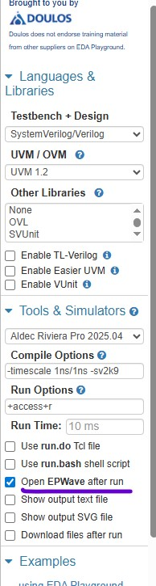

### 2026/2/6 learning Diary
今天進度少少

有去研究一下環境怎麼建立 
最後決定用EDA playground 
https://youtu.be/Qn6SvG-Kya0?si=O3bK3oRRluOTyEpV 

然後有去研究EDA playground 的 UVM 環境怎麼用 還有怎麼設定可以讓波形圖出來 
 

還有 看 Hello UVM ! 這篇但還沒看完 

又找到一個EDA playground的UVM 完整範例  
https://edaplayground.com/x/tZta
 
之前那個github是去驗完整的APB3 protocol 
有master 和slave 

這個則是只有slave ！ 超讚

然後就好奇問perplexity 一堆問題 
我覺得最重要的是

要注意 不要被這個右邊 的code 給誤導  不過我不知道是不是對的 因為我是問perplexity的 不知道perplexity有沒有在搞 
所謂右邊code 在EDA playground指的是 design 的code 也就是DUT的部分
左邊code是testbench 還有UVM相關程式 

這個在右邊的code 也就是DUT的部分加上了一些interface 和clocking  
我問perplexity 他是說這個部分理論上要弄在左邊的 他說這個作者把DUT的code 檔案  加了這些interface 還有clocking 
我後面可能要試試右邊code 是完全verilog 然後去左邊進行設定interface 還有clocking 有的沒的東東
