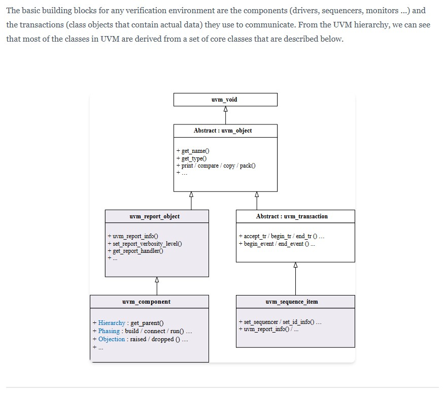
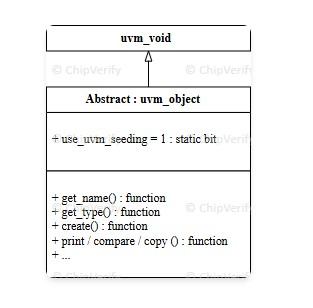
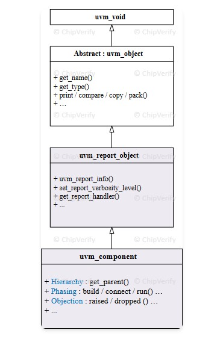
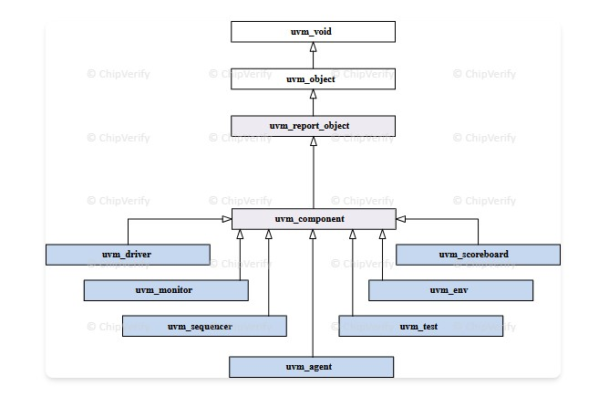
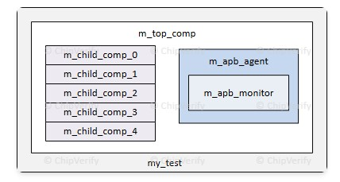

### 2026/2/7 learning Diary
今天進度少少

---
---
這三行各自的意思是：

```systemverilog
`include "uvm_macros.svh"
import uvm_pkg::*;
```

我分別說明。


## 1. `` `include "uvm_macros.svh"``

- 這是「把一個檔案原文展開貼進來」的預處理指令，類似 C 的 `#include`。  
- `uvm_macros.svh` 裡定義了很多 UVM 會用到的巨集，例如：  
  - `\`uvm_component_utils(...)`  
  - `\`uvm_info`, `\`uvm_error`, `\`uvm_fatal` 等報告巨集  
- 你在 class 裡用到這些巨集之前，必須先 `include` 這個檔案，不然編譯器會說「找不到巨集名稱」。

簡單講：**沒這行，你就不能用 UVM 那些方便的巨集語法。**

***

## 2. `import uvm_pkg::*;`

- UVM 本體是放在一個 SystemVerilog package 裡，通常叫 `uvm_pkg`。  
- `import uvm_pkg::*;` 的意思是「把 `uvm_pkg` 裡所有型別／函式／task 名稱拉進目前 scope」。  
- 例如你在 code 裡會寫：  
  - `class my_env extends uvm_env;`  
  - `uvm_config_db#(virtual dut_if)::set(...);`  
  如果沒 import，就得寫全名 `uvm_pkg::uvm_env`、`uvm_pkg::uvm_config_db`，或根本編譯不過。

簡單講：**這行是把 UVM 的 class / function 名稱「打開來用」。**

***

## 為什麼 UVM 範例都會一起寫這三行？

- `timescale`：把整份 testbench 的時間定義好。  
- `include uvm_macros.svh`：開啟所有 UVM 巨集（`uvm_component_utils`, `uvm_info` …）。  
- `import uvm_pkg::*`：讓你可以直接用 `uvm_test`, `uvm_env`, `uvm_config_db` 等型別。

實務上你可以把這三行當成「寫任何 UVM 檔案時幾乎一定會出現的開頭模板」。


hello UVM

左邊code 

```systemverilog
`timescale 1ns/1ps
`include "uvm_macros.svh"
import uvm_pkg::*;


//--------------------------------------
// Environment : just print "Hello UVM"
//--------------------------------------
class my_env extends uvm_env;
  `uvm_component_utils(my_env)

  function new(string name, uvm_component parent);
    super.new(name, parent);
  endfunction

  function void build_phase(uvm_phase phase);
    super.build_phase(phase);
  endfunction

  task run_phase(uvm_phase phase);
    set_report_verbosity_level(UVM_MEDIUM);
    uvm_report_info(get_name(),
                    $sformatf("Hello UVM ! Simulation has started."),
                    UVM_MEDIUM,
                    `__FILE__,
                    `__LINE__);
    `uvm_info(get_name(),
              $sformatf("Finishing up with run_phase ... "),
              UVM_LOW)
  endtask
endclass

//--------------------------------------
// Interface : bundle DUT signals
//--------------------------------------
interface dut_if (input logic clk);

  logic       rstn;
  logic [7:0] wdata;
  logic [7:0] rdata;
  logic [7:0] addr;
  logic       wr;
  logic       en;

endinterface

//--------------------------------------
// DUT Wrapper : connect interface to DUT
//--------------------------------------
module dut_wrapper (dut_if _if);

  dut u_dut (
    .clk   (_if.clk),
    .rstn  (_if.rstn),
    .wr    (_if.wr),
    .en    (_if.en),
    .wdata (_if.wdata),
    .addr  (_if.addr),
    .rdata (_if.rdata)
  );

endmodule

//--------------------------------------
// Test : create env, (可選)取得 interface
//--------------------------------------
class base_test extends uvm_test;
  `uvm_component_utils(base_test)

  my_env        m_top_env;
  virtual dut_if dut_vi;

  function new(string name = "base_test",
               uvm_component parent = null);
    super.new(name, parent);
  endfunction

  virtual function void build_phase(uvm_phase phase);
    super.build_phase(phase);

    // 建 env（用 factory）
    m_top_env = my_env::type_id::create("m_top_env", this);

    // 從 config_db 取 virtual interface（如果 top 有 set）
    if (!uvm_config_db#(virtual dut_if)::get(this, "",
                                             "dut_if", dut_vi)) begin
      `uvm_warning(get_type_name(),
                   "dut_if not set in config_db (OK for this Hello example)")
    end
  endfunction

  task run_phase(uvm_phase phase);
    phase.raise_objection(this);
    // 這裡沒有 sequence，就單純等一下，讓 env.run_phase 印訊息
    #10;
    phase.drop_objection(this);
  endtask
endclass

//--------------------------------------
// Top testbench : clock, wrapper, run_test
//--------------------------------------
module tb_top;

  logic clk;
  dut_if dut_if1(clk);

  // 產生 clock
  initial begin
    clk = 0;
    forever #5 clk = ~clk;
  end

  // 連接 DUT
  dut_wrapper dut_wr0 (dut_if1);

  // reset & default 信號
  initial begin
    dut_if1.rstn  = 0;
    dut_if1.en    = 0;
    dut_if1.wr    = 0;
    dut_if1.wdata = '0;
    dut_if1.addr  = '0;
    #20;
    dut_if1.rstn = 1;
    dut_if1.en   = 1;
  end

  // 把 virtual interface 塞進 UVM，並啟動測試
  initial begin
    uvm_config_db#(virtual dut_if)::set(null, "uvm_test_top",
                                        "dut_if", dut_if1);
    run_test("base_test");
  end

  // 產生波形 (EDAPlayground)
  initial begin
    $dumpfile("dump.vcd");
    $dumpvars(0, tb_top);
  end
endmodule

```

<br>

右邊code
```systemverilog
//--------------------------------------
// DUT : simple 1-byte memory
//--------------------------------------
module dut (
  input  logic       clk,    // Clock
  input  logic       rstn,   // Active low reset
  input  logic       wr,     // Write enable
  input  logic       en,     // Module enable
  input  logic [7:0] wdata,  // Write data
  input  logic [7:0] addr,   // Address
  output logic [7:0] rdata   // Read data
);

  logic [7:0] mem [0:255];

  always_ff @(posedge clk or negedge rstn) begin
    if (!rstn) begin
      rdata <= '0;
    end else if (en) begin
      if (wr) begin
        mem[addr] <= wdata;
      end else begin
        rdata <= mem[addr];
      end
    end
  end

endmodule

```

------------
------------

## 第二章 




這張圖在說「UVM 裡所有重要類別是怎麼從幾個**核心基底 class**長出來的」，也就是 UVM 的 class 階層骨架。

簡單拆一下圖上的幾個框：

1. **最頂：`uvm_void`**  
   - 所有 UVM 物件最後都可以追到這個最原始的 type，基本上只是語義上的根。  

2. **`uvm_object`（抽象）**  
   - 提供通用操作：`get_name()`, `get_type()`, `print / compare / copy / pack()` 等。  
   - 所有「非長駐、以資料為主」的東西（config 物件、transaction、sequence item…）都直接或間接繼承它。  

3. **`uvm_report_object`**  
   - 從 `uvm_object` 再長出來，加上報告機制：`uvm_report_info()`, `set_report_verbosity_level()`, `get_report_handler()` 等。  
   - 任何需要印 log、控制 verbosity 的 component 都是它的子孫。

4. **`uvm_component`**（左下）  
   - 繼承自 `uvm_report_object`，代表「長駐在 testbench 階層裡的元件」，像 `env`, `agent`, `driver`, `monitor`, `scoreboard`, `test` 都是它的子類。  
   - 特色是：  
     - 有 **Hierarchy**：`get_parent()` 等，用來掛在 `uvm_test_top.env.agent...` 這棵樹上。  
     - 有 **Phasing**：`build / connect / run / ...` 這些 phase 函式。  
     - 有 **Objection**：`raise_objection / drop_objection`，用來控制 `run_phase` 何時結束。  

5. **`uvm_transaction`（右上，中間那塊）**  
   - 也是從 `uvm_object` 下來的抽象類別，用來描述「交易」層級的資料（transaction），提供 `accept_tr() / begin_tr() / end_tr()` 之類和 transaction recording 有關的東西。  
   - 在 UVM 裡，transaction 是一次有意義的操作／資料傳輸，被包成的一個物件（class instance）。通常是 uvm_sequence_item 的子類，所以你看到的 Item extends uvm_sequence_item，那個 Item 就是 transaction 類型的一種。
6. **`uvm_sequence_item`（右下）**  
   - 繼承 `uvm_transaction`，是你在 UVM 裡實際會去 extend 的 transaction 類別的直接父類，例如你的 `Item extends uvm_sequence_item`。  
   - 除了 transaction base 的功能，還有像 `set_sequencer()`、`set_id_info()` 以及報告功能等。

換句話說，這頁想傳達的重點是：

- 整個 UVM 的世界可以粗分成兩大族群：  
  - 一族是「**component 類**」：長駐 testbench、跟 phase/objection/hierarchy 有關，全部從 `uvm_component` 來。  
  - 另一族是「**transaction / object 類**」：負責承載資料、當作 sequence item 或 config object，用 `uvm_object → uvm_transaction → uvm_sequence_item` 這條鏈。  
- 只要搞懂這幾個 core class，你就知道：  
  - 為什麼 env/test/driver 都要 extend `uvm_component`；  
  - 為什麼 transaction/Item 都要 extend `uvm_sequence_item`；  
  - 為什麼大家都可以用 `print/compare/copy` 和統一的報告機制。


-------
-------

這頁在介紹 **`uvm_root` / `uvm_top` 是什麼角色、能做哪些事**，可以把它當成「UVM 世界的隱形 top module ＋總管」。

***

## uvm_root / uvm_top 是什麼

- `uvm_root` 是一個 **singleton 類別**，UVM 啟動時會自動 new 一個實例，名字叫 **`uvm_top`**。  
- 你不需要、也不應該自己再 new 一個 `uvm_root`；整個模擬裡只會有這一個。  
- 所有 parent 沒有指定的 component，預設 parent 就會被設成 `uvm_top`。  
  - 例子裡 `m_env_1 = my_env::type_id::create("m_env_1", this);` → parent 是 `my_test`。  
  - `m_env_2 = my_env::type_id::create("m_env_2");` → parent = `null`，所以變成 `uvm_top.m_env_2`。

***

## 它在階層與搜尋上的作用

- `uvm_top` 是整棵 UVM component tree 的根，可以用它來**搜尋指定路徑或用萬用字元找元件**：  
  - `uvm_top.find("m_env.m_agent.m_driver");` → 用完整階層路徑找到 driver。  
  - `uvm_top.find("*apb_driver*");` → 找第一個名字符合 pattern 的元件。  
  - `uvm_top.find_all("*apb_driver*");` → 找出所有符合條件的元件，回傳 queue。  
- 這對 debug 很有用：你可以在 `end_of_elaboration` 用 `uvm_top` 去抓某些 component，印出它們的 full name 或做一些檢查。

***

## 它在報告與 verbosity 上的作用

- `uvm_top` 可以設定**全域的報告 verbosity**：  
  - 例如 `uvm_top.set_report_verbosity_level_hier(UVM_HIGH);` 讓整個 testbench 的訊息輸出都變成 HIGH 等級。  
- 它的 reporting 機制**不只**在 component 裡能用，在 module、sequence 這種不是 `uvm_component` 的地方也可以透過 `uvm_top` 來間接使用。  
- 這樣你就可以很快全域開/關 debug log，而不用逐一調每個 component。

***

## 它跟 config_db 的關係

- `uvm_top` 的名稱被設成空字串 `""`，所以 child 的 full name 不會變成 `uvm_top.xxx`，而是直接 `env.agent.drv`，路徑比較乾淨。  
- 用 config_db 做全域設定時，常會直接用 `uvm_root::get()` 當「頂層節點」：  
  - `uvm_config_db#(my_cfg)::set(uvm_root::get(), "*", "my_cfg", m_cfg);`  
  - 任何在樹上的 component 只要用 `"*"` pattern，就能從 config_db 把 `my_cfg` 取出來。  

***

## 為什麼要懂這頁，對你之後有什麼用

- 你會知道：  
  - 不指定 parent new component → 它會掛在 `uvm_top` 底下。  
  - 需要從「外部」（module、sequence）控制/搜尋 component、或設定全域 verbosity/config 時，就用 `uvm_top` / `uvm_root::get()`。  
- 在大型 UVM 專案裡，`uvm_top` 就像一個全域管理者：  
  - 管 phase（所有 component 的 build/run 等都由它統一排程）。  
  - 管階層搜尋。  
  - 管全域報告行為。  

把它想成「UVM 版的頂層 testbench shell」，有這個概念後，你看別人 code 裡那些 `uvm_top.find(...)`、`uvm_top.set_report_verbosity_level_hier(...)`、`uvm_root::get()` 就不會覺得莫名其妙。

--------------------------
--------------------------


## 1. config_db 是什麼？

`uvm_config_db` 是 UVM 提供的 **全域「設定資料庫」**：

- 你可以把某個物件/值「放進去」：  

  ```systemverilog
  uvm_config_db#(virtual dut_if)::set(this, "env.agent.*", "vif", dut_vi);
  ```

- 在別的 component 用路徑＋欄位名把它「拿出來」：  

  ```systemverilog
  uvm_config_db#(virtual dut_if)::get(this, "", "vif", vif);
  ```

用途：

- 取代「一堆 global 變數或長長的 new() 傳參數」。  
- 適合傳像 virtual interface、configuration object、pattern 參數這種東西。  
- 透過 wildcard 路徑，你可以控制「哪些 component 拿得到、哪些拿不到」。

你可以把它想像成 UVM 版的「全域 key-value store」，但有階層路徑與型別檢查，比裸 global safety 高很多。

***

## 2. `uvm_root` / `uvm_top` 是一樣的東西嗎？

概念上：**是同一個東西的兩種說法**。

- `uvm_root` 是類別（class）。  
- UVM 啟動時自動 new 出一個 `uvm_root` 物件，放在 `uvm_pkg::uvm_top` 這個全域變數裡。  
- 一般口語說「uvm_top」就是指那個唯一的 `uvm_root` 實例。

它負責：

- 當整棵 UVM component tree 的根節點（parent 為 null 的 component 會掛在它下面）。  
- 管理 phase 流程。  
- 提供 `find/find_all` 搜尋 component 階層。  
- 提供全域報告/verbosity 設定。  

所以你可以記：  
- `uvm_root` = 類型；  
- `uvm_top` = 那個唯一的實例（物件）。

***

## 3. singleton 是什麼？

**Singleton（單例）設計模式**：某個類別在系統中「只能、有且只有一個物件」，而且大家都要能拿到同一個。

特徵：

- 第一次要用的時候建立物件，以後再叫同一個。  
- 任何地方拿到的都是同一個 handle，不會再 new 新的。  
- 適合做「全域管理者」：例如 config manager、factory、command line parser、`uvm_root` 等。

UVM 裡的 `uvm_root` 就是典型 singleton：

- 只有一個 `uvm_top`。  
- 所有 component/外部模組用 `uvm_root::get()` 或直接用 `uvm_top` 存取這個單一的全局「總管」。


--------------------------
--------------------------


用更「直覺」的方式講一次，你可以把 verbosity 當成「這句 log 是多吵、多囉嗦」，然後再用一個「閥值」決定要不要讓它出現在 console。

***

## 1. 每一行 `uvm_info` 都有一個「吵度」

例如：

```systemverilog
`uvm_info("MON", "Saw 1 packet", UVM_LOW)
`uvm_info("MON", "Saw item ...",  UVM_HIGH)
```

- 第一行標成 `UVM_LOW`：代表「一般重要」，平常希望看得到。  
- 第二行標成 `UVM_HIGH`：代表「debug 級」，平常不一定要顯示。

這個第三個參數就是 **這行訊息的 verbosity 等級**。

***

## 2. 再設定一個「顯示閥值」

系統另外有一個「目前允許的最大吵度」，像這樣：

```systemverilog
uvm_top.set_report_verbosity_level_hier(UVM_MEDIUM);
```

你可以把它想成：「只顯示 **小於等於 UVM_MEDIUM** 的訊息」。

常見的 enum 定義大概是這樣（實際數值不重要，只有大小關係重要）：

```systemverilog
UVM_NONE   = 0
UVM_LOW    = 100
UVM_MEDIUM = 200
UVM_HIGH   = 300
UVM_FULL   = 400
UVM_DEBUG  = 500
```

判斷規則可以簡化成一句話：

> 只有「訊息的等級 ≤ 目前設定的閥值」的 `uvm_info` 會被印出。

***

## 3. 用例子看差別

假設你寫了三行：

```systemverilog
`uvm_info("ID", "A", UVM_LOW)
`uvm_info("ID", "B", UVM_MEDIUM)
`uvm_info("ID", "C", UVM_HIGH)
```

情況一：閥值是 `UVM_MEDIUM`（預設就是這個）

- 會印：A(LOW), B(MEDIUM)  
- 不會印：C(HIGH)  → 因為 HIGH(300) > MEDIUM(200)

情況二：你把閥值調成 `UVM_HIGH`

```systemverilog
uvm_top.set_report_verbosity_level_hier(UVM_HIGH);
```

- 會印：A(LOW), B(MEDIUM), C(HIGH)  
- 因為這三個等級都 ≤ HIGH

情況三：閥值設成 `UVM_LOW`

- 會印：只剩 A(LOW)  
- B、C 都被擋掉，因為 MEDIUM/HIGH 比 LOW「更吵」。

---

`uvm_info` 就是 UVM 裡的「**印一行 log**」指令，類似你在 C 裡的 `printf` 或在 Python 裡的 `print`，只是它多了幾個欄位讓 UVM 幫你管理、過濾。

一行 `uvm_info` 的四個重點欄位可以拆成這樣看：

```systemverilog
`uvm_info("ID", "內容文字", UVM_HIGH)
```

- 第 1 個參數 `"ID"`：這行訊息的 **名字 / 類別**，例如 `"DRV"`、`"MON"`、`"APB_WRITE"`，方便之後只打開某一類訊息。  
- 第 2 個參數 `"內容文字"`：真的要顯示在 log 裡的文字。  
- 第 3 個參數 `UVM_HIGH`：這行訊息的 **verbosity 等級**（有多吵）。  

------------------
------------------



<br>
這頁在講 **`uvm_object` 這個基底類別在 UVM 裡扮演什麼角色、提供哪些共通功能**，然後用幾段程式碼示範你自己寫的 class 要怎麼跟它配合。

***

## 1. 這頁的總體重點

- 在 UVM testbench 裡，所有「資料類 / 物件類」的 class（transaction、sequence item、config object，甚至 `uvm_component` 本身）都**直接或間接繼承自 `uvm_object`**。  
- `uvm_object` 把一些常用操作（print、copy、compare、record 等）集中實作好，讓你只要 `extends uvm_object` 就能免費用這些工具，不用每個 class 重寫。  
- 另外，它也定義了跟 factory 相關的介面（`create()`、`get_type_name()` 等），讓 factory 能夠「憑類型名字 new 出正確的物件」。

***

## 2. `uvm_object` 類別定義在說什麼

節錄的定義：

```systemverilog
virtual class uvm_object extends uvm_void;

  // 建構子：給這個 object 一個名字（可選）
  function new(string name="");

  // 公用工具函式
  function void print (uvm_printer printer=null);
  function void copy  (uvm_object rhs, uvm_copier copier=null);
  function bit  compare (uvm_object rhs, uvm_comparer comparer=null);
  function void record (uvm_recorder recorder=null);
  ...

  // 這兩個是「純虛擬」，要讓子類去實作
  virtual function uvm_object create (string name=""); return null; endfunction
  virtual function string get_type_name ();           return "";   endfunction

endclass
```

逐行看：

- `virtual class uvm_object extends uvm_void;`  
  `uvm_object` 是抽象類別（virtual class），不能直接 new，它繼承自更底層的 `uvm_void`。  

- `function new(string name="");`  
  建構子，可選擇給這個 object 一個字串名字（之後 print 或錯誤訊息時用得到）。

- `print/copy/compare/record` 四個函式：  
  - `print`：把整個物件裡的欄位「深度列印」出來（對 debug 很好用）。  
  - `copy`：把另一個物件的所有欄位值複製到自己身上。  
  - `compare`：深度比較兩個物件，所有欄位都一樣就回傳 1，不一樣回 0。  
  - `record`：把物件內容記錄到 transaction database（波形或交易紀錄）。  
  這些函式在 `uvm_object` 裡有通用實作，子類通常不用重寫，只要透過 hook（`do_print/do_copy/do_compare`）補充自己特有欄位即可。

- `create` / `get_type_name` 兩個 virtual 函式：  
  - `create(string name)`：用來「透過 factory」建立**同類型**的新物件，回傳型別是基底 `uvm_object`。  
  - `get_type_name()`：回傳這個 class 的型別名稱字串，主要給 debug 和 factory 用。  
  這兩個在基底回傳空值，**要求子類一定要實作**（或用 UVM 巨集幫你自動實作）。

***

## 3. 子類 `my_object` 怎麼實作 `create` / `get_type_name`

### 3.1 `create` 的實作

範例：

```systemverilog
class my_object extends uvm_object;
  ...

  // 實作 create：new 一個 my_object，回傳成 uvm_object handle
  virtual function uvm_object create(string name="my_object");
    my_object obj = new(name);
    return obj;
  endfunction

endclass
```

意思是：

- 當 factory 或其他程式碼只握有一個 `uvm_object` handle（但知道實際類型是 `my_object`）時，呼叫 `create()` 就能 new 出**同類型**的新物件。  
- `create()` 跟 `new()` 差別：  
  - `new()` 是「在現在這個 class 裡自己 new 自己」。  
  - `create()` 是「提供一個多型介面，讓外界只透過 `uvm_object` handle 就能 new 出對應子類的 instance」。

### 3.2 `get_type_name` 的實作

範例：

```systemverilog
class my_object extends uvm_object;

  // static，讓你不用 new 就能取得 type 名
  static function string type_name();
    return "my_object";
  endfunction

  virtual function string get_type_name();
    return type_name;
  endfunction
endclass
```

- `type_name()` 是 static 函式，方便 `my_object::type_name()` 直接呼叫。  
- `get_type_name()` 回傳 `type_name` 的結果；這個 virtual 函式是 `uvm_object` 規定要實作的介面。  
- factory 和報告系統會用這個名字來辨識類型、印 log 或做 override。

實務上你不會自己手寫這些，多半是交給 UVM 巨集（下面講）。

***

## 4. Factory 介面與 `\`uvm_object_utils` 巨集

頁面說明的重點：

```systemverilog
class my_object extends uvm_object;

  // 把目前這個 class 型別註冊到 factory
  `uvm_object_utils (my_object)

  ...

endclass
```

- UVM 有一個「factory」：你可以跟它註冊「有哪些 class 型別」，之後就可以用型別名/instance 名來 new 新物件，還可以做 type override。  
- 但光是 `extends uvm_object` 還不夠，**一定要加 `\`uvm_object_utils(my_object)`** 這個巨集，factory 才會知道這個型別的存在。  
- 這個巨集背後會幫你生成：  
  - `create()` 的實作。  
  - `get_type_name()` / `type_name()`。  
  - 把這個 type 登記到 factory 的註冊表。

意思是：  
> 只要你寫的是「資料物件類」（transaction、config、sequence item…），幾乎都會是 `class XXX extends uvm_object; \`uvm_object_utils(XXX)` 這種 pattern。

***

## 5. `print / copy / compare` 這些 utility function 的用法

頁面後半段提到：

- `print(printer)`：深度列印物件內容，用內建或自訂 `uvm_printer` 決定格式；若要加自訂欄位，就 override `do_print()`。  
- `copy(rhs)`：把 `rhs` 的欄位值全部複製過來；子類如果有額外欄位，要 override `do_copy()`。  
- `compare(rhs)`：逐欄位比較兩個物件是否相同；自訂行為則寫在 `do_compare()`。  

這些函式的好處：

- scoreboard 比對時，只要呼叫 `if (!exp.compare(act))` 就可以判斷兩個 transaction 是否完全一致，不用自己寫一堆 `if (a!=b || c!=d...)`。  
- debug 時，只要呼叫 `obj.print()`，就能看到所有欄位值，包含父類欄位也一起列印。  
- 覆蓋率記錄或 transaction database 錄波也可以透過 `record()` 自動帶出欄位內容。


這就是這頁想讓你理解的：**`uvm_object` 是所有「data/transaction 類」與大部分 UVM 類別的共同基底，負責提供通用工具和 factory 介面。**

------------------
------------------


<br>



這頁在講 **`uvm_component` 這個基底類別在做什麼，以及它提供的三大能力：階層 (hierarchy)、phase 流程、factory**，然後用程式碼示範怎麼用這些 API。

***

## 1. 什麼是 `uvm_component`

- 所有 UVM 裡的「長駐元件」── `env`, `agent`, `driver`, `monitor`, `scoreboard`, `test` 等──全部都是 `uvm_component` 的子類。  
- 它在 `class uvm_component extends uvm_report_object;` 這行說明：  
  - 繼承 `uvm_report_object` → 內建 log/report 機制（`uvm_info/uvm_error` 等）。  
  - 再加上：
    - **Hierarchy**：元件可以互相包含，形成樹狀結構。  
    - **Phasing**：有 `build/connect/run/...` 各種 phase 的虛擬函式可 override。  
    - **Factory**：可以被 factory 註冊、用 type_id::create 建立、做 override。

你可以把 `uvm_component` 想成「所有 testbench 結構元件的共同父類」，跟前一頁的 `uvm_object` 是「所有資料/物件的父類」相呼應。

***

## 2. 階層方法：如何在樹裡找 parent/child

程式碼示例定義了幾個 class：

```systemverilog
class apb_monitor extends uvm_component;
class apb_agent   extends uvm_component;
  apb_monitor m_apb_monitor;
endclass

class child_comp extends uvm_component;

class top_comp extends uvm_component;
  child_comp m_child_comp_sa  [vaalukasolutions](https://vaalukasolutions.com/how-factory-registration-happen-in-uvm/);
  apb_agent  m_apb_agent;

  virtual function void end_of_elaboration_phase(uvm_phase phase);
    uvm_component l_comp_h;
    uvm_component l_comp_q[$];
    ...
  endfunction
endclass
```

意思是：

- `top_comp` 底下有：
  - 一個 `m_apb_agent`。  
  - 一個長度 5 的陣列 `m_child_comp_sa[0..4]`。  
- `apb_agent` 裡面再 new 一個 `m_apb_monitor`。  
- 在 `top_comp.end_of_elaboration_phase()` 裡，用各種 `uvm_component` 提供的階層 API 來走這棵樹。

接著看 `end_of_elaboration_phase` 內容：

```systemverilog
// 1) 取得 parent
l_comp_h = get_parent();
`uvm_info("tag", $sformatf("get_parent=%s", l_comp_h.get_name()), UVM_LOW)
```

- `get_parent()`：回傳現在這個 component（`top_comp`）的 parent handle。  
- 執行結果 log：`get_parent=uvm_test_top`，表示 `top_comp` 是掛在 `uvm_test_top` 底下（也就是 test 的 child）。

***

```systemverilog
// 2) 取得所有直接小孩
get_children(l_comp_q);
foreach (l_comp_q[i])
  `uvm_info("tag", $sformatf("child_%0d = %s",
                              i, l_comp_q[i].get_name()), UVM_LOW)
```

- `get_children(queue)`：把「所有直接 child（不含孫子）」放進 queue。  
- 印出來會看到：
  - child_0 = m_apb_agent  
  - child_1 = m_child_comp_0  
  - ...  
  - child_5 = m_child_comp_4  

這對 debug 階層很有用：你可以在某個 component 裡列出底下到底有哪些實例。

***

```systemverilog
// 3) 用名字找特定小孩
l_comp_h = get_child("m_child_comp_2");
`uvm_info("tag", $sformatf("Found %s", l_comp_h.get_name()), UVM_LOW)
```

- `get_child("名字")`：只在「自己的直接小孩」裡找這個名字，有就回 handle，沒有就 null。  
- 這裡會找到 `m_child_comp_2`。

***

```systemverilog
// 4) 其他輔助 API
`uvm_info("tag", $sformatf("number of children = %0d",
                           get_num_children()), UVM_LOW)
`uvm_info("tag", $sformatf("has_child('abc') = %0d",
                           has_child("abc")), UVM_LOW)
`uvm_info("tag", $sformatf("has_child('m_apb_agent') = %0d",
                           has_child("m_apb_agent")), UVM_LOW)
`uvm_info("tag", $sformatf("get_depth = %0d", get_depth()), UVM_LOW)
```

- `get_num_children()`：直接小孩數量（這例子是 6）。  
- `has_child(name)`：有沒有這個名字的直接小孩，回 1/0（`abc` → 0，`m_apb_agent` → 1）。  
- `get_depth()`：從 `uvm_top` 算起的深度（`uvm_top=0`, `uvm_test=1`, `top_comp=2`，所以印出 2）。

***

```systemverilog
// 5) lookup：用「路徑字串」找 nested child
l_comp_h = lookup("m_apb_monitor");
...
l_comp_h = lookup("m_apb_agent.m_apb_monitor");
```

- 第一個 `lookup("m_apb_monitor")`：因為 `m_apb_monitor` 是 `apb_agent` 的 child，不是 `top_comp` 的直接 child，所以這裡找不到，UVM 幫你丟一個 warning。  
- 第二個 `lookup("m_apb_agent.m_apb_monitor")`：這次給完整階層路徑，就成功找到，log 裡印出 full name：`uvm_test_top.m_top_comp.m_apb_agent.m_apb_monitor`。  

結論：這一段程式在示範 `uvm_component` 內建的「階層巡覽工具」，方便你在大 testbench 裡用程式方式查 parent、children、深度、以及用路徑找任意 component。

***

## 3. Phasing：在不同 phase 做不同事

第二段程式碼是 `apb_agent` 的縮寫版：

```systemverilog
class apb_agent extends uvm_component;
  ...
  apb_monitor   m_monitor;
  apb_driver    m_driver;
  apb_sequencer m_seqr;

  // build_phase：new 小孩
  virtual function void build_phase(uvm_phase phase);
    super.build_phase(phase);

    m_monitor = apb_monitor::type_id::create("m_monitor", this);
    m_driver  = apb_driver ::type_id::create("m_driver",  this);
    m_seqr    = apb_sequencer::type_id::create("m_seqr",  this);
  endfunction

  // connect_phase：把小孩接起來
  virtual function void connect_phase(uvm_phase phase);
    super.connect_phase(phase);

    m_driver.seq_item_port.connect(m_seqr.seq_item_export);
  endfunction
endclass
```

重點：

- `build_phase`：  
  - 所有 component 通常在這裡 instantiate 自己的 child。  
  - 用 `type_id::create("instance_name", parent)`，等於「透過 factory new 出一個子 component，並且指定 parent」。  
  - `super.build_phase(phase);` 讓基底類別也有機會做它該做的事（很重要，幾乎每個 override phase 都會先呼叫 super）。  

- `connect_phase`：  
  - 在這裡做 port/export 的連接，像 `driver.seq_item_port` 接到 `sequencer.seq_item_export`。  
  - 這樣 phase 流程變成：  
    - `build_phase`：元件都 new 出來。  
    - `connect_phase`：接線。  
    - `run_phase`：真正開始送 transaction、收資料。

這段說明了：**UVM 用「phase 方法」來規範 testbench 的生命週期，每個 component 只要 override 自己需要的 phase 就好，其餘用預設行為。**

***

## 4. Factory 方法與 `\`uvm_component_utils`

最後一小段：

```systemverilog
class my_comp extends uvm_component;

  // 把 my_comp 註冊到 factory
  `uvm_component_utils (my_comp)

  function new(string name = "my_comp", uvm_component parent = null);
    super.new(name, parent);
  endfunction

endclass
```

重點：

- 跟 `uvm_object` 一樣，**component 想用 factory，就一定要呼叫對應的巨集**（這裡是 `\`uvm_component_utils`）。  
- 這個巨集會幫你：  
  - 實作 `get_type_name()`、`create()` 等 factory 介面。  
  - 把 `my_comp` 的 type 註冊到全域 factory 裡。  
- 之後你才能在別的地方寫：  
  ```systemverilog
  my_comp m_comp;
  m_comp = my_comp::type_id::create("m_comp", parent);
  ```
  或用 factory override，把所有 `my_comp` 在不改原始碼的情況下換成某個 subclass。

後面那段 `set_type_override_by_type` 的 wrapper，只是在說：

- factory 本體是一個 singleton 物件（整個模擬只有一個）。  
- `uvm_component` 幫你包了一層方便呼叫的 function，所以你可以直接從任一個 component 用  
  ```systemverilog
  m_comp.set_type_override_by_type(apb_driver::get_type(),
                                   apb_driver_2::get_type());
  ```
  來告訴 factory：「之後如果有人想要 `apb_driver`，請改給他 `apb_driver_2`。」

***

## 整頁的實用總結（配合你會寫的 code）

- **`uvm_component` = 所有 env/agent/driver/monitor/test 的爸爸**。  
- 它幫你處理：  
  - 階層：`get_parent / get_children / lookup / get_depth` 讓你對整棵 TB 樹有掌握。  
  - phase：你在 `build_phase` new 小孩，在 `connect_phase` 接線，在 `run_phase` 做真正的驗證行為。  
  - factory：使用 `\`uvm_component_utils` 註冊，之後用 `type_id::create` new、用 override 取代。  
  
  
-------------------------------------------
-------------------------------------------
