### 2026/2/8 learning Diary


## 來到第三章 UVM Components

這部分我感覺比較重要


---
---
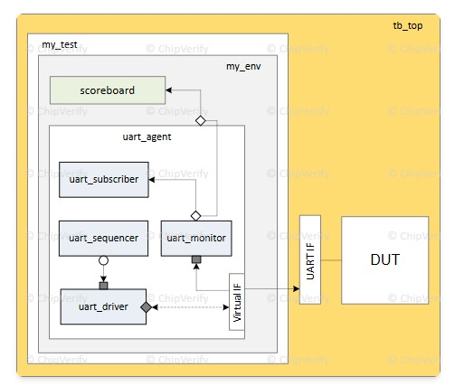

這頁在講「testbench 最上層 module（tb_top）」在 UVM 裡扮演什麼角色、裡面通常放什麼東西，還有 `run_test` 在背後到底做了什麼。 


## 1. tb_top 裡面到底放了什麼？

範例：

```systemverilog
module tb_top;
   import uvm_pkg::*;

   bit clk;
   always #10 clk <= ~clk;

   dut_if         dut_if1  (clk);
   dut_wrapper    dut_wr0  (._if (dut_if1));

   initial begin
      uvm_config_db #(virtual dut_if)::set (null, "uvm_test_top", "dut_if", dut_if1);
      run_test ("base_test");
   end

   initial begin
      $dumpvars;
      $dumpfile("dump.vcd");
   end

endmodule
```

逐行拆：

- `module tb_top; ... endmodule`  
  - 這是 **唯一的 Verilog 模組最上層**，所有東西（DUT、interface、UVM 環境）都掛在這顆底下。 

- `import uvm_pkg::*;`  
  - 讓這個 module 可以用 `run_test`, `uvm_config_db` 等 UVM construct。

- `bit clk; always #10 clk <= ~clk;`  
  - 在 TB 產生一顆 50MHz 的時鐘（20ns period），當作 DUT 跟 interface 的 clock source。  

- `dut_if dut_if1 (clk);`  
  - 實體化一個 **interface**，把 `clk` 傳進去。  
  - 之後 driver/monitor 會拿到這個 `virtual dut_if` 來 drive/sample DUT。

- `dut_wrapper dut_wr0 (._if (dut_if1));`  
  - 把介面接到 DUT（或 DUT wrapper）上。  
  - 這樣 DUT 的所有 pin 就透過 `dut_if1` 被 testbench 控制。

- 第一個 `initial` block：

  ```systemverilog
  initial begin
    uvm_config_db #(virtual dut_if)::set (null, "uvm_test_top", "dut_if", dut_if1);
    run_test ("base_test");
  end
  ```

  - `uvm_config_db::set(null, "uvm_test_top", "dut_if", dut_if1);`  
    - 把 `dut_if1` 這個 **實體 interface handle** 塞進 UVM config DB，path 是 `"uvm_test_top"` + field name `"dut_if"`。  
    - 在 `base_test` 或 env 的 `build_phase` 裡面你就可以：

      ```systemverilog
      virtual dut_if vif;
      uvm_config_db#(virtual dut_if)::get(this, "", "dut_if", vif);
      ```

      這樣就拿到上面塞的那顆 `dut_if1`。

  - `run_test("base_test");`  
    - 啟動 UVM：建立 `uvm_test_top.base_test`，進入 UVM phases，跑完再 `finish`。

- 第二個 `initial` block：

  ```systemverilog
  initial begin
    $dumpvars;
    $dumpfile("dump.vcd");
  end
  ```

  - 把 waveform dump 設定放在 tb_top 裡。不同 simulator 寫法可能不一樣，這裡用很 generic 的 VCD。


## 2. `run_test` 背後到底做什麼？

ChipVerify 有貼出 UVM 裡的定義（簡化）：

```systemverilog
task run_test (string test_name="");
  uvm_root top;
  uvm_coreservice_t cs;
  cs = uvm_coreservice_t::get();
  top = cs.get_root();
  top.run_test(test_name);
endtask
```

- 這個 global task 只是 thin wrapper：  
  - 透過 `uvm_coreservice_t::get()` 拿到 **唯一** 的 `uvm_root` 實例。  
  - 呼叫 `uvm_root::run_test(test_name);`。

`uvm_root::run_test` 做的事（ChipVerify 摘要版）：

```systemverilog
task uvm_root::run_test(string test_name="");
  ...

  // 從 +UVM_TESTNAME=xxx 讀 test name（如果 test_name 沒傳或是空字串）
  test_name_count = clp.get_arg_values("+UVM_TESTNAME=", test_names);
  if (test_name_count > 0) begin
    test_name = test_names[0];
    testname_plusarg = 1;
  end

  ...

  fork
    phase_runner_proc = process::self();
    uvm_phase::m_run_phases();     // 啟動 UVM phases (build, connect, run, ...)
  join_none

  wait (m_phase_all_done == 1);
  phase_runner_proc.kill();

  l_rs = uvm_report_server::get_server();
  l_rs.report_summarize();

  if (finish_on_completion)
    $finish;
endtask
```

重點：

- 你呼叫 `run_test("base_test")` 時：  
  - 如果 command line 沒有 `+UVM_TESTNAME=...`，就用 `"base_test"`。  
  - UVM factory 會 new 一個 `base_test` 物件，放在 root 下面，名字叫 `uvm_test_top`。  
- 然後 `uvm_phase::m_run_phases()` 會：  
  - 呼叫所有 component 的 `build_phase`、`connect_phase`、`run_phase` 等等。  
- 所有 phase 結束後：  
  - `report_summarize()` 印出 report summary。  
  - 預設 `finish_on_completion=1`，所以 `run_test` 回來前會呼叫 `$finish` 結束模擬。

因此你在 `tb_top` 只要有這一行：

```systemverilog
run_test("base_test");
```

整個 UVM 世界就會跑起來：test/env/agent/driver/monitor/sequence 全部由 UVM 生命週期管理，不需要你在 tb_top 一個一個手動 new。


## 3. 為什麼 clock/reset/tap points也放在 tb_top？

ChipVerify 後面幾段是在說：現實設計常會有多 clock、多 reset、internal tap nets，這些「跟 DUT 物理連接相關」的東西，都**比較適合留在 tb_top (RTL/接口層)**，而非 UVM class 裡。 

- Clock generation：  
  - 小設計可以 `always #10 clk = ~clk;`。  
  - 大設計常常會做成 clock module 或 clock agent，用 config 物件控制頻率/phase 等等。

- Reset generation：  
  - 可能有多種 reset 型態（硬體 pin reset / register software reset）。  
  - 硬體 reset 可以做成 reset agent + reset interface；tb_top 只是把 reset interface 接到 DUT，真正 reset sequence 在 UVM world 控制。

- Internal tap points：  
  - 有時候 debug 需要接到 DUT internal nets。  
  - tb_top 可以把 internal net assign 到一個 generic interface（例如 `gen_if`），再用某個 UVM agent 去 sample 或 drive。


## 4. 總結這頁在講的核心觀念

- `tb_top` 是 **Verilog 世界的 root**，UVM 的東西（test/env/agent）都掛在 `uvm_test_top` 這顆 class hierarchy 上。  
- tb_top 負責：
  - 實體化 DUT 和 interface。  
  - 產生 clock/reset 或接外部 clock/reset module。  
  - 用 `uvm_config_db::set` 把 interface handle 丟給 UVM world。  
  - 呼叫 `run_test(...)` 啟動整個 UVM phasing。  
  - 設定 waveform dump 或其他 simulator 相關的東西。

你可以把它想成：  
> tb_top = “硬體接線 + simulator glue code”；  
> UVM test/env/agent = “行為邏輯 + 驗證控制”。

---
---

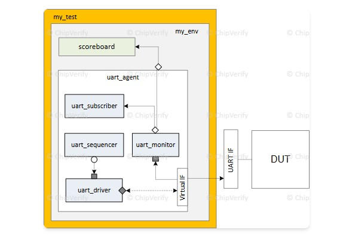


這頁在講「**什麼是 UVM 的 test（`uvm_test`）class，怎麼寫、怎麼跑、怎麼用繼承做一堆不同 test case**」。我用它的程式碼一步一步對應說明。


## 1. 什麼是 testcase / `uvm_test`？

概念上：

- Environment（`uvm_env`）裡放的是整個可重用 testbench：agent、driver、monitor、scoreboard、register model 等。  
- **Test** 則是「這次要怎麼用這個 environment」：  
  - 開哪些 agent（ACTIVE/PASSIVE）  
  - 設什麼 config knob  
  - 跑哪一條 sequence（traffic pattern / scenario）  

所以：

> 同一套 env + 不同 test = 不同驗證情境。這就是為什麼一個設計可能有幾百個 test，卻共用一套 env。


## 2. 寫一個最基本的 `uvm_test`

### Step 1：繼承 `uvm_test` + 註冊 factory

```systemverilog
class my_test extends uvm_test;

  `uvm_component_utils (my_test)

  function new (string name = "my_test", uvm_component parent = null);
    super.new (name, parent);
  endfunction

endclass
```

- `extends uvm_test`：表示這是一個「test level 的 component」，UVM root 會把它當整個 testbench 的入口。  
- `` `uvm_component_utils``：把這個 class 註冊進 factory，這樣 `run_test("my_test")` 或 `+UVM_TESTNAME=my_test` 才能 new 得出來。  


## 3. 在 test 裡建 env + cfg（build_phase）

```systemverilog
class my_test extends uvm_test;

  `uvm_component_utils (my_test)

  my_env   m_top_env;  // 整個 testbench 環境
  my_cfg   m_cfg0;     // 用來控制 env 的設定

  function new (...); super.new(...); endfunction

  virtual function void build_phase (uvm_phase phase);
    super.build_phase (phase);

    // 用 factory 建 env & cfg
    m_top_env = my_env::type_id::create ("m_top_env", this);
    m_cfg0    = my_cfg::type_id::create ("m_cfg0",    this);

    // 可以在這裡呼叫自訂的 set_cfg_params() 做環境設置
    set_cfg_params();

    // 把 cfg 丟到 config_db，給 env/agent 下面的人拿
    uvm_config_db #(my_cfg)::set (this, "m_top_env.my_agent", "m_cfg0", m_cfg0);
  endfunction

endclass
```

- `m_top_env`：就是那個包含所有 agent/scoreboard 的環境。  
- `m_cfg0`：你自訂的設定物件，裡面可能有：  
  - virtual interface handle (`vif`)  
  - agent active/passive  
  - verbosity level  
  - 其他 DUT 相關參數  

`uvm_config_db::set` 這行很重要：

- Path `"m_top_env.my_agent"`：表示 `my_agent` 這顆 agent 底下的人，可以用 `get()` 拿到 `m_cfg0`。  
- 這就是把「test 的設定」往下傳給整個環境的標準手法。


## 4. end_of_elaboration + run_phase：印 topology、啟動 sequence

### 印 topology（方便 debug）

```systemverilog
virtual function void end_of_elaboration_phase (uvm_phase phase);
  uvm_top.print_topology ();
endfunction
```

- 在 env 都建好之後、真正跑 simulation 前，印出整棵 UVM component 樹，確認有哪些 env/agent/driver/monitor 被 new 出來。

### run_phase：這支 test 要跑哪條 sequence？

最基本寫法：

```systemverilog
virtual task run_phase (uvm_phase phase);
  my_seq m_seq = my_seq::type_id::create ("m_seq");

  phase.raise_objection (this);
  m_seq.start (m_env.seqr);
  phase.drop_objection (this);
endtask
```

- `run_phase` 是這支 test 的主流程。  
- `my_seq` 是你想跑的情境（讀寫 register、隨機 traffic、某種 corner case）。  
- `m_env.seqr` 是 env 裡的 sequencer。  
- `raise_objection` / `drop_objection`：  
  - 有 objection → UVM 不會結束 simulation。  
  - 所以跑 sequence 前 raise，跑完再 drop，test 才會收尾。  

另一種寫法是用「預設 sequence」：在 `start_of_simulation_phase` 用 `uvm_config_db` 指定哪條 sequence 會在某個 phase 自動跑，這頁也有提。 


## 5. 怎麼啟動一支 test？

### 在 tb_top 裡 call `run_test`

```systemverilog
initial begin
  run_test("base_test");  // 或者 run_test();
end
```

- `run_test("base_test")`：factory 會 new `base_test`，掛在 `uvm_test_top` 下，然後開始跑 phases。  
- 如果你不給參數，改用 command line：

```bash
vsim ... +UVM_TESTNAME=base_test
```

- 那就算 `run_test()` 裡沒寫 test name，也會從 `+UVM_TESTNAME` 抓名字來跑。


## 6. Base test + 派生 tests（Derivative Tests）

這頁後面示範怎麼用繼承去疊出一整族 test。

### Base test：共用 env + 基本 config

```systemverilog
class base_test extends uvm_test;

  `uvm_component_utils (base_test)

  my_env m_top_env;
  my_cfg m_cfg0;

  function new (...); super.new(...); endfunction

  virtual function void build_phase (uvm_phase phase);
    super.build_phase(phase);
    m_top_env = my_env::type_id::create("m_top_env", this);
    m_cfg0    = my_cfg::type_id::create("m_cfg0",    this);

    set_cfg_params();
    uvm_config_db#(my_cfg)::set(this, "m_top_env.my_agent", "m_cfg0", m_cfg0);
  endfunction

  virtual function void set_cfg_params ();
    if (!uvm_config_db#(virtual dut_if)::get(this, "", "dut_if", m_cfg0.vif)) begin
      `uvm_error(get_type_name(), "DUT Interface not found !")
    end
    m_cfg0.m_verbosity = UVM_HIGH;
    m_cfg0.active      = UVM_ACTIVE;
  endfunction

  virtual function void end_of_elaboration_phase (uvm_phase phase);
    uvm_top.print_topology();
  endfunction

  virtual task run_phase (uvm_phase phase);
    my_seq m_seq = my_seq::type_id::create("m_seq");
    super.run_phase(phase);
    phase.raise_objection(this);
    m_seq.start(m_env.seqr);
    phase.drop_objection(this);
  endtask

endclass
```

這支 `base_test` 做的事：

- 建 env、建 cfg。  
- 從 config_db 拿 virtual interface 塞進 cfg。  
- 設一些共用的 knob（verbosity、agent active）。  
- 定義「預設要跑哪條 sequence」。  

之後所有 test 都可以 `extends base_test`，只改掉需要不同的 phase 即可。

### 派生 test 1：只換 run_phase（跑不同 sequence）

```systemverilog
class dv_wr_rd_register_test extends base_test;
  `uvm_component_utils (dv_wr_rd_register_test)

  function new(string name = "dv_wr_rd_register_test");
    super.new(name);
  endfunction

  virtual task run_phase(uvm_phase phase);
    wr_rd_reg_seq m_wr_rd_reg_seq = wr_rd_reg_seq::type_id::create("m_wr_rd_reg_seq");

    super.run_phase(phase);    // 視你想不想先跑 base_test 的 run_phase
    phase.raise_objection(this);
    m_wr_rd_reg_seq.start(m_env.seqr);
    phase.drop_objection(this);
  endtask
endclass
```

- 只 override `run_phase`：改成跑 `wr_rd_reg_seq`。  
- 其他（build env、cfg、拿 interface、config_db）都沿用 `base_test` 的邏輯。  

### 派生 test 2：再疊一層，只改 build_phase（換 config）

```systemverilog
class dv_cfg1_wr_rd_register_test extends dv_wr_rd_register_test;
  `uvm_component_utils (dv_cfg1_wr_rd_register_test)

  function new(string name = "dv_cfg1_wr_rd_register_test");
    super.new(name);
  endfunction

  virtual function void build_phase(uvm_phase phase);
    super.build_phase(phase);         // 先照 base_test 做一遍
    m_cfg0.active = UVM_PASSIVE;      // 再改成 PASSIVE
  endfunction
endclass
```

- 這一支 test 繼承 `dv_wr_rd_register_test`：  
  - run_phase：用 `wr_rd_reg_seq`  
  - build_phase：先跑 base_test 的 build，再把 `m_cfg0.active` 改成 `UVM_PASSIVE`。  

所以整個繼承關係：

- `base_test`：定義 env + 基本 config + default sequence。  
- `dv_wr_rd_register_test`：同一個 env/config，但跑「讀寫 register 的 sequence」。  
- `dv_cfg1_wr_rd_register_test`：同一條 sequence，但把某個 agent 改成 PASSIVE 等不同 config。

這樣就可以很快產出一堆 test，而不用複製貼上整套 env 建構 code。


## 7. 重點整理（用你之後寫 test 時可以直接套）

- 寫 test 的基本骨架就是：  

  ```systemverilog
  class XXX_test extends uvm_test;
    `uvm_component_utils(XXX_test)

    // env + cfg handle
    my_env m_top_env;
    my_cfg m_cfg0;

    function new(...); super.new(...); endfunction

    function void build_phase(...); // new env, new cfg, config_db set
    function void end_of_elaboration_phase(...); // optional print_topology
    task run_phase(...); // raise objection, run sequences, drop objection
  endclass
  ```

- tb_top 裡用 `run_test("XXX_test")` 或 command line `+UVM_TESTNAME=XXX_test` 來啟動。  
- 用繼承去疊 test family：  
  - Base test：共用 env + config。  
  - 派生 test：  
    - 改 `run_phase` → 不同 sequence。  
    - 改 `build_phase` → 不同 config（agent active/passive、clock mode、coverage on/off…）。
	
----
----


是的，這裡的 `m_cfg0` 就是你自己定義的一個 **configuration object**，用來集中管理「這支 test 想怎麼設定整個 environment」的各種 config。它不是 UVM 內建某個特定型別，而是你自己寫的 `class my_cfg extends uvm_object;` 之類的東西。 


## cfg 通常會放哪些東西？

典型會放這幾類：

- **virtual interface**：  
  - 比如頁面裡的：`m_cfg0.vif`，是從 `tb_top` 的 `dut_if1` 抓進來的。  
  - 之後 agent/driver 用 `cfg.vif` 來 drive / sample DUT。 

- **agent 行為模式**：  
  - `m_cfg0.active = UVM_ACTIVE / UVM_PASSIVE`，決定這個 agent 是會 drive bus 還是只當 monitor。 

- **log / debug 相關**：  
  - `m_cfg0.m_verbosity = UVM_HIGH` 這種，把 verbosity 集中開關。  

- **測試情境相關的 knob**：  
  - 例如：data width、burst length、timeout、是否打開 coverage、是否啟用某些 checker 等，全部可以丟進 cfg。  

你可以把 `cfg` 想成「這支 test 對整個 env 的參數表」，用物件的方式傳進去。


## 為什麼不用一堆 `uvm_config_db::set`，而是做一個 cfg？

如果不用 cfg，你會在 test 或 tb_top 到處寫：

```systemverilog
uvm_config_db#(virtual dut_if)::set(this, "m_top_env.my_agent", "vif", dut_if1);
uvm_config_db#(int)::set(this, "m_top_env.my_agent", "burst_len", 16);
uvm_config_db#(bit)::set(this, "m_top_env.my_agent", "enable_cov", 1);
...
```

改成 cfg 風格：

```systemverilog
m_cfg0.vif        = dut_if1;
m_cfg0.burst_len  = 16;
m_cfg0.enable_cov = 1;

uvm_config_db#(my_cfg)::set(this, "m_top_env.my_agent", "m_cfg0", m_cfg0);
```

下面的 agent 一行就拿到所有設定：

```systemverilog
my_cfg m_cfg0;
uvm_config_db#(my_cfg)::get(this, "", "m_cfg0", m_cfg0);
```

- 好處：  
  - 所有測試相關的設定都集中在 `my_cfg` 一個 class 裡。  
  - 之後 derivative test 只要改 `m_cfg0` 的某幾個欄位就可以做出新的情境（就像 `m_cfg0.active = UVM_PASSIVE;` 那個例子）。 


## 簡單小結（用一句話記）

- `cfg` = 你自己定義的 **環境設定物件**，  
- 由 test 填值，透過 `uvm_config_db` 傳進 env/agent，  
- 讓「這支 test 要怎麼用這個 env」的所有 config 都集中管理、好繼承、好改版本。


---
---

在 verification / UVM 的語境裡，**knob（控制鈕）就是「可以調的參數」的口語說法**，不是某個特定語法或型別。

你可以這樣理解：

- 在一個 agent / env / sequence 裡，你會留一些「可調的變數」，用來控制行為，例如：  
  - bus 是否插入 random delay  
  - 最大 burst 長度  
  - 是否打開 coverage 或 scoreboard check  
  - agent 是 ACTIVE 還是 PASSIVE  
- 這些變數就是所謂的 *control knobs*：  
  - 在 code 裡通常就是 class 的 member，例如 `int max_burst; bit enable_cov; uvm_active_passive_enum active;`  
  - 在 test 裡或從 command line，可以把這些 knob 設成不同值，就像轉旋鈕一樣改 testbench 的行為。

所以前面說的「tweak knobs」就是：

> 透過改 cfg 裡的欄位（或 config_db / command line）去設定各種控制參數，讓同一個 environment 跑出不同風格的 test。

---
---


UVM environment（`uvm_env`）就是把多個 verification components 有系統地包在一起的「測試平台殼」，方便重複利用、層級化組裝，並讓 test 只負責「怎麼測」，不用管「testbench 長什麼樣子」。 


## 文字內容重點：什麼是 `uvm_env`
1. **定義與作用**  
   - `uvm_env` 是一個從 `uvm_component` 繼承的容器，用來放多個 agent、scoreboard、coverage、checker 等元件，並設定它們的預設組態。 
   - 同一個 environment 可以在 block-level、subsystem-level、SoC-level 反覆被拿來重用，也可以再被包在更大的 environment 裡變成一個 sub‑env。 

2. **為什麼不要在 test 內直接 new 元件**  
   - 雖然你可以在 `uvm_test` 裡直接宣告 `apb_agent m_apb_agent;`、`base_scoreboard m_base_scbd;` 然後在 `build_phase` new 出來，但這樣會有幾個問題： 
     - 測試和 testbench 拿在一起寫，導致測試不易重用。  
     - 每個測試都要知道 testbench topology、config 細節，維護困難。  
     - 只要 topology 有變動，要改一堆測試檔。  
   - 把這些元件集中放進 `uvm_env`，test 只要選擇哪個 env、怎麼設定 config knob，大幅提升可重用性與維護性。 

3. **`uvm_env` 的 class hierarchy**  
   - 網頁列出階層：`uvm_void → uvm_object → uvm_report_object → uvm_component → uvm_env`。 
   - 也就是說 `uvm_env` 具備 component 的所有特性（phase、建構、報告機制、factory），只是專門作為「hierarchical container」。  


## 三張圖在說什麼？


### 圖一：SoC / DMA 的多層級 environment（`abc11.jpg`）
這張圖左邊是 **unit-level** 的 `dma_env`，右邊是 **system-level** 的 `sys_env`。 

- 左邊（unit level）  
  - `dma_env` 裡面有：  
    - 多個 `agent_1/2/3`（每個 agent 對應一個 DMA interface），每個 agent 內含 driver、sequencer、monitor。  
    - 一個 scoreboard、functional coverage、virtual sequencer。  
  - 右邊是實際 DUT block：`DMA Ctrl`，三個 interface 透過 interface 連到對應 agent。  
- 右邊（system level）  
  - `sys_env` 內部又包含前面已經驗證過的 `dma_env`（當作一個 sub‑env）、`spi_env`、`core_env` 等其他 sub‑env，外面再有一層 system‑level scoreboard、virtual sequencer、regmodel。
  - 底下灰色框是整個 SoC DUT：Core、DMA、Periph、RAM、DDR 等。  
- 重點觀念：  
  - `dma_env` 先在 block level 驗證完，之後整包搬到 system level 把它當一個 component 來用。  
  - 這就是 environment 可重用、階層化的典型例子：`sys_env` ⊃ `dma_env`，而 `dma_env` 內又有多個 agents、scoreboard。  


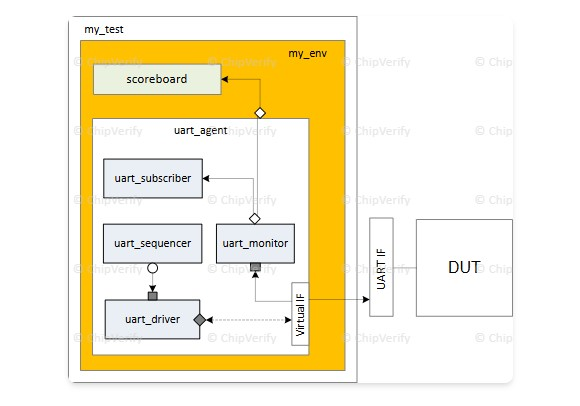
### 圖二：單一 UART 環境（`abc9.jpg`）
這張圖是比較小的 environment 範例：`my_env` 只包了一個 `uart_agent` 和一個 scoreboard。 

- `my_test` 類別實例化 `my_env`，`my_env` 裡面：  
  - 一個 `uart_agent`，裡面有 `uart_driver`、`uart_sequencer`、`uart_monitor`，以及一個 `uart_subscriber` 做 coverage 或 check。  
  - 一個 `scoreboard`，用來檢查 DUT 行為是否正確。  
- `UART IF` 是實體（或 virtual）interface，連接到 DUT 的 UART 介面。  
- 這個例子對應到文末那段簡化的環境程式碼：一個 agent + 一個 scoreboard，在 `build_phase` 裡 new 出來，在 `connect_phase` 裡把 monitor 的 analysis port 接到 scoreboard。

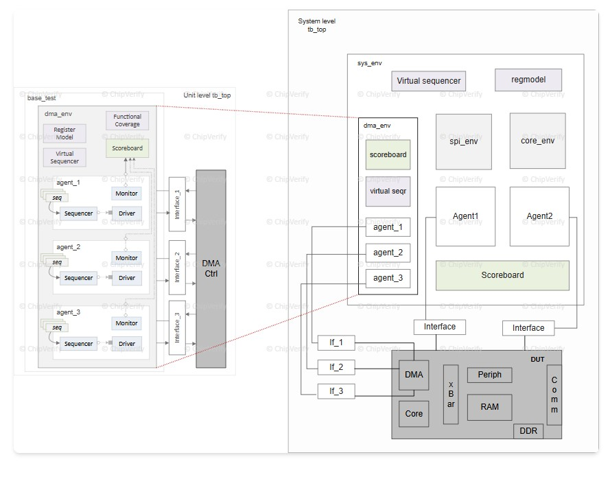
### 圖三：`uvm_env` 的 class 階層（`abc10.jpg`）
這張圖就是把文字中的 class hierarchy畫出來：最下面是 `uvm_env`，往上是 `uvm_component`、`uvm_report_object`、`uvm_object`、`uvm_void`。

- `uvm_env` 繼承 `uvm_component`，因此：  
  - 有 `build_phase`、`connect_phase` 等 phase。  
  - 可以參與 factory、config_db、報告機制。  
- 圖上也標了 `+ new()` 和 `+ run_test()` 等介面，提醒你建立環境要有建構子，整體 simulation 從 `run_test()` 開始。 


## 程式碼片段：一步步看 `uvm_env` 怎麼寫

### 1. 宣告並註冊 environment 類別
```systemverilog
class my_env extends uvm_env;

  `uvm_component_utils (my_env)

  function new (string name = "my_env",
                uvm_component parent = null);
    super.new (name, parent);
  endfunction

  // 後面會再加 build_phase、connect_phase
endclass
```  

- `extends uvm_env`：表示這個 class 是一個 environment，可以再被其他 env 或 test 實例化。 
- `` 'uvm_component_utils``：把 `my_env` 登記到 factory，之後可以用 `type_id::create` 來 new。 

### 2. 在 `build_phase` 中 new 出子元件
```systemverilog
class my_env extends uvm_env;

  `uvm_component_utils (my_env)

  my_agent      m_agnt0;
  my_scoreboard m_scbd0;

  function new (string name, uvm_component parent);
    super.new (name, parent);
  endfunction

  virtual function void build_phase (uvm_phase phase);
    super.build_phase (phase);
    m_agnt0 = my_agent     ::type_id::create("my_agent",      this);
    m_scbd0 = my_scoreboard::type_id::create("my_scoreboard", this);
  endfunction

  virtual function void connect_phase (uvm_phase phase);
    m_agnt0.m_mon0.item_collected_port.connect(m_scbd0.data_export);
  endfunction

endclass
```  

- `my_agent`、`my_scoreboard` 對應圖二中的 `uart_agent` 與 `scoreboard` 方塊，只是把 UART 替換成更 generic 的名字。 
- 在 `build_phase` 裡用 `type_id::create` 而不是 `new`，好處是：之後可以用 factory override 把 agent 或 scoreboard 換成其他變體（例如 random agent / directed agent）。 

### 3. 把 env 用在 test 裡
一般會再寫一個 `base_test` 或 `my_test`：

```systemverilog
class my_test extends uvm_test;

  `uvm_component_utils(my_test)

  my_env m_env;

  function new(string name = "my_test", uvm_component parent = null);
    super.new(name, parent);
  endfunction

  virtual function void build_phase(uvm_phase phase);
    super.build_phase(phase);
    m_env = my_env::type_id::create("m_env", this);
  endfunction

endclass
```  

- `my_test` 只做「instantiate 一個 env」+ 之後下 sequences，而不用再管裡面有幾個 agent、scoreboard 怎麼連，全部封裝在 `my_env` 裡。  
- 若有別的 SoC，或想在 system-level 直接用這個 block-level env，只要在另一個 testbench 或更大的 env 裡再 `create("m_env", this)` 一次就好，和圖一的 `dma_env` 重用方式一樣。 


## 把文字、圖、程式碼串起來的直覺理解
- 可以把 **`uvm_env` 想成「樂高底板」**：  
  - 圖二是單一 UART 小底板，上面插了一顆 agent 和一顆 scoreboard。  
  - 圖一是把多顆底板（`dma_env`、`spi_env`、`core_env`…）再插到一個更大的 system‑level 底板 `sys_env`。  
- 程式碼上，這些「底板」都是 `class xxx_env extends uvm_env;`，內部在 `build_phase` new agents / sub‑env，在 `connect_phase` 用 TLM 連線（monitor analysis port → scoreboard export 等）。 
- test 只要 new 出最上層的 env（例如 `sys_env`），並啟動對應 sequences，就可以在不同專案、不同 SoC 之間重複利用同一套 verification component。這正是這一頁以及三張圖想傳達的核心。 


----
----

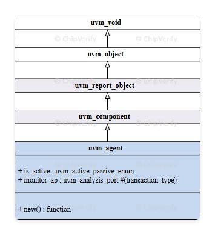

這頁（UVM Agent | `uvm_agent`）的核心是：把 **sequencer/driver/monitor** 打包成一個「針對某個介面/協定」的可重用單元，並且可用 `is_active` 讓同一個 agent 在 active/passive 兩種模式間切換。 

## 先看這張圖的架構

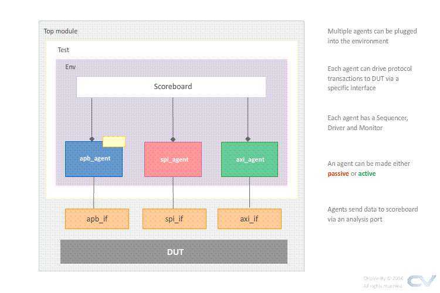

`uvm-agent.jpg` 這張圖畫的是典型拓撲：Top module 裡面有 Test → Env，Env 內有 scoreboard，並可插多個 agent（如 apb/spi/axi），每個 agent 透過對應介面（apb_if/spi_if/axi_if）連到 DUT。 
圖右邊也點出重點：agent 內含 sequencer/driver/monitor，並且 agent 可以是 passive 或 active；monitor 收到的 transaction 會經由 analysis port 類型的通道送到 scoreboard。

## Agent 為什麼要「封裝三件套」
ChipVerify 強調的 agent 定義是：agent 透過 TLM 介面把 sequencer、driver、monitor 實例化並連起來，形成單一 entity。 
概念上資料流是：sequencer 產生 transaction → driver 把 transaction 轉成 pin-level 訊號驅動 DUT → monitor 從 DUT 取樣，再把 pin-level 還原成 transaction 分發給 scoreboard/coverage 等等待者。

## Active vs Passive（何時用哪個）
Active agent 會建立 sequencer+driver+monitor，因為它需要「發 stimulus 進 DUT」。 
Passive agent 通常只建立 monitor，用在你不需要 drive、只想做檢查與 coverage（例如只觀察某條匯流排、或外部已有 BFMs/CPU 在驅動）。 

## 怎麼判斷/設定 is_active（對應圖與程式）
`uvm_agent` 有 `get_is_active()`，會回傳 `uvm_active_passive_enum` 的 `UVM_ACTIVE` 或 `UVM_PASSIVE`，用來決定 build/connect 時要不要建立與連接 driver、sequencer。
`uvm-agent.jpg`（UART 例子）可以對照：若 UART agent 是 active，就會有 `uart_sequencer`→`uart_driver` 去透過 virtual interface 驅動 DUT；不論 active/passive，`uart_monitor` 都會把觀察到的 transaction 往上送到 env 的 scoreboard/subscriber。

## 對照用的程式碼骨架（精簡版）
下面骨架就是這頁在講的「只有 active 才建 driver/seqr、而 monitor 永遠存在；connect 也只在 active 做」這個模式。 

```systemverilog
class my_agent extends uvm_agent;
  `uvm_component_utils(my_agent)

  my_driver                m_drv;
  my_monitor               m_mon;
  uvm_sequencer #(my_txn)  m_seqr;

  function new(string name="my_agent", uvm_component parent=null);
    super.new(name, parent);
  endfunction

  function void build_phase(uvm_phase phase);
    super.build_phase(phase);

    if (get_is_active() == UVM_ACTIVE) begin
      m_seqr = uvm_sequencer#(my_txn)::type_id::create("m_seqr", this);
      m_drv  = my_driver::type_id::create("m_drv", this);
    end

    m_mon = my_monitor::type_id::create("m_mon", this);
  endfunction

  function void connect_phase(uvm_phase phase);
    if (get_is_active() == UVM_ACTIVE)
      m_drv.seq_item_port.connect(m_seqr.seq_item_export);
  endfunction
endclass
```

也可以在 env/test 用 config 把 agent 設成 active/passive（ChipVerify 以 `is_active` 做為 config 參數；概念上就是對 agent 路徑寫入 `UVM_ACTIVE/UVM_PASSIVE`）。 


----
----


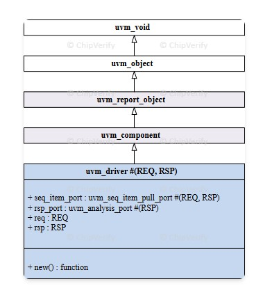


`uvm_driver` 是 UVM testbench 中唯一真正與 DUT「接觸」的元件——它從 sequencer 拿到 transaction-level 物件，把它翻譯成 pin-level 的信號時序，驅動到 DUT 的 interface 上。


## 圖一：Class Hierarchy（abc14.jpg）

這張圖畫的是 `uvm_driver` 的類別繼承鏈： 

```
uvm_void → uvm_object → uvm_report_object → uvm_component → uvm_driver #(REQ, RSP)
```

圖的最下方方塊列出 `uvm_driver` 自帶的關鍵成員： 

- **`seq_item_port`**：型別為 `uvm_seq_item_pull_port #(REQ, RSP)`，這是 driver 向 sequencer 拉取（pull）transaction 的 TLM 埠。
- **`rsp_port`**：型別為 `uvm_analysis_port #(RSP)`，如果 driver 需要把 response 寫回 sequencer，就用這個埠。
- **`req`、`rsp`**：built-in 的 handle，用來暫存從 sequencer 拿到的 request 和要回傳的 response。
- **`new()` function**：建構子，和所有 `uvm_component` 一樣需要 `name` 和 `parent`。

重點：`uvm_driver` 是一個 **parameterized class**（`#(REQ, RSP)`），REQ 預設等於 `uvm_sequence_item`，RSP 預設與 REQ 相同。你在宣告自己的 driver 時通常會傳入你自定的 transaction type。


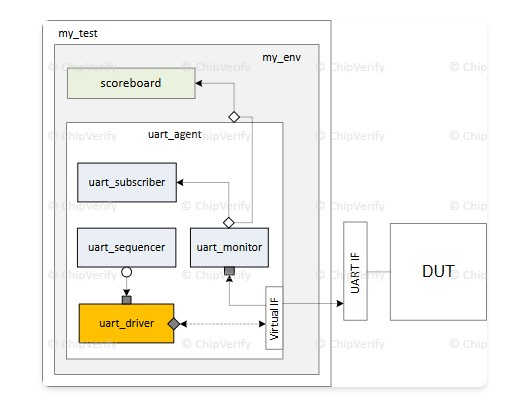
## 圖二：UART Testbench 裡 Driver 的位置（abc15.jpg）

在這張 UART testbench 架構圖中，`uart_driver`（橘色方塊）位於 `uart_agent` 內部的最底層： 

- **資料流方向**：`uart_sequencer` 產生 transaction → 經由 TLM port 傳給 `uart_driver` → driver 透過 **Virtual IF**（虛擬介面）把 pin-level 信號驅動到 DUT。 
- **同時**：`uart_monitor` 也連接到同一個 Virtual IF，但它只「觀察」不「驅動」。monitor 採樣到的 transaction 會往上送到 `uart_subscriber`（coverage）和 `scoreboard`。 
- driver 和 sequencer 的 TLM 連線是在 agent 的 `connect_phase` 裡做的：`m_drv.seq_item_port.connect(m_seqr.seq_item_export);`。 


## 建立 Driver 的三個步驟（對應程式碼）

### Step 1：繼承 `uvm_driver`、factory 註冊、建構子

```systemverilog
class my_driver extends uvm_driver #(my_data);  // 參數化：只接受 my_data 型別
  `uvm_component_utils(my_driver)

  function new(string name = "my_driver", uvm_component parent = null);
    super.new(name, parent);
  endfunction
endclass
```

`extends uvm_driver #(my_data)` 告訴 factory 這個 driver 專門處理 `my_data` 型別的 transaction。 

### Step 2：宣告 virtual interface 並在 `build_phase` 取得

```systemverilog
virtual dut_if vif;  // 對應圖二中「Virtual IF」那條線

virtual function void build_phase(uvm_phase phase);
  super.build_phase(phase);
  if (!uvm_config_db #(virtual dut_if)::get(this, "", "vif", vif))
    `uvm_fatal(get_type_name(), "Didn't get handle to virtual interface")
endfunction
```

為什麼需要 virtual interface？因為 class-based 的 UVM 元件不能直接存取 module-level 的信號，必須透過 `virtual interface` 當橋樑。`uvm_config_db::get()` 是從 testbench top 或 agent config 拿到實際 interface handle 的標準做法。

### Step 3：在 `run_phase` 驅動 DUT（核心邏輯）

```systemverilog
task run_phase(uvm_phase phase);
  my_data req_item;
  super.run_phase(phase);

  forever begin
    // 1. 從 sequencer 拿 transaction（阻塞直到有 item）
    seq_item_port.get_next_item(req_item);

    // 2. 把 transaction 翻譯成 pin-level 信號
    drive_item(req_item);

    // 3. 通知 sequencer：這筆 item 我處理完了
    seq_item_port.item_done();
  end
endtask

virtual task drive_item(my_data data_obj);
  @(posedge vif.clk);
  vif.en   <= 1;
  vif.addr <= data_obj.addr;
  vif.data <= data_obj.data;
  // ... 依照協定時序繼續驅動
endtask
```

這段 `forever` 迴圈就是 driver 的生命週期：不斷「拿→驅動→回報完成→拿下一筆」。


## Driver-Sequencer 握手機制

這頁特別強調的兩種握手模式：

| 模式 | Driver 端呼叫 | Sequence 端行為 | 特點 |
|---|---|---|---|
| `get_next_item` + `item_done` | 先 `get_next_item(req)` 拿到 item → 驅動 → 再 `item_done()` | `finish_item()` 會一直 block，直到 driver 呼叫 `item_done()` 才返回 | **推薦用法**：driver 確實驅動完才放行 sequence，時序最精確  
| `get` + `put` | 呼叫 `get(req)` 後 sequencer 立即解除 block → 驅動 → 再 `put(rsp)` 回傳結果 | `finish_item()` 在 `get()` 完成時就解除 block | driver 還沒驅動完，sequence 已經可以準備下一筆；適合需要提前 pipeline 的場景 

對照圖二：`uart_sequencer` 和 `uart_driver` 之間那條連線，就是 `seq_item_port` ↔ `seq_item_export` 的 TLM 連接，上述握手就發生在這條通道上。


## 完整 Driver 範例（整合）

```systemverilog
class my_driver extends uvm_driver #(my_data);
  `uvm_component_utils(my_driver)

  virtual dut_if vif;

  function new(string name, uvm_component parent);
    super.new(name, parent);
  endfunction

  virtual function void build_phase(uvm_phase phase);
    super.build_phase(phase);
    if (!uvm_config_db #(virtual dut_if)::get(this, "", "vif", vif))
      `uvm_fatal(get_type_name(), "Didn't get handle to virtual interface dut_if")
  endfunction

  task run_phase(uvm_phase phase);
    my_data data_obj;
    super.run_phase(phase);
    forever begin
      `uvm_info(get_type_name(), "Waiting for data from sequencer", UVM_MEDIUM)
      seq_item_port.get_next_item(data_obj);
      drive_item(data_obj);
      seq_item_port.item_done();
    end
  endtask

  virtual task drive_item(my_data data_obj);
    @(posedge vif.clk);
    vif.en   <= 1;
    vif.addr <= data_obj.addr;
    vif.data <= data_obj.data;
    @(posedge vif.clk);
    vif.en   <= 0;
  endtask
endclass
```

而在 agent 裡的 `connect_phase`，就是把圖二那條 sequencer→driver 連線實現出來： 

```systemverilog
virtual function void connect_phase(uvm_phase phase);
  m_drv.seq_item_port.connect(m_seqr.seq_item_export);
endfunction
```

這樣整個 sequence → sequencer → driver → virtual interface → DUT 的資料通道就完整串起來了。 


----
----


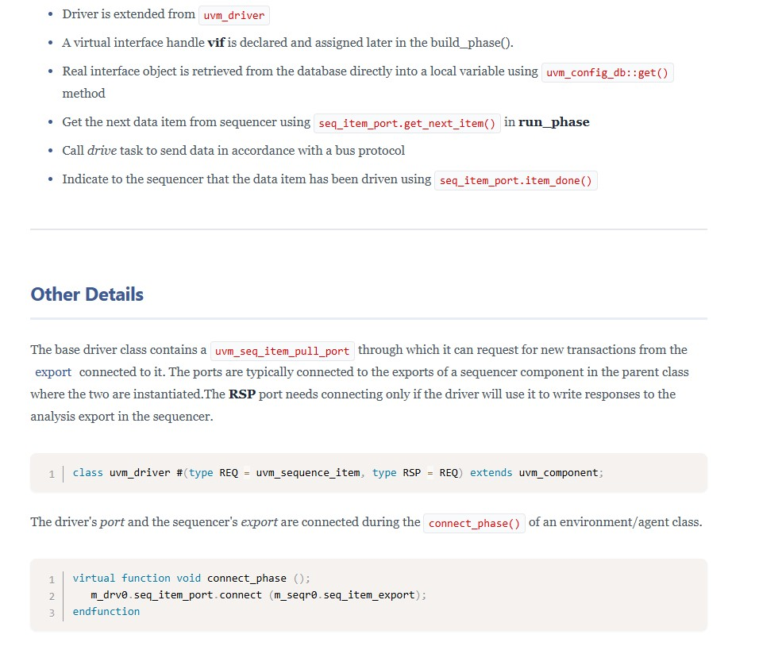


你截圖這段主要在補充兩個點：**`uvm_seq_item_pull_port` 的角色**，以及在 `connect_phase` 中如何把 driver 和 sequencer 接起來。 


## 1. `uvm_seq_item_pull_port` 做什麼？

- `uvm_driver` 裡的 `seq_item_port` 型別是 `uvm_seq_item_pull_port #(REQ, RSP)`，它是「拉交易」用的 TLM port。 
- 這個 port 會連到 sequencer 端的 `seq_item_export`，driver 透過它呼叫 `get_next_item` / `get` / `try_next_item` 去向 sequencer 取得下一個 transaction。
- 也就是說：  
  - **方向**：sequencer 提供 item，driver 主動「pull」。  
  - **REQ/RSP 類型**：REQ 是進來 driver 的 request 物件，RSP（如果你用）是 driver 要回傳給 sequencer 的 response 物件。 

RSP port 只有當你真的要把 response 往回送給 sequencer 的 analysis export 時才需要連，不用就可以忽略。 


## 2. Driver / Sequencer 在哪裡被連起來？

你看到的程式片段：

```systemverilog
virtual function void connect_phase ();
   m_drv0.seq_item_port.connect(m_seqr0.seq_item_export);
endfunction
```

說明這個連線是 **在 agent 或 env 的 `connect_phase` 裡完成** 的。 

- `m_drv0` 是你在 agent `build_phase` 裡 `create` 的 driver。  
- `m_seqr0` 是同一個 agent 裡的 sequencer。  
- 在 `connect_phase` 時呼叫 `connect()`，就把 driver 端的 port 接到 sequencer 端的 export，之後 `seq_item_port.get_next_item()` 才會真的從對應的 sequencer 拿到項目。 


## 3. 串回剛剛的 UART 圖

放回 UART 圖裡看：`uart_sequencer` 和 `uart_driver` 之間那條線，實際上就是上面這句 `seq_item_port.connect(seq_item_export)`。 
一旦連好，run_phase 裡呼叫 `seq_item_port.get_next_item(req);`，就會沿著這條 pull port → export 的 TLM 通路，去從 UART sequencer 取出 transaction 來驅動 DUT。


----
----


UVM monitor 就是「只看不開車」的元件：透過 virtual interface 觀察 DUT 的訊號，把它 decode 成 transaction，再用 analysis port 廣播給 scoreboard、subscriber 等其它元件。 


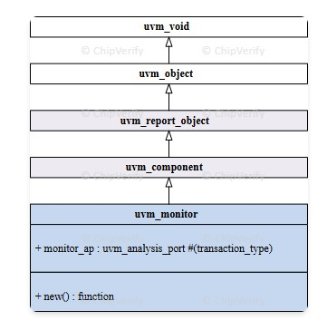
## 圖一：`uvm_monitor` 類別階層（abc17.jpg）

這張圖說明 `uvm_monitor` 在 UVM 中的繼承關係：

- `uvm_void → uvm_object → uvm_report_object → uvm_component → uvm_monitor`  
- 在 `uvm_monitor` 裡，ChipVerify 特別標出一個成員：  
  - `monitor_ap : uvm_analysis_port #(transaction_type)`  
- 也就是說，**每個 monitor 天生就適合「把 transaction 往外送」**，因為它繼承了 component 的 phase/報告機制，又內建 analysis port 這種「多播」通道。 

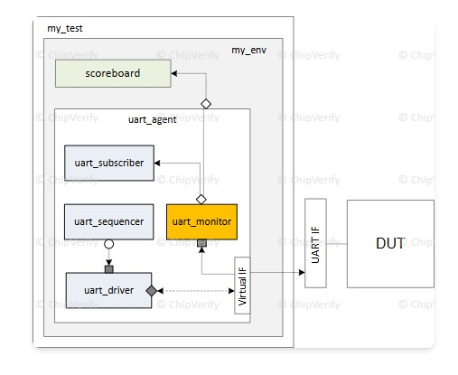

## 圖二：UART testbench 裡 monitor 的位置（abc18.jpg）

在 UART 圖中，`uart_monitor`（橘色方塊）放在 `uart_agent` 裡，透過 Virtual IF 觀察 UART 介面，向上把資料送給 `uart_subscriber` 和環境的 scoreboard。 

- Virtual IF：和 driver 共用同一個 `UART IF`，但 driver 用來驅動，monitor 用來取樣。  
- 往上的箭頭：表示 monitor 把 decode 後的 transaction 經由 analysis port 送到 subscriber/scoreboard。  
- 這就對應到程式裡的 `mon_analysis_port.write(data_obj);`。


## 程式碼步驟 1：宣告 monitor 類別與成員

```systemverilog
class my_monitor extends uvm_monitor;
  `uvm_component_utils(my_monitor)

  virtual dut_if vif;                       // 連到 DUT 的 virtual interface
  bit            enable_check   = 1;
  bit            enable_coverage= 1;

  uvm_analysis_port #(my_data) mon_analysis_port;

  function new(string name = "my_monitor",
               uvm_component parent = null);
    super.new(name, parent);
  endfunction
endclass
```

重點：

- `extends uvm_monitor`：讓這個元件自動擁有 monitor 的身份與擴充能力。 
- `vif`：用來讀 DUT 的 bus/訊號。  
- `mon_analysis_port`：這就是圖一畫的 `monitor_ap`，型別為 `uvm_analysis_port #(my_data)`，my_data 是你用來包 transaction 的 class。  


## 程式碼步驟 2：在 `build_phase` 建立 analysis port、取得 interface

```systemverilog
virtual function void build_phase(uvm_phase phase);
  super.build_phase(phase);

  // 1) new 一個 analysis port 實例
  mon_analysis_port = new("mon_analysis_port", this);

  // 2) 從 config_db 拿到 virtual interface
  if (!uvm_config_db #(virtual dut_if)::get(this, "", "vif", vif)) begin
    `uvm_error(get_type_name(), "DUT interface not found")
  end
endfunction
```

- analysis port 在這裡實例化後，才能在 run_phase 呼叫 `write()`。  
- virtual interface 也是從 config_db 取回，和 driver 的寫法完全對稱。 


## 程式碼步驟 3：`run_phase` – 監控、檢查、coverage、廣播

```systemverilog
virtual task run_phase(uvm_phase phase);
  my_data data_obj = my_data::type_id::create("data_obj", this);

  forever begin
    @([some event when DUT port is valid]); // 等待一個合法 transaction
    data_obj.data = vif.data;
    data_obj.addr = vif.addr;

    if (enable_check)
      check_protocol();                    // 基本協定檢查

    if (enable_coverage)
      data_obj.cg_trans.sample();          // 功能 coverage

    mon_analysis_port.write(data_obj);     // 廣播給 scoreboard / subscriber
  end
endtask

virtual function void check_protocol();
  // 基礎協定 check：握手時序、burst 長度等
endfunction
```

這段對應到 spec 中的「Steps 3 & 4」與 example： 

- `@([Some event ...])`：當 bus 達到某種條件（例如 valid & ready），表示一個 transaction 完成，就把信號複製到 `data_obj`。  
- `enable_check`、`enable_coverage`：可由 test 透過 `uvm_config_db::set` 控制，決定 monitor 要不要同時做 protocol check 和 coverage。 
- `mon_analysis_port.write(data_obj)`：這一行就是圖二中「uart_monitor → uart_subscriber / scoreboard」那條線。任何在 env/test 裡把自己接到 `mon_analysis_port` 上的元件，都會收到這個 `data_obj`。  


## Test/Env 中如何用 config knob 控制 monitor

網頁最後的兩行範例：

```systemverilog
uvm_config_db #(bit)::set(this, "*.agt0.monitor", "enable_check", 0);
uvm_config_db #(bit)::set(this, "*.agt0.monitor", "enable_coverage", 0);
```

- 這寫在 test 或更上層的 env 裡，可以關掉某個 agent 內 `monitor` 的 check/coverage。  
- 方便你在某些 test case 只想 dump waveform 或做特定 debug，而不想被一堆 protocol error 和 coverage 影響。  


## 串回整體 UART 架構

結合你前面看過的 driver/agent/env：

- sequence 產生 `my_data` → sequencer → driver 透過 virtual IF 驅動 UART DUT。  
- **同一個 virtual IF** 被 `uart_monitor` 觀察，monitor 在 `run_phase` 把 UART bus decode 成 `my_data`，做完基本 protocol check / coverage 後，透過 `mon_analysis_port.write(data_obj)` 廣播。  
- `uart_subscriber`（例如 coverage subscriber）與 scoreboard 透過 analysis export 或 analysis FIFO 接上 `mon_analysis_port`，即可收到所有 transaction。  

這就是這頁文字、程式碼和兩張圖一起要表達的完整 monitor 角色與使用方式。


----
----


這一段其實不是「要你做題目」，而是在給你兩個**建議做法**：要寫 monitor 的時候，記得「從 `uvm_monitor` 繼承」。 

具體意思是：

- 你的所有 user-defined monitor class 都應該寫成  
  ```systemverilog
  class my_monitor extends uvm_monitor;
  ```
  而不是直接從 `uvm_component` 或別的 class 繼承。  
- 這樣做有兩個好處：  
  - 一看繼承關係就知道它是 monitor（容易區分不同 component 類型）。  
  - 將來 UVM 官方如果對 `uvm_monitor` base class 增加新功能，你的 monitor 會自動跟著受益，不需要改所有 code。  


----
----
