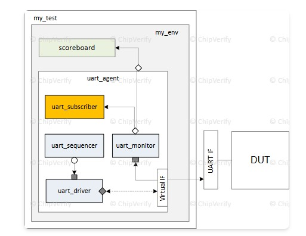
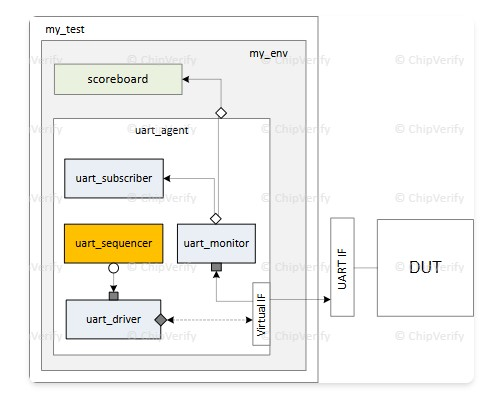
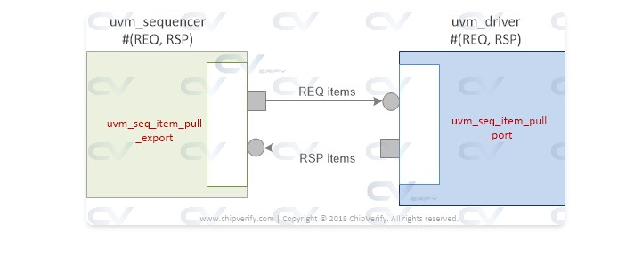

### 2026/2/9 learning Diary

今天進度少少

-----
-----





在這一頁裡，`uvm_subscriber` 是一種「專門接 analysis port 的 component」，用來當 **listener**：例如 coverage collector 或 checker，接收從 monitor/agent 廣播出來的 transaction。 


## 圖：UART testbench 中的 `uart_subscriber`

在 UART 圖中，`uart_subscriber`（橘色）放在 `uart_agent` 裡，接在 `uart_monitor` 的 analysis port 後面。 

- `uart_monitor` 透過 virtual IF 觀察 UART 訊號，decode 成 transaction，呼叫 `mon_analysis_port.write(pkt)` 廣播。  
- `uart_subscriber` 透過自己的 `analysis_export` 收到這些 `pkt`，可以做 coverage 或額外檢查，再把構好的資訊（例如 coverage）回報到環境中。  
- Scoreboard 通常也是接在 monitor 的 analysis port 上，只是它不一定寫成 subscriber；ChipVerify 這頁是介紹「想寫 coverage 類 listener 時，最好繼承 `uvm_subscriber`」。 


## `uvm_subscriber` 類別長什麼樣子

原文的 class 定義精華如下：

```systemverilog
virtual class uvm_subscriber #(type T = int) extends uvm_component;
  typedef uvm_subscriber #(T) this_type;

  uvm_analysis_imp #(T, this_type) analysis_export;

  function new(string name, uvm_component parent);
    super.new(name, parent);
    analysis_export = new("analysis_imp", this);
  endfunction

  pure virtual function void write(T t);
endclass
```

重點：

- 它本質上還是 `uvm_component`，只是幫你內建好了 `analysis_export`。  
- `analysis_export` 的型別是 `uvm_analysis_imp #(T, this_type)`，會把收到的物件轉呼叫 `write(T t)`，所以你只要 override `write()` 就能處理來自 analysis port 的資料。  
- 泛型 `T` 是你要接收的 transaction 類型，像 UART 可以是 `uart_txn`。  


## 實際用法：寫 coverage subscriber

ChipVerify 的例子是 coverage 收集器： 

```systemverilog
class my_coverage extends uvm_subscriber #(bus_pkt);

  covergroup cg_bus;
    // ... coverpoints / crosses
  endgroup

  function new(string name, uvm_component parent);
    super.new(name, parent);
    cg_bus = new();
  endfunction

  virtual function void write(bus_pkt pkt);
    cg_bus.sample();  // 每收到一個 pkt 就 sample coverage
  endfunction
endclass
```

- `extends uvm_subscriber #(bus_pkt)`：宣告這個 subscriber 專門聽 `bus_pkt`。  
- 覆寫 `write(bus_pkt pkt)`：所有從 monitor 廣播來的 `bus_pkt` 都會經過這裡，因此在這裡 sample coverage 或做簡單統計最自然。  


## 在 env/agent 中接上 monitor 的 analysis port

接線通常在 `connect_phase` 做： 

```systemverilog
class my_env extends uvm_env;
  my_agent     m_agt;
  my_coverage  m_cov;

  virtual function void connect_phase(uvm_phase phase);
    super.connect_phase(phase);
    m_agt.mon_analysis_port.connect(m_cov.analysis_export);
  endfunction
endclass
```

- `m_agt.mon_analysis_port`：agent 裡 monitor 的 analysis port（就像 UART 圖中的 `uart_monitor`）。  
- `m_cov.analysis_export`：subscriber 內建的 analysis_export。  
- 一旦 connect 完，monitor 呼叫 `mon_analysis_port.write(pkt)`，就會觸發 `my_coverage.write(pkt)`。  


## 為什麼要用 `uvm_subscriber`（突破點）

這裡的「突破」其實是 coding style 與可維護性：

- 如果你只是想寫 coverage/統計/簡單 checker，直接繼承 `uvm_component` 也可以，但你要自己宣告 `analysis_export` 與 `write()`。  
- **用 `uvm_subscriber` 的好處**：  
  - 所有「聽 analysis port 的元件」都有一致的介面（都叫 `analysis_export`，都 override `write()`），env/connect_phase 寫法統一。  
  - UVM 對 subscriber 做的任何未來強化（例如 callback、reporting）會自動套用到你的 class。  

對照你那張 UART 圖：  

- `uart_monitor`：負責從 DUT 觀察並 `write(txn)` 到 analysis port。  
- `uart_subscriber`（`extends uvm_subscriber #(uart_txn)`）：負責實作 `write(uart_txn t)` 裡的 coverage 或統計。  
- env 在 `connect_phase` 中把 `uart_monitor.mon_analysis_port` 接到 `uart_subscriber.analysis_export`，這樣整個「監控 → 廣播 → 訂閱」的 flow 就串完了。


----
----

這頁在講 `uvm_sequencer`：它是負責「管理 sequence 產生的 transactions，並在適當時機把它們交給 driver」的元件，而且最常見的互動模型是 **pull semantic**（driver 準備好時才來 sequencer 取 item）。



## 圖：UART 架構裡 sequencer 在哪裡（你附的 image.jpg）

在你的圖中，`uart_sequencer` 位於 `uart_agent` 內，介於 sequence 與 `uart_driver` 之間： 
`uart_driver` 會透過 `seq_item_port` 連到 `uart_sequencer` 的 `seq_item_export`，形成 driver↔sequencer 的 transaction 通道，這個連線通常在 agent 的 `connect_phase` 建立。 


## `uvm_sequencer` 在做什麼

- 它管理多個 sequence 送來的 items，決定仲裁順序（誰先送、誰後送），再把 item 提供給 driver。 
- 在 pull 模型下，driver 端有 `uvm_seq_item_pull_port`，sequencer 端提供 `uvm_seq_item_pull_export`，driver 會「拉」下一筆 item。 
- 這也是為什麼 ChipVerify 在 “How it works” 會寫：driver 有 pull port、sequencer 提供 pull export，並在 `connect_phase` 連線。


## 直接用 `uvm_sequencer #(REQ,RSP)`（最常見）

ChipVerify 的建議是：如果你沒有要加額外 ports/功能，多數情況直接用 parameterized `uvm_sequencer` 就好。 

```systemverilog
uvm_sequencer #(my_data, data_rsp) m_seqr0; // REQ=my_data, RSP=data_rsp
uvm_sequencer #(my_data)           m_seqr1; // REQ=my_data, RSP=my_data(預設)
```

- `REQ` 是 request item type（driver 拿到的那種）。
- `RSP` 預設等於 `REQ`；若你的 response 物件不同型別才需要第二個參數。


## agent 內的範例：build + connect（對照你的圖）

這段對應你圖上的 `uart_sequencer` 與 `uart_driver` 連線： 

```systemverilog
class my_agent extends uvm_agent;
  `uvm_component_utils(my_agent)

  uvm_sequencer #(my_data) m_sequencer;
  my_driver                m_driver;

  function void build_phase(uvm_phase phase);
    super.build_phase(phase);
    m_sequencer = uvm_sequencer#(my_data)::type_id::create("m_sequencer", this);
    m_driver    = my_driver::type_id::create("m_driver", this);
  endfunction

  function void connect_phase(uvm_phase phase);
    super.connect_phase(phase);
    m_driver.seq_item_port.connect(m_sequencer.seq_item_export);
  endfunction
endclass
```

連上之後，driver 的 `seq_item_port.get_next_item(req)` / `item_done()` 這套握手才能運作。


## 什麼是 `m_sequencer` 與 `p_sequencer`

- **`m_sequencer`**：每個 `uvm_sequence` 內建的 handle，型別是「泛用」的 `uvm_sequencer_base`，當你 `seq.start(seqr)` 時就會指到那個 sequencer。 
- **`p_sequencer`**：用 `` `uvm_declare_p_sequencer(你的sequencer型別)`` 宣告後得到的「型別正確」handle，本質是把 `m_sequencer` cast 成你自訂的 sequencer 型別，讓你能直接存取自訂欄位/方法。 

簡單說：`m_sequencer` 永遠存在但很泛用；`p_sequencer` 讓你在 sequence 裡用「不需要手動 $cast」的方式存取自訂 sequencer 功能。 


## 什麼時候要寫 Custom Sequencer

ChipVerify 的態度是：**不一定要寫**，除非你真的要在 sequencer 上加東西（例如額外的狀態、API、handles 給 virtual sequence 用）。 
如果要寫，建議 `extends uvm_sequencer #(your_req, your_rsp)`，並用 factory 註冊，其他跟一般 component 一樣。 


----
----

你貼的這段其實是「把 sequencer 放進整個 TB 的完整路徑」的三個步驟，我剛才只講到前後，沒有一行一行對著講，下面我補齊，用中文直接串起來。


## 1. `my_transaction`：sequence item（REQ/RSP 型別）

```systemverilog
class my_transaction extends uvm_sequence_item;
  `uvm_object_utils_begin(my_transaction)
    `uvm_field_int(addr,       UVM_ALL_ON)
    `uvm_field_int(data,       UVM_ALL_ON)
    `uvm_field_enum(bit, read_write, UVM_ALL_ON) // 0=read, 1=write
  `uvm_object_utils_end

  rand bit [31:0] addr;
  rand bit [31:0] data;
  rand bit        read_write; // 0=read, 1=write

  function new(string name = "my_transaction");
    super.new(name);
  endfunction
endclass : my_transaction
```

這一段在做的事：

- 定義一個 **transaction 類別**，後面會同時當作 sequencer 的 REQ/RSP 型別。  
- `rand` 欄位：之後在 sequence 裡可以 `randomize()` 出不同 addr/data/read_write pattern。  
- `` `uvm_object_utils_begin/end`` + field 宏：讓這個 class 自動支援 print、copy、compare、record 等功能，用在 debug/scoreboard 很方便。 

你可以想像：之後 driver 收到的就是這個 `my_transaction`，從裡面拿 `addr/data/read_write` 來決定怎麼 wiggle pin。


## 2. `my_sequencer`：客製 sequencer 的定義

```systemverilog
class my_sequencer extends uvm_sequencer #(my_transaction, my_transaction);
  `uvm_component_utils(my_sequencer)

  function new(string name = "my_sequencer", uvm_component parent);
    super.new(name, parent);
  endfunction
endclass : my_sequencer
```

這裡在做兩件事：

- `extends uvm_sequencer #(my_transaction, my_transaction)`  
  - 告訴 UVM：這個 sequencer 只處理 `my_transaction` 型別的 request 和 response。  
  - 對應到 driver 端 `uvm_driver #(my_transaction)`，兩邊型別要一致，driver 的 `seq_item_port` 和這個 sequencer 的 `seq_item_export` 才能連在一起。  
- 目前 class 裡沒有額外欄位，只是一個「型別包裝好的 sequencer」。  
  - 以後如果你想在 sequencer 裡加一些 **控制參數** 或 **handle**（例如 virtual sequence 要用的 sub‑sequencer handle），就可以加在這個 `my_sequencer` 裡。  

如果你暫時沒有要加功能，其實可以不寫 `my_sequencer`，直接在 agent 使用 `uvm_sequencer #(my_transaction)`，ChipVerify 後面也有這種寫法。


## 3. `my_agent`：把 sequencer、driver 實例化並連線

```systemverilog
class my_agent extends uvm_agent;
  `uvm_component_utils(my_agent)

  my_sequencer m_sequencer;
  my_driver    m_driver;

  ...

  virtual function void build_phase(uvm_phase phase);
    super.build_phase(phase);

    m_sequencer = my_sequencer::type_id::create("m_sequencer", this);
    m_driver    = my_driver   ::type_id::create("m_driver",    this);
  endfunction

  function void connect_phase(uvm_phase phase);
    super.connect_phase(phase);

    m_driver.seq_item_port.connect(m_sequencer.seq_item_export);
  endfunction
endclass
```

這是把前面兩個 class 放進 UART 圖裡「**agent 裡的 sequencer + driver**」那個框： 

- `build_phase`：  
  - 用 factory `::type_id::create` 建出 `m_sequencer` 和 `m_driver`，兩個都掛在 `my_agent` 下面（第二個參數是 `this`）。  
  - 這跟你之前看到的 `my_env` build agent、scoreboard 的 pattern 一樣，只是這裡換成 sequencer/driver。  
- `connect_phase`：  
  - 關鍵一行：  
    ```systemverilog
    m_driver.seq_item_port.connect(m_sequencer.seq_item_export);
    ```  
  - 這就是在實作「driver 的 `uvm_seq_item_pull_port` ↔ sequencer 的 `uvm_seq_item_pull_export` 連線」。  
  - 連上之後，driver 的  
    ```systemverilog
    seq_item_port.get_next_item(req);
    ...
    seq_item_port.item_done();
    ```  
    就會真的去這個 `m_sequencer` 拿由 sequence 送來的 `my_transaction`。  

對照你那張圖：`uart_sequencer` 就是 `m_sequencer`，`uart_driver` 就是 `m_driver`，那條水平線就是這句 connect。 


## 把三段 + 前面講的 sequence/driver 串成一條路

完整資料流可以這樣看：

1. 在 test 裡你會寫一個 `my_sequence extends uvm_sequence #(my_transaction)`，在它的 `body()` 裡呼叫 `` `uvm_do(req)`` 或 `start(m_sequencer)` 產生多筆 `my_transaction`。 
2. 這些 `req` 會排進 `my_sequencer` 的佇列，依仲裁規則排序。  
3. `my_driver` 在 `run_phase` 裡 `get_next_item(req)` 從 `m_sequencer` 拉出一筆 `my_transaction`。  
4. driver 用 `req.addr/req.data/req.read_write` 透過 virtual IF 驅動 DUT，完成後 `item_done()` 告訴 sequencer 可以發下一筆。  


----
----


`m_sequencer` / `p_sequencer` 都是在 **sequence 裡面用來「指到目前跑在哪一個 sequencer」** 的 handle，只是型別不同：`m_sequencer` 是泛用 base type；`p_sequencer` 是你宣告的「特定 sequencer 型別」，方便你直接存取自訂 sequencer 的欄位/方法。 [vlsiverify](https://vlsiverify.com/uvm/uvm-sequencer/)


## m_sequencer 是什麼（為什麼需要它）

- `m_sequencer` 是每個 `uvm_sequence` **天生就有**的 handle，型別是 `uvm_sequencer_base`，當你呼叫 `start(seqr_handle)` 時就會被設成「這個 sequence 正在跑的 sequencer」。
- 因為它是 base type，所以你用 `m_sequencer` 只能呼叫 base class 的通用方法（例如 arbitration、lock 之類），不能直接存取你自訂 sequencer 新加的成員。 

例子（你貼的頁面也有類似概念）：

```systemverilog
class my_sequence extends uvm_sequence #(my_transaction);
  virtual task body();
    // 讀取通用資訊：OK，因為是 base method
    uvm_sequencer_arb_mode mode = m_sequencer.get_arbitration();

    // `uvm_do(req) 這種 macro 也會隱含使用 m_sequencer 送 item
    `uvm_do(req);
  endtask
endclass
```


## p_sequencer 是什麼（為什麼需要它）

- `p_sequencer` 是「**型別正確**」的 sequencer handle：你用 `` `uvm_declare_p_sequencer(你的自訂sequencer型別)`` 宣告它後，UVM 會在 sequence 啟動時把 `m_sequencer` **$cast 成該型別**，成功就放到 `p_sequencer`。 
- 好處是：你可以在 sequence 裡直接用 `p_sequencer.xxx` 存取自訂 sequencer 的欄位/方法，不用每次自己手動 `$cast`。 

ChipVerify 文中給的 macro（你貼文也有）本質就是做這件事：

```systemverilog
`define uvm_declare_p_sequencer(SEQUENCER) \
  SEQUENCER p_sequencer; \
  virtual function void m_set_p_sequencer(); \
    super.m_set_p_sequencer(); \
    if( !$cast(p_sequencer, m_sequencer)) \
      `uvm_fatal("DCLPSQ", "Error casting p_sequencer ...") \
  endfunction
```


## 什麼情境一定用得到 p_sequencer（例子）

假設你自訂 sequencer，多加一個參數（例如你頁面上的 `max_transactions`）：

```systemverilog
class my_custom_sequencer extends uvm_sequencer #(my_transaction);
  int max_transactions = 10;
endclass
```

你的 sequence 想讀這個欄位：

- 用 `m_sequencer.max_transactions` 會出錯，因為 `m_sequencer` 的型別是 `uvm_sequencer_base`，它「不知道」有 `max_transactions`。
- 正確作法：宣告 `p_sequencer`，然後用它存取：

```systemverilog
class my_custom_sequence extends uvm_sequence #(my_transaction);
  `uvm_object_utils(my_custom_sequence)
  `uvm_declare_p_sequencer(my_custom_sequencer)

  virtual task body();
    `uvm_info(get_full_name(),
              $sformatf("Max=%0d", p_sequencer.max_transactions),
              UVM_LOW)
  endtask
endclass
```

這就是 `p_sequencer` 的價值：**讓 sequence 能「型別安全」地用到自訂 sequencer 的擴充能力**。


## 一句話記法（你考試/面試可以這樣講）

- `m_sequencer`：每個 sequence 內建的「泛用」sequencer 指標（base type）。 
- `p_sequencer`：用 macro 把 `m_sequencer` cast 成「你指定的 sequencer 型別」，讓你在 sequence 裡用自訂方法/變數。 


----
----


# Driver–Sequencer Handshake（TLM port/export 連線）

本頁在說明 **sequencer** 和 **driver** 是怎麼透過 TLM 的 **port / export** 溝通的，也就是「握手機制」的物理連線。



## 圖在畫什麼（`seq_item_export` ↔ `seq_item_port`）


- 圖左：`uvm_sequencer #(REQ, RSP)`
  - 內建 `seq_item_export`（pull export / imp 端）
- 圖右：`uvm_driver #(REQ, RSP)`
  - 內建 `seq_item_port`（pull port 端）
- 上方箭頭 **REQ items**：driver 從 sequencer **拉 (pull)** request
- 下方箭頭 **RSP items**：driver 將 response 往回送（如果有用 RSP）


## Driver 端：有哪些 TLM port

ChipVerify 列出的 `uvm_driver`（重點欄位）：

```systemverilog
class uvm_driver #(type REQ = uvm_sequence_item,
                   type RSP = REQ) extends uvm_component;

  // Driver 用這個 port 向 sequencer 要 item，也可以回 rsp
  uvm_seq_item_pull_port #(REQ, RSP) seq_item_port;

  // 另一種回 response 的方式：analysis_port（可選）
  uvm_analysis_port #(RSP) rsp_port;

  REQ req;
  RSP rsp;

endclass
```

重點：
- `seq_item_port` 是 **pull port**，通常在 driver 的 `run_phase` 呼叫 `get_next_item(req)`、`item_done()` 等 API。
- `rsp_port` 是「可選」的；只有在你希望 driver 用 analysis 方式回傳 RSP 時才會用到。


## Sequencer 端：對應的 TLM export

ChipVerify 列出的 `uvm_sequencer`（重點欄位）：

```systemverilog
class uvm_sequencer #(type REQ = uvm_sequence_item, RSP = REQ)
  extends uvm_sequencer_param_base #(REQ, RSP);

  // 這個 export 提供 sequencer 的 pull 介面實作
  uvm_seq_item_pull_imp #(REQ, RSP, this_type) seq_item_export;

endclass
```

重點：
- `seq_item_export` 是 pull 介面實作端，提供 `get_next_item`、`get`、`try_next_item` 等方法，背後會從 sequencer 內部佇列取出 item。


## 在哪裡接起來（`connect_phase`）

driver 的 port 與 sequencer 的 export 通常在 **agent 的 `connect_phase`** 連接：

```systemverilog
class my_agent extends uvm_agent;
  'uvm_component_utils(my_agent)

  my_driver    #(my_sequence_item) m_drv;
  uvm_sequencer #(my_sequence_item) m_seqr;

  virtual function void connect_phase(uvm_phase phase);
    super.connect_phase(phase);

    // Always: port.connect(export)
    m_drv.seq_item_port.connect(m_seqr.seq_item_export);
  endfunction
endclass
```

補充：
- 這個 connect 是 **one-to-one**：通常不會多個 driver 接同一個 sequencer，也不會多個 sequencer 接同一個 driver。


## 為什麼要這些 API（`get_next_item` / `item_done`）

握手機制的目的：讓 driver 能「一筆一筆」跟 sequencer 協調 transaction 的取得與完成。

典型 flow：
1. driver 呼叫 `get_next_item(req)`：阻塞等待下一筆 transaction
2. driver 將 `req` 轉成 pin wiggles 驅動 DUT（透過 virtual interface）
3. driver 呼叫 `item_done()`：告訴 sequencer「這筆完成，可以給我下一筆」


----
----


這一頁其實是在用「APB 範例程式碼」＋「UART 方塊圖」來說明：UVM scoreboard 是怎麼被建立、怎麼接到 testbench，然後用 reference model / checker 去比較 DUT 的 input、output。整體可以分三個重點：scoreboard 的角色、程式碼的 5 個步驟、以及圖裡各模組之間的資料流。


## 1. 圖：UART UVM testbench 結構

你貼的圖左邊是 `my_test` 裡的 `my_env`，環境裡有一個 `uart_agent`，裡面包含：`uart_driver`、`uart_sequencer`、`uart_monitor`、`uart_subscriber`，對 DUT 連的是 UART 介面；右上角獨立畫出 scoreboard，裡面再分為 `ref_model`（或叫 predictor）和 `Checker` 兩塊。

資料流可以這樣讀：

- `uart_sequencer` 產生 transaction，經 `uart_driver` 轉成 pin-level 的 UART 波形送進 DUT。
- `uart_monitor` 監看 UART 介面，把觀察到的 bus 活動組合成一個完整的 transaction（例如一個 UART frame、或一筆 APB access），經由 analysis port broadcast 給訂閱者。
- `uart_subscriber`／scoreboard 透過 analysis imp 接收這些 transaction。
- Scoreboard 裡的 `ref_model` 用 transaction 去「預測」DUT 應該產生的正確結果（expected），`Checker` 再把 expected 跟 DUT 的實際輸出（actual）比較，有 mismatch 就報錯。

也就是說，圖要傳達的是：scoreboard 不直接 drive DUT，而是「被動」地收集 monitor 廣播出來的 TLM transaction，利用 reference model／checker 來判斷 DUT 功能對不對。


## 2. 什麼是 scoreboard？

文字說明裡先定義 scoreboard：它是 UVM 裡負責功能檢查的 component，通常包含一個或多個 checker，有時內部還會實作 reference model。

頁面舉了一個 register 範例：

- 寫一筆資料到 RW register 時，monitor 捕捉到 write transaction，scoreboard 把這筆視為「期望值」。
- 之後讀回同一個 register，再得到一筆 read transaction，scoreboard 把這個當作「實際值」。
- 然後比較兩者是否一致，如果不一致就報錯。

這就是圖右邊 `ref_model + Checker` 的抽象版本：`ref_model` 給 expected，`Checker` 比對 actual。

網站也提醒：自訂 scoreboard 類別建議繼承自 `uvm_scoreboard` 而不是 `uvm_component`，這樣未來 UVM 對 `uvm_scoreboard` 加新功能時，你的 class 會自動繼承到。


## 3. 什麼是 reference model？

reference model（或叫 predictor）是 scoreboard 裡模擬 DUT 功能的那一塊邏輯。

流程是：

1. Scoreboard 透過 analysis imp 收到 transaction。
2. 這個 transaction 可以直接丟到 reference model，reference model 根據協定／演算法算出預期的輸出（expected）。
3. 最後，scoreboard 把 DUT 實際輸出與 expected 比較。

在圖裡，右上角方塊 `ref_model` 就是這個功能，而 `Checker` 就是比較與報告錯誤的部分。


## 4. 程式碼 Step1–4：建立 `my_scoreboard`

這一段是用 APB 範例來示範 scoreboard 的最基本骨架，並不是 UART 專用，但圖的概念是一樣的。

### Step1：宣告 class，繼承 `uvm_scoreboard`

```systemverilog
class my_scoreboard extends uvm_scoreboard;

    // [Recommended] Makes this scoreboard more re-usable
    `uvm_component_utils (my_scoreboard)

    function new (string name = "my_scoreboard", uvm_component parent = null);
      super.new (name, parent);
    endfunction

    // Code for rest of the steps come here
endclass
```

要點：

- `my_scoreboard extends uvm_scoreboard`：宣告一個自訂 scoreboard 類別，繼承自標準 `uvm_scoreboard`。
- `` uvm_component_utils(my_scoreboard) ``：註冊到 factory，使其可用 factory override／create。
- `new()` 呼叫 `super.new()`，是所有 UVM component 標準的建構子寫法。

### Step2：宣告並在 `build_phase` 建立 analysis imp

```systemverilog
uvm_analysis_imp #(apb_pkt, my_scoreboard) ap_imp;

function void build_phase (uvm_phase phase);
  ap_imp = new ("ap_imp", this);
endfunction
```

說明：

- `uvm_analysis_imp #(apb_pkt, my_scoreboard) ap_imp;`  
  宣告一個 analysis implementation port，型別為 `apb_pkt`，宿主類別是 `my_scoreboard`。 
  這個 imp 會把 monitor 的 `write()` 呼叫轉接到 scoreboard class 裡的 `write()` 方法。
- 在 `build_phase` 把它實體化：`ap_imp = new("ap_imp", this);`，跟建立一般物件一樣。
- 在 UART 圖裡，monitor 的 analysis port 連到 scoreboard 的 analysis imp，反映的就是這段程式碼的意義。

### Step3：實作 `write()`，定義收到 transaction 要做什麼

```systemverilog
virtual function void write (apb_pkt data);
  `uvm_info ("write", $sformatf("Data received = 0x%0h", data), UVM_MEDIUM)
endfunction
```

- `write(apb_pkt data)` 是 analysis imp 對應到 scoreboard 的 callback；monitor 只要呼叫 `analysis_port.write(pkt);`，這裡就會被觸發。
- 範例裡只印 log，但實際應該在這裡：
  - 把 `data` 丟給 reference model 算 expected；
  - 或是 push 進 queue，等另一個 direction 的 transaction（例如 read）來再做比對；
  - 或直接做 on-the-fly check。
- 也就是說，這一個 `write()` 就是圖中 scoreboard 接收 monitor 送來 transactions 的入口。

進階範例再加上：

```systemverilog
virtual task run_phase (uvm_phase phase);
  ...
endtask

virtual function void check_phase (uvm_phase phase);
  ...
endfunction
```

- `run_phase` 是 scoreboard 執行時間相關邏輯的地方（例如等待兩個方向的 pkt 都到齊再比較、timeout 檢查等）。
- `check_phase` 在 simulation 結束前做最後檢查或統計（例如檢查是否有遺漏 compare、統計 error 數量）。
- 頁面也強調：不一定要把所有 check 都丟到 `check_phase`，在 `run_phase` 裡做 online check 很常見；只有一些 summary／收尾動作放在 `check_phase` 即可。


## 5. Step5：在 `my_env` 裡建立並連接 scoreboard

環境端的程式碼是：

```systemverilog
class my_env extends uvm_env;
  `uvm_component_utils (my_env)

  function new (string name = "my_env", uvm_component parent);
    super.new (name, parent);
  endfunction

  // Declare a handle so that we can connect TB components to this
  my_scoreboard m_scbd;

  // Instantiate or Build the scoreboard using standard UVM factory create calls
  virtual function void build_phase (uvm_phase phase);
    super.build_phase (phase);
    m_scbd = my_scoreboard::type_id::create ("m_scbd", this);
  endfunction

  // Step5: Connect the analysis port of the scoreboard with the monitor so that
  // the scoreboard gets data whenever monitor broadcasts the data.
  virtual function void connect_phase (uvm_phase phase);
    super.connect_phase (phase);
    m_apb_agent.m_apb_mon.analysis_port.connect (m_scbd.ap_imp);
  endfunction
endclass
```

重點對應到圖裡 `my_env` 那一塊：

- 宣告 `my_scoreboard m_scbd;`：在 env 中保留一個 handle。
- `build_phase` 用 factory 建立 scoreboard 物件：`m_scbd = my_scoreboard::type_id::create("m_scbd", this);`，這樣未來若要在 test 裡用 factory override 替換 scoreboard 實作也很方便。
- `connect_phase` 把 monitor 的 analysis port 接到 scoreboard 的 analysis imp：`m_apb_agent.m_apb_mon.analysis_port.connect(m_scbd.ap_imp);`。

對照圖：

- 左邊 `uart_agent.uart_monitor.analysis_port` → 右上 scoreboard 的輸入，就是這條 `connect()` 線。
- 一旦連接完成，只要 `uart_monitor` 收到一筆完整 frame，就 `analysis_port.write(pkt);`，scoreboard 的 `write(apb_pkt data)` 就會被觸發。


## 6. 用圖＋程式碼串起來看一次

綜合圖和程式碼，你可以把整個流程想成：

1. Test 啟動 sequence，`uart_driver` 驅動 DUT。
2. `uart_monitor` 監看 UART／總線介面，組好一個 `apb_pkt` 或 UART transaction 後呼叫：`analysis_port.write(pkt);`。
3. 在 env 中，由於 `analysis_port.connect(m_scbd.ap_imp);` 已經建立連線，所以這個 `write` 會轉呼叫到 `my_scoreboard::write(apb_pkt data)`。
4. `my_scoreboard::write()` 裡可以：
   - 更新 internal model（例如 register mirror）；
   - 呼叫 reference model 算 expected；
   - 立刻做 compare（on-the-fly），或存起來在 `check_phase` 再總結。
5. 若檢查失敗，scoreboard 呼叫 `uvm_error` 等 reporting API，讓 test 最後以 FAIL 告終。

這就是頁面用 UART 方塊圖＋ APB 範例程式碼想要完整說明的 UVM scoreboard 使用方式，從定義 class、建立 TLM analysis imp、實作 `write()`、到在 env 中建立與 monitor 連接，全部串在一起。


---
---
