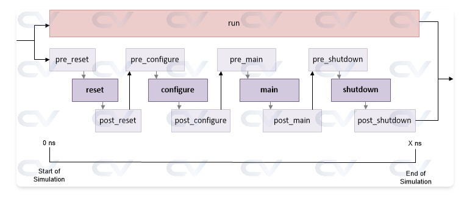
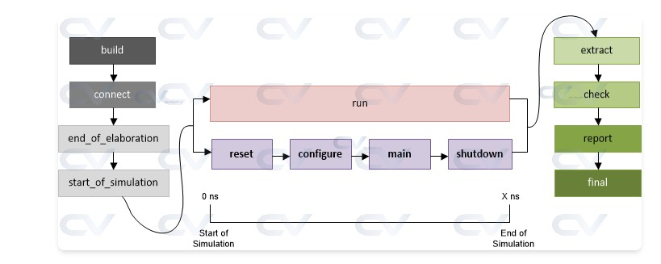
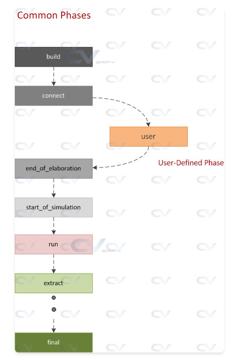
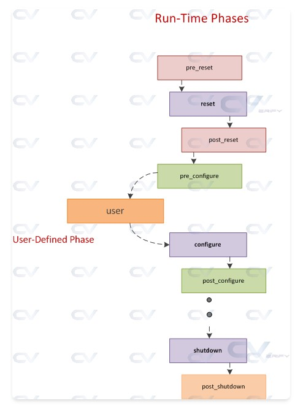

### 2026/2/10 learning Diary

今天進度少少

-----
-----

## 來到第四章 UVM phase


UVM 這一頁在講兩件事：  
1）`run_phase` 被切成 `reset/configure/main/shutdown` 等細部 phase 的時間線（第一張圖）；  
2）整個 simulation 從 `build→connect→run→extract/check/report/final` 的完整生命週期（第二張圖），以及每個 phase 應該做什麼。


## 1. 為什麼需要 UVM phases？

- 所有 testbench component 都繼承自 `uvm_component`，UVM 用一組固定順序的 phase callback 來同步它們的行為，每個 component 必須等所有人都完成當前 phase 才能進入下一個 phase。
- 不耗時間的工作用 **function phase**（如 `build`、`connect`、`extract`），會在 0ns 或 simulation 結束時執行；耗時間的刺激與監測在 **task phase** `run_phase` 裡執行，並行跑。
- SystemVerilog testbench 因為是物件化、可以在任意時間 new component，如果沒有這種同步機制，某個 component 可能還沒建立就被別人呼叫，導致結果不可靠。



## 2. `run_phase` 裡的一串小 phase（第一張圖）

第一張圖只畫 run 相關 phases：上面是整體 `run`，下面是一串 `reset→configure→main→shutdown`，每一段又有 `pre/post` 三個小 phase。

時間線從 0ns 到 Xns，大致流程：

- **pre_reset**  
  與 `run_phase` 同時開始，用來做 reset 前的準備，例如等待 power-good、clock 穩定。

- **reset**  
  真正產生 DUT reset、把介面拉回 default 狀態，例如把 reset 拉低 N 個 cycle 再釋放。

- **post_reset**  
  reset 完馬上要做的工作，例如檢查 DUT 是否真的回到已知狀態、清一些內部變數。

- **pre_configure**  
  reset 結束後、寫 register 之前的準備，例如計算接下來要 program 的值、打開一些 monitor。

- **configure**  
  對 DUT 與 testbench 做設定，如寫 register、下載 memory image，讓 DUT 進入 ready 狀態。

- **post_configure**  
  配置完成後的收尾，例如確認所有設定成功、更新 scoreboard 裡的 register model。

- **pre_main**  
  正式送 stimulus 前的準備，可以啟動 coverage、打開 checker。

- **main**  
  核心 phase：產生並送出 test case 的 stimulus、driver 驅動 DUT、monitor 收集資料，通常會搭配 objection 機制控制這一段的長度。

- **post_main**  
  `main` 結束後的一些收尾，例如等 pipeline 裡的資料完全送完、停止某些 background sequence。

- **pre_shutdown**  
  進入關機前的 buffer，還要送最後幾筆必要 stimulus（例如讀 status register）。

- **shutdown**  
  確保 `main_phase` 送到 DUT 的刺激都已經有結果產生並被 drain 出來，可以做最後一輪狀態讀取或訊號拉成 idle。

- **post_shutdown**  
  time‑consuming 的 run‑time 活動到這裡結束，做最後一點與時間相關的操作（例如關掉 clock 產生器）後，simulation 時間不再往前跑。

圖中上層長條「run」表示：`run_phase` 這個 task 會從模擬開始就存在，並與下面這一串小 phase 並行；小 phase 則是 run 裡細分出來給你 override 的 callback，方便精細控制 reset／配置／刺激／關機的流程。




## 3. build / run / clean-up 全流程（第二張圖）

第二張圖把所有 UVM phases 串成一張「從建構環境到收尾」的流程圖，分成三大類：Build phases、Run phase、Clean-up phases。

### Build-time phases（左邊灰色）

- **build_phase（function）**  
  自頂向下建立整個 testbench 階層：在 test 底下 create env，在 env 裡 create agent、driver、monitor、scoreboard 等，順便讀取／設定 `config_db` 參數。  
  由於環境是巢狀結構，要先有 test 才能有 env，再有 agent，所以 build 一定是 top‑down；ChipVerify 那個 topology 列表就是 build 完後的結果。

- **connect_phase（function）**  
  所有 component 都建好後，自底向上把 TLM port/export 連起來，例如 `monitor.analysis_port.connect(scoreboard.ap_imp);`。

- **end_of_elaboration_phase（function）**  
  在 simulation 開始前做最後的結構／連線／設定微調，也常用來 dump UVM 拓樸（`uvm_top.print_topology()`）。

- **start_of_simulation_phase（function）**  
  外部 simulator 已啟動，環境 ready，可在此設定初始 runtime config、放 debug breakpoint 或再印一次 topology。

### Run-time phase（中間粉紅＋紫色）

- **run_phase（task）**  
  唯一會消耗模擬時間的共通 phase，各 component 在這裡啟動 clock、reset driver、sequence、monitor 等，並行執行。  
  其內部依照前一節說的 `pre_reset/reset/…/shutdown/post_shutdown` 子 phase 依序進行，形成第一張圖那條時間線。

### Clean-up phases（右邊綠色）

- **extract_phase（function）**  
  當 DUT 不再需要被模擬、時間不再往前走時，從 scoreboard、coverage monitor 等收集資料、做統計，例如把 coverage 累計起來、整理 scoreboard 的預期／實際結果。

- **check_phase（function）**  
  在所有資料都抽取完後，檢查是否還有未處理的資料，根據 scoreboard 的結果判斷 test pass/fail。

- **report_phase（function）**  
  已經知道 pass/fail，在這裡印出總結、寫 log 檔或測試報告。

- **final_phase（function）**  
  完成最後的清理與關閉動作，例如關檔案、結束 co-simulation engine，準備結束 simulator。

圖中的箭頭表示：  
`build → connect → end_of_elaboration → start_of_simulation → run → extract → check → report → final`，除了 `run` 是耗時間、且各 component 並行外，其餘都是在 0ns 或模擬結束後依序呼叫的 function。


## 4. Verilog 為什麼不需要這麼多 phase？

- 傳統 Verilog testbench 組成是 static `module`：所有 module 在 time 0 就已經建立好，彼此用 wire 連接，不會在模擬中途 new 新 component，所以只要在 `initial` 裡自己排好 `reset → run → check` 的順序即可，不需要額外的 phasing 機制。
- SystemVerilog/UVM 則是物件導向、component 可以動態 new，也常常要把來自不同公司、不同架構的 VIP plug 在一起，因此需要一套共同遵守的 phase 流程，確保大家都先建好、再連線、再一起跑 stimulus、最後再一起收尾。


## 5. 每個 phase 應該做什麼（對照表重點）

ChipVerify 最後那張表是在回答「在每個 phase 建議做哪些事」：

- **build**：`new` 所有 `uvm_component`、建立 register model、從 `config_db` 取參數、把參數塞給子元件。  
- **connect**：連接所有 TLM port/export/socket，建立 register model 與 adapter 的連線，設定額外的 phase domain。  
- **end_of_elaboration**：環境架構已定型，可列印 topology、開檔案、做額外設定。  
- **start_of_simulation**：外部工具同步完成，可再印配置摘要、設定初始 runtime 參數。  
- **run**：視為「電源已上」，所有時序相關活動（reset、configure、stimulus、check）在這裡進行，直到 DUT 不必再被模擬。  
- **extract**：時間停止後，從 scoreboard、coverage 等收集資料、計算統計。  
- **check**：確認沒有漏掉的資料，並明確決定測試 pass 或 fail。  
- **report**：輸出結果（螢幕／檔案）。  
- **final**：最後清理關閉，退出模擬器。  

這樣就把兩張圖、程式碼中的 phase callback，以及頁面底下的說明全部串起來：先用 build 族群把環境建好、connect 好，run 裡再細分 `reset/configure/main/shutdown` 來跑實際測試，最後 `extract/check/report/final` 做收尾。


----
----

先從「Objection 怎麼工作＋方法＋最佳實務」這一大段講起；後面兩個 sequence 例子可以下一輪再拆。


## 1. 這一頁的核心問題：模擬什麼時候可以結束？

UVM testbench 裡很多 component 同時運作（driver、monitor、scoreboard、各種 sequence），但「誰」有資格說 `run_phase` 可以結束？  
UVM 的做法是：任何還在工作中的元件，都可以對當前 phase raise objection；只要還有人 `objection > 0`，phase 就不能結束。

概念上就是一個「共享計數器」：

- 每個 task 型 phase（`run_phase`、`reset_phase`、`main_phase` 等）各自有一個 `uvm_objection` 物件。
- 某個元件開始一段需要完成的活動時，呼叫 `phase.raise_objection(this)` → 計數加 1。
- 完成後呼叫 `phase.drop_objection(this)` → 計數減 1。
- 只有計數變回 0 並且 drain time 結束後，這個 phase 才能往下走。


## 2. Objection 的典型用法（Usecase）

頁面先給一個 test 裡的簡化例子，邏輯是：

```systemverilog
class my_test extends uvm_test;
   `uvm_component_utils(my_test)

   function new(string name="my_test", uvm_component parent=null);
     super.new(name, parent);
   endfunction

   virtual task main_phase(uvm_phase phase);
      my_virtual_seq m_vseq = my_virtual_seq::type_id::create("m_vseq");

      // 1) 宣告「我有事要做」
      phase.raise_objection(this);
      super.main_phase(phase);

      // 2) 在 main_phase 裡啟動 virtual sequence，送 stimulus
      m_vseq.start(m_env.m_vseqr);

      // 3) 事情做完，放下手
      phase.drop_objection(this);
   endfunction
endclass
```

關鍵點：

- 這裡用的是 `main_phase`，但概念跟 `run_phase` 一樣：在 phase 開始時 raise、結束時 drop。  
- 只要 `my_test` 沒 drop objection，`main_phase` 就不會結束，即使時間已經跑到很後面。  
- 真正在送 stimulus 的工作在 `m_vseq.start()` 裡；objection 只是「幫這段工作撐住 phase 不要結束」。


## 3. 三個關鍵方法：raise / drop / set_drain_time

### 3.1 `raise_objection`

宣告「這個 phase 先不要結束，我這裡還在忙」：

```systemverilog
function void uvm_phase::raise_objection (uvm_object obj,
                                          string description = "",
                                          int    count = 1);
```

- `obj`：通常填 `this`，代表是哪個物件在舉手。
- `description`：強烈建議要寫，方便日後 debug 掛住的模擬。
- `count`：一次加多少（幾乎都是 1）。

呼叫後會發生兩件事：

1. 當前 phase 的 objection 計數 +1。  
2. 這個 raise 會沿著元件階層往上 propagate，讓 env、test、`uvm_top` 的總計數也加上對應的值（方便全域統計）。

### 3.2 `drop_objection`

宣告「我這邊的活動已經結束，可以少算一個人」：

```systemverilog
function void uvm_phase::drop_objection (uvm_object obj,
                                         string description = "",
                                         int    count = 1);
```

- 必須跟先前的 raise 配對；多 raise 少 drop 會讓 phase 永遠不結束。
- 當 phase 的本地計數被扣到 0，就會觸發「all_dropped」事件，準備結束該 phase（但還要考慮 drain time）。

### 3.3 `set_drain_time`

處理「in‑flight 交易」的緩衝時間：

```systemverilog
function void set_drain_time (uvm_object obj = null,
                              time        drain);
```

這是 `uvm_objection` 的方法，所以通常先拿到物件：

```systemverilog
uvm_objection obj = phase.get_objection();
obj.set_drain_time(this, 100ns);
```

意義是：當 count 降到 0 之後，再多等 `drain` 這麼久才真的把 phase 結束。  
如果在 drain_time 期間又有人 raise objection，就取消這一次的 drop，phase 繼續維持活動狀態。

典型用途：stimulus 停止後，DUT pipeline 還在吐最後幾筆資料，scoreboard 還要再吃幾個 cycle 才收完。


## 4. 常見地雷與最佳實務

### 4.1 常見問題：模擬永遠不結束

- 最典型情況：某個元件或 sequence `raise_objection()` 之後忘記 `drop_objection()`。  
- 另一個常見坑：對 sequence 開啟 automatic phase objection（後面會講），但 sequence `body()` 裡有 `forever` 迴圈，導致永遠不結束。

解法：

- 習慣在同一個 block 或同一條控制路徑裡寫 raise / drop，必要時用 try/finally 類似的結構（SystemVerilog 沒 finally，就用 `fork/join` 或把 if/else 走向檢查清楚）。  
- 用 `+UVM_OBJECTION_TRACE` 看是哪個物件 raise 了卻沒 drop（頁面後面的 log 就是在示範這個）。

### 4.2 哪些元件應該 raise objection？

建議只在高階元件 raise/drop：

- top-level test；
- top-level virtual sequence；
- 有時 scoreboard（因為它知道最後一筆 response 什麼時候到）。

Passive 的 monitor 通常不 raise objection，只負責收資料。  
agent 若是 passive（只有 monitor）也不需要參與 objection。  

這樣可以避免大量小 component 都在 raise/drop，增加複雜度與 trace 噪音。

### 4.3 其它輔助機制

- **Drain time**：上面已說，只在頂層或 env 這種地方設定即可，不要到處亂設超長 drain time。  
- **Callbacks**：要對 objection 行為做細緻控制時，可以用 `uvm_callbacks_objection`／`uvm_objection_callback`（例如在 all_dropped 觸發時做額外動作）。  
- **Tracing**：  
  - `+UVM_OBJECTION_TRACE`：列出所有 raise/drop/all_dropped 事件、來源物件、描述、目前 count。  
  - `+UVM_PHASE_TRACE`：列出各 phase 進入／離開時間，搭配 objection trace 看 phase 為何卡住。  
- **強制結束**：如果真的卡住，可用 `phase.get_objection().clear()`、`uvm_heartbeat` 或 `uvm_report_fatal` 強制中止模擬。


----
----


這組程式就是在刻意做一個「test 也 raise objection、driver 也 raise objection」的環境，然後讓你看到為什麼 sequence 在 200ns 結束，整個模擬卻拖到 400ns 才結束。下面照階層＋時間來看。


## 1. 結構：誰在 TB 裡？

從下往上看：

- `my_driver`：真正會 `raise_objection`、`drop_objection` 的 driver。  
- `my_agent`：裡面只有一個 `m_driver`。  
- `my_vseqr`：空的虛擬 sequencer，方便 sequence 有個 sequencer 可以掛。  
- `my_env`：同時包含 `m_agent` 和 `m_vseqr`。  
- `my_seq`：只做 200ns delay 的簡單 sequence。  
- `my_test`：建 env，啟動 sequence，同時自己也 raise/drop objection。  
- `tb` module：產生 clock，呼叫 `run_test("my_test")`。

所以 UVM 階層大概是：

```text
uvm_top
  uvm_test_top (my_test)
    m_env (my_env)
      m_agent (my_agent)
        m_driver (my_driver)
      m_vseqr (my_vseqr)
```


## 2. driver：在 run_phase 裡撐 400ns

```systemverilog
class my_driver extends uvm_driver;
  ...

  virtual task run_phase(uvm_phase phase);
    uvm_objection  l_obj = phase.get_objection();
    `uvm_info(..., "Driver started", ...)

    phase.raise_objection(this);
    #400;
    phase.drop_objection(this);
    l_obj.display_objections();

    `uvm_info(..., "Driver ended", ...)
  endtask
endclass
```

重點：

- 一進 `run_phase` 就拿到 phase 對應的 objection 物件 `l_obj`。  
- 立刻 `phase.raise_objection(this);`：代表「driver 有事要做，run phase 不能結束」。  
- `#400;` 之後才 `phase.drop_objection(this);`，最後用 `display_objections()` 印出目前 objection 狀態。  
- 這就是 log 裡 0ns 時 driver raise、400ns 才 drop 的那一串訊息來源。

在實際專案裡 driver 通常不會自己 raise objection，這裡純粹是為了示範。


## 3. agent / env：只是把 driver / vseqr 建起來

```systemverilog
class my_agent extends uvm_agent;
  my_driver m_driver;
  ...
  virtual function void build_phase(uvm_phase phase);
    super.build_phase(phase);
    m_driver = my_driver::type_id::create("m_driver", this);
  endfunction
endclass
```

```systemverilog
class my_env extends uvm_env;
  my_vseqr m_vseqr;
  my_agent m_agent;
  ...
  virtual function void build_phase(uvm_phase phase);
    super.build_phase(phase);
    m_agent = my_agent::type_id::create("m_agent", this);
    m_vseqr = my_vseqr::type_id::create("m_seqr", this);
  endfunction
endclass
```

- `build_phase` 只做 factory create，不牽涉 objection。  
- 這兩個 class 會在 log 裡出現，是因為 objection 會「沿著階層往上累加」，但它們本身沒有呼叫 raise/drop。


## 4. sequence：200ns 的活動

```systemverilog
class my_seq extends uvm_sequence;
  ...
  virtual task body();
    `uvm_info(..., "Sequence started", ...)
    #200;
    `uvm_info(..., "Sequence ended", ...)
  endtask
endclass
```

- 沒有任何 objection 操作，只是 200ns 的延遲。  
- 在 log 裡你會看到 0ns「Sequence started」、200ns「Sequence ended」，但 objection count 在 200ns 還是 2，因為 test 和 driver 的 objection 都還在。


## 5. test：真正控制整個 run 結束時間的人之一

```systemverilog
class my_test extends uvm_test;
  my_env m_env;

  virtual function void build_phase(uvm_phase phase);
    super.build_phase(phase);
    m_env = my_env::type_id::create("m_env", this);
  endfunction

  virtual task run_phase(uvm_phase phase);
    my_seq l_seq = my_seq::type_id::create("my_seq");
    uvm_objection l_obj = phase.get_objection();

    super.run_phase(phase);

    // 1) test raise objection
    phase.raise_objection(this);
    l_obj.display_objections();

    // 2) 啟動 sequence，跑 200ns
    l_seq.start(m_env.m_vseqr);
    l_obj.display_objections();

    // 3) sequence 結束後，test drop objection
    phase.drop_objection(this);
  endtask
endclass
```

逐段對 log 的影響：

1. `phase.raise_objection(this);`  
   - 產生 log：`Object uvm_test_top raised 1 objection(s)`，`uvm_top total=1`。  
   - 這就是你 log 一開始那幾行。  
2. `l_seq.start(...)`  
   - 0ns 時印「Sequence started」，200ns 印「Sequence ended」。  
   - 期間 objection 計數 **不變**，一直是 test=1、driver=1。  
3. `phase.drop_objection(this);`  
   - 200ns 時 test 把自己的 objection 放下，log 顯示 `uvm_test_top dropped 1 objection(s)`，整體 total 從 2 降到 1。  
   - 但 driver 那邊還沒 drop，所以 run phase 不能結束。


## 6. tb module：只是啟動 UVM

```systemverilog
module tb;
  reg clk;
  always #10 clk = ~clk;

  initial begin
    clk = 0;
    run_test("my_test");
  end
endmodule
```

- `run_test("my_test")` 讓 UVM 建 `my_test`，再從 `build_phase` → `run_phase` 走完整個 lifecycle。  
- clock 在這裡只是讓模擬時間流動（雖然這個例子裡沒有真的用到 clk）。


## 7. 對照時間點再看一次

把程式跟你那份 log 合在一起看：

- 0ns  
  - `my_test.run_phase` 開始，`phase.raise_objection(this);` → test 的 objection=1。  
  - `my_driver.run_phase` 也開始，`phase.raise_objection(this);` → driver 的 objection=1。  
  - 總 objection=2。  

- 0–200ns  
  - `my_seq.body()` 在跑（delay 200ns）。  
  - test 和 driver 的 objection 都還沒 drop → run phase 絕對不會結束。  

- 200ns  
  - sequence 印「Sequence ended」。  
  - `my_test` 的 `phase.drop_objection(this);` 執行，test 的 objection=0，但 driver 的還是 1，總數=1。  

- 200–400ns  
  - driver 的 `#400` delay 還沒結束 → objection 仍為 1。  

- 400ns  
  - driver 的 `phase.drop_objection(this);` 執行，整條階層（agent/env/test/top）的 total objection 全部扣回 0。  
  - UVM 印出 `[TEST_DONE] 'run' phase is ready to proceed to the 'extract' phase`，run phase 正式結束。  

所以這份 code 的教學重點就是：

- 只要 **有任一 component 還沒 drop objection**，整個 phase 就會被「撐住」不結束。  
- 你可以透過 `phase.get_objection().display_objections();` 或 `+UVM_OBJECTION_TRACE` 來看到「是誰」還在舉手沒放下。


----
----


## 0ns：test raise objection，總數 = 1

```text
UVM_INFO @ 0: reporter [RNTST] Running test my_test...
UVM_INFO @ 0: run [OBJTN_TRC] Object uvm_test_top raised 1 objection(s): count=1  total=1
UVM_INFO @ 0: run [OBJTN_TRC] Object uvm_top added 1 objection(s) to its total (raised from source object uvm_test_top): count=0  total=1
```

- `uvm_test_top` 是你的 `my_test` 物件。它在 `run_phase` 一開始呼叫 `phase.raise_objection(this);`。  
  - 對 `uvm_test_top` 這個 objection 來說：`count=1 total=1`。  
- Objection 會**沿階層往上加總**到 `uvm_top`：所以 `uvm_top` 的 total 也變 1。  

接著這行：

```text
The total objection count is 1
Source  Count  Total Count  Object
0       1      uvm_top
1       1        uvm_test_top
```

- `Source Count`：本地自己 raise 了幾次。  
- `Total Count`：包含子階層加總之後的數字。  
- 目前只有 test raise 1 次，所以 total=1。

> 到目前為止：**整個系統 objection 總數 = 1（只來自 test）。**


## 0ns：driver 也 raise objection，總數 = 2

```text
UVM_INFO testbench.sv(14) @ 0: ... [my_driver] Driver started
UVM_INFO @ 0: run [OBJTN_TRC] Object ...m_driver raised 1 objection(s): count=1  total=1
UVM_INFO @ 0: run [OBJTN_TRC] Object ...m_agent added 1 objection(s) to its total ...: count=0  total=1
UVM_INFO @ 0: run [OBJTN_TRC] Object ...m_env added 1 objection(s) ... total=1
UVM_INFO @ 0: run [OBJTN_TRC] Object uvm_test_top added 1 objection(s) ...: count=1  total=2
UVM_INFO @ 0: run [OBJTN_TRC] Object uvm_top added 1 objection(s) ...: count=0  total=2
```

- `my_driver.run_phase()` 一開始也 `phase.raise_objection(this);`。  
- 這個 raise 往上 propagate：driver → agent → env → `uvm_test_top` → `uvm_top`。  
- 所以：  
  - `m_driver` 的 `count=1 total=1`（它自己 raise 一次）；  
  - `m_agent`、`m_env` 各自多 1；  
  - `uvm_test_top` 的總數從 1 變 2（test 自己 1 + driver 那邊 1）；  
  - `uvm_top` 總數也變 2。

200ns 前的總表：

```text
The total objection count is 2

Source  Count  Total Count  Object
0       2      uvm_top
1       2        uvm_test_top
0       1          m_env
0       1            m_agent
1       1              m_driver
```

解讀：

- `uvm_test_top`：自己 raise 1（test），但 total=2（下面還有 driver 那一個）。  
- `m_driver`：自己 raise 1，total=1（下面沒有子物件）。  

> 此時：**整個系統 objection 總數 = 2（test 1 + driver 1），所以 run phase 絕對不能結束。**


## 200ns：test drop objection，總數從 2 變 1

```text
UVM_INFO testbench.sv(82) @ 0: ... [my_seq] Sequence started
UVM_INFO testbench.sv(84) @ 200: ... [my_seq] Sequence ended
...
UVM_INFO @ 200: run [OBJTN_TRC] Object uvm_test_top dropped 1 objection(s): count=0  total=1
UVM_INFO @ 200: run [OBJTN_TRC] Object uvm_top subtracted 1 objection(s) from its total (dropped from source object uvm_test_top): count=0  total=1
```

- sequence 在 200ns 結束後，`my_test.run_phase()` 裡呼叫 `phase.drop_objection(this);`。  
- 對 `uvm_test_top`：自己的 `count` 從 1→0，`total` 從 2→1（因為 driver 那一個還在）。  
- 對 `uvm_top`：total 從 2→1（driver 還沒 drop）。  

再看那張表：

```text
The total objection count is 2
...
0 2 uvm_top
1 2   uvm_test_top
0 1     m_env
0 1       m_agent
1 1         m_driver
```

這是 drop 前的快照，後面的兩行 log 才把 total 減到 1。重點是：**即使 test 已經 drop，自身 count=0，但因為 driver 還有 1，整體 objection 仍然非 0，所以 run phase 還不能結束。**


## 400ns：driver drop objection，總數從 1 變 0

```text
UVM_INFO @ 400: run [OBJTN_TRC] Object ...m_driver dropped 1 objection(s): count=0  total=0
UVM_INFO /.../uvm_objection.svh(1072) @ 400: run [UVM/OBJ/DISPLAY] The total objection count is 1
...
0 1 uvm_top
0 1   uvm_test_top
0 1     m_env
0 1       m_agent
```

這兩段要分開看：

1. 第一行：  
   - 對「driver 那個 objection 物件」來說，它本地 count=0 total=0。  

2. 接著那張「total 1」的表：  
   - 這是 **還沒往上扣** 之前的 snapshot：上層（agent/env/test/top）各自 total 仍然是 1。  

接著是關鍵的 all_dropped 事件：

```text
UVM_INFO ... [my_driver] Driver ended
UVM_INFO @ 400: run [OBJTN_TRC] Object ...m_driver all_dropped 1 objection(s): count=0  total=0
UVM_INFO @ 400: run [OBJTN_TRC] Object m_agent subtracted 1 objection(s) ...: count=0  total=0
UVM_INFO @ 400: run [OBJTN_TRC] Object m_env   subtracted 1 objection(s) ...: count=0  total=0
UVM_INFO @ 400: run [OBJTN_TRC] Object uvm_test_top subtracted 1 objection(s) ...: count=0  total=0
UVM_INFO @ 400: run [OBJTN_TRC] Object uvm_top      subtracted 1 objection(s) ...: count=0  total=0
UVM_INFO ... [TEST_DONE] 'run' phase is ready to proceed to the 'extract' phase
```

- `all_dropped` 代表：這個 source（driver）相關的 objection **整條階層都扣完了**。  
- UVM 會從 driver 往上一路把 `total` 減掉：agent→env→test→top。  
- 現在：  
  - driver：count=0 total=0  
  - test：count=0 total=0（自己的早在 200ns 就 0）  
  - `uvm_top`：total=0  

當整個 phase 的 total objection 變成 0，UVM 印出：

```text
[TEST_DONE] 'run' phase is ready to proceed to the 'extract' phase
```

**這一刻起，run phase 才真的可以結束，進入 extract/check/report。**


## 整體時間線總結（重點）

| 時間 | 誰在做什麼 | 整體 total objection | 能不能結束 run? |
|------|------------|----------------------|-----------------|
| 0ns  | test raise | 1（只來自 test）    | 不行            |
| 0ns  | driver raise | 2（test + driver） | 不行            |
| 0–200ns | sequence 在跑 | 2                | 不行            |
| 200ns | sequence 結束，test drop | 從 2 降為 1（只剩 driver） | 不行 |
| 200–400ns | driver 還在 delay | 1 | 不行 |
| 400ns | driver drop & all_dropped | 從 1 降為 0 | **可以**，run phase 結束 |

所以你看到：sequence 200ns 就結束了，但模擬要拖到 400ns 才跳到 extract phase，就是因為 driver 還握著 objection 沒放手。


----
----


## 一、在 sequence 裡手動 raise/drop objection

### 1. 程式結構

先是一個簡單的 transaction：

```systemverilog
class my_seq_item extends uvm_sequence_item;
  rand bit [3:0] data;

  `uvm_object_utils_begin (my_seq_item)
    `uvm_field_int(data, UVM_ALL_ON)
  `uvm_object_utils_end

  function new (string name = "my_seq_item");
    super.new(name);
  endfunction
endclass
```

再來是一個會自己 raise/drop objection 的 sequence：

```systemverilog
class my_sequence extends uvm_sequence #(my_seq_item);
  `uvm_object_utils (my_sequence)

  rand int num_items = 5;
  constraint c_num_items { num_items > 0; num_items <= 20; }

  function new (string name = "my_sequence");
    super.new(name);
  endfunction

  virtual task body();
    // 1) 找到這個 sequence 是在「哪個 phase」被啟動
    uvm_phase phase = get_starting_phase();

    // 2) 如果有 phase，就在 phase 上 raise objection
    if (phase != null) begin
      phase.raise_objection(this, "Sequence generating stimulus");
    end

    // 3) 真正的活動：送 num_items 筆交易
    repeat (num_items) begin
      my_seq_item tx;
      `uvm_do (tx)
      #10;
    end

    // 4) 活動結束，drop objection
    if (phase != null) begin
      phase.drop_objection(this, "Sequence finished stimulus generation");
    end
  endtask
endclass
```

重點：

- `get_starting_phase()` 會回傳「這個 sequence 被啟動時所屬的 phase」（例如 `run_phase` 或 `main_phase`）。  
- 只有 `phase != null` 時才 raise/drop，避免序列被「手動啟動但沒設定 phase」時出錯。  
- `raise_objection(this, "...")`：讓目前 phase 的 objection 計數 +1。  
- 送完所有 item 後 `drop_objection(this, "...")`：計數 -1，若變 0 則 phase 可以結束。

### 2. 對照 log

```text
UVM_INFO @ 0: reporter [RNTST] Running test my_test...
UVM_INFO testbench.sv(64) @ 0: uvm_test_top [my_test] my_test started
UVM_INFO @ 0: run [OBJTN_TRC] Object l_seq raised 1 objection(s) (Sequence generating stimulus): count=1  total=1
UVM_INFO @ 0: run [OBJTN_TRC] Object uvm_top added 1 objection(s) to its total (raised from source object l_seq, Sequence generating stimulus): count=0  total=1
...
UVM_INFO @ 50: run [OBJTN_TRC] Object l_seq dropped 1 objection(s) (Sequence finished stimulus generation): count=0  total=0
UVM_INFO @ 50: run [OBJTN_TRC] Object l_seq all_dropped 1 objection(s) (Sequence finished stimulus generation): count=0  total=0
UVM_INFO @ 50: run [OBJTN_TRC] Object uvm_top subtracted 1 objection(s) from its total (...) : count=0  total=0
UVM_INFO /.../uvm_objection.svh(...) @ 50: reporter [TEST_DONE] 'run' phase is ready to proceed to the 'extract' phase
UVM_INFO testbench.sv(69) @ 50: uvm_test_top [my_test] my_test ended
```

- 0ns：`my_sequence.body()` 一開始找到 `phase`，呼叫 `phase.raise_objection(this, "Sequence generating stimulus")`。  
  - log 說 `Object l_seq raised 1 objection(s)`；  
  - `uvm_top total` 也變 1（objection 往上加總）。  
- 約 50ns：sequence 發完所有 item，呼叫 `phase.drop_objection(this, ...)`。  
  - `l_seq dropped ...`，自已的 count=0 total=0；  
  - `all_dropped` 事件觸發，`uvm_top` 的 total 也被扣回 0。  
- 當 total 變成 0，objection 機制認為 run phase 可以結束，所以印出 `TEST_DONE`，test 在 50ns 結束。

這個例子展示的是：「**由 sequence 本人負責撐住 phase**」，只要 sequence 沒做完、objection 沒 drop，phase 就不會結束。

----
----


## 二、使用自動 objection 的 sequence

這個例子想表達：很多時候 sequence 的整個 `body()` 就代表一段完整活動，因此可以讓 UVM 自動幫你在開始／結束時 raise/drop objection，不用自己寫那兩行。

### 1. 程式結構

transaction 類似，就不多說。

自動 objection 的 sequence：

```systemverilog
class my_auto_sequence extends uvm_sequence #(my_seq_item);
  `uvm_object_utils (my_auto_sequence)

  rand int num_items = 5;
  constraint c_num_items { num_items > 0; num_items <= 20; }

  function new (string name = "my_auto_sequence");
    super.new(name);
    // 這一行打開「自動 phase objection」
    set_automatic_phase_objection(1);
  endfunction

  virtual task body();
    `uvm_info (get_type_name(), $sformatf("sequence started"), UVM_MEDIUM)

    // 這裡沒有任何 raise/drop 呼叫
    repeat (num_items) begin
      #10;
    end

    `uvm_info (get_type_name(), $sformatf("sequence ended"), UVM_MEDIUM)
  endtask
endclass
```

test 用法：

```systemverilog
class my_test extends uvm_test;
  `uvm_component_utils(my_test)

  function new(string name="my_test", uvm_component parent=null);
    super.new(name, parent);
  endfunction

  virtual task run_phase(uvm_phase phase);
    my_auto_sequence l_seq = my_auto_sequence::type_id::create("l_seq");

    super.run_phase(phase);
    `uvm_info(get_type_name(), $sformatf("my_test started"), UVM_MEDIUM)

    // 告訴 sequence：「你是跑在這個 phase 裡」
    l_seq.set_starting_phase(phase);
    // 然後啟動它
    l_seq.start(null);

    `uvm_info(get_type_name(), $sformatf("my_test ended"), UVM_MEDIUM)
  endtask
endclass
```

關鍵點：

- `set_automatic_phase_objection(1)`：  
  - 當 sequence 開始執行時（在 pre_start 之前），UVM 會自動 **raise objection**；  
  - 在 sequence 結束後（post_start 之後），UVM 會自動 **drop objection**。  
- 要讓自動 objection 知道「是哪個 phase」，必須在啟動前呼叫 `l_seq.set_starting_phase(phase);`。  

這樣 `body()` 裡就不必寫任何 raise/drop 相關 code，比較乾淨。

### 2. 對照 log

```text
UVM_INFO @ 0: reporter [RNTST] Running test my_test...
UVM_INFO testbench.sv(57) @ 0: uvm_test_top [my_test] my_test started
UVM_INFO @ 0: run [OBJTN_TRC] Object l_seq raised 1 objection(s) (automatic phase objection): count=1  total=1
UVM_INFO @ 0: run [OBJTN_TRC] Object uvm_top added 1 objection(s) to its total (raised from source object l_seq, automatic phase objection): count=0  total=1
UVM_INFO testbench.sv(34) @ 0: reporter@@l_seq [my_auto_sequence] sequence started
UVM_INFO testbench.sv(42) @ 50: reporter@@l_seq [my_auto_sequence] sequence ended
UVM_INFO @ 50: run [OBJTN_TRC] Object l_seq dropped 1 objection(s) (automatic phase objection): count=0  total=0
UVM_INFO @ 50: run [OBJTN_TRC] Object l_seq all_dropped 1 objection(s) (automatic phase objection): count=0  total=0
UVM_INFO @ 50: run [OBJTN_TRC] Object uvm_top subtracted 1 objection(s) from its total (...) : count=0  total=0
UVM_INFO /.../uvm_objection.svh(1271) @ 50: reporter [TEST_DONE] 'run' phase is ready to proceed to the 'extract' phase
UVM_INFO testbench.sv(62) @ 50: uvm_test_top [my_test] my_test ended
```

- 0ns：  
  - `my_test.run_phase` 裡 `l_seq.set_starting_phase(phase);` 之後 `l_seq.start(null);`；  
  - 由於 sequence 設了 `set_automatic_phase_objection(1)`，UVM 自動替 `l_seq` 呼叫 `phase.raise_objection(l_seq, "automatic phase objection")`；  
  - log 顯示 `Object l_seq raised 1 objection(s) (automatic phase objection)`。  
- 接著 sequence 印「sequence started」，跑 `repeat(num_items) #10`。  
- 50ns 左右：sequence 結束，UVM 自動幫它 `drop_objection()`：  
  - `l_seq dropped ...`，再 `all_dropped ...`，`uvm_top total` 也扣回 0。  
- total 變 0 後，run phase 被判定可以結束，印出 `TEST_DONE`，test 也在 50ns 結束。

這個例子展示的是：「**由 sequence 自動管理 objection**」，你只要設定 starting_phase 和 automatic_phase_objection 就好。


## 三、兩種方式何時用哪一種？

- **手動 raise/drop（第一個例子）適合：**  
  - 你只想在 `body()` 某一段時間內撐住 phase（例如先做一段 init，再送刺激，再做 clean‑up）；  
  - 或是 sequence 不是整個 phase 的唯一活動，要精細控制 objection 何時開始、何時結束。

- **自動 objection（第二個例子）適合：**  
  - 這個 sequence 的整個 `body()` 就代表一段連續的 test activity；  
  - 想減少樣板 code，只要記得設定 `set_starting_phase()` ＋ `set_automatic_phase_objection(1)`。

不管哪一種方式，log 的解讀邏輯都一樣：  
誰 raise，就會在 `OBJTN_TRC` log 裡看到那個 object 的 `count/total` 變化，直到最後 `total` 回到 0，phase 才會跳到下一個階段。


----
----


這一頁在教你「怎麼自己插一個 user‑defined phase 進 UVM 的 phase 流程」，兩張圖剛好對應兩種插法：一張是插在 run‑time phases（pre_reset～shutdown）之間，一張是插在 common phases（build～final）之間。


## 1. 為什麼要自訂 phase？圖在說什麼？

有時你想要一個額外的階段來做特定動作，例如：

- 在 `connect` 之後、`run` 之前跑一些初始化 script。
- 在 `pre_configure` 和 `configure` 之間打開某些 monitor。

UVM 允許你把自己的 phase（圖中的 `user` 橘色方塊）插進現有流程。

兩張圖的含意：

- Run‑Time Phases 圖：橘色 `user` 被放在 `pre_configure` 和 `configure` 之間，還示意也可以放別的位置（虛線箭頭）。
- Common Phases 圖：橘色 `user` 放在 `connect` 和 `end_of_elaboration` 之間，整個順序變成：`build → connect → user → end_of_elaboration → ... → final`。

後面的程式就是實作「在 common phases 裡的 `connect` 之後插入一個 `user_phase`」。


## 2. Step1：建立自訂 phase 類別 `uvm_user_phase`

```systemverilog
class uvm_user_phase extends uvm_task_phase;

   // 建構子：name 不用帶 uvm/phase 字樣
   protected function new(string name="post_run");
      super.new(name);
   endfunction

   // 標準的 type_name 寫法
   static const string type_name = "uvm_user_phase";
   virtual function string get_type_name();
      return type_name;
   endfunction

   // 這個 phase 要做的事：呼叫 test 裡的 post_run_phase()
   virtual task exec_task(uvm_component comp, uvm_phase phase);
      my_test TEST;
      if ($cast(TEST, comp))
         TEST.post_run_phase (phase);
   endtask

   // singleton 物件
   local static uvm_user_phase m_inst;

   static function uvm_user_phase get();
      if(m_inst == null)
         m_inst = new;
      return m_inst;
   endfunction
endclass
```

重點：

- `extends uvm_task_phase`：表示這是一個會消耗時間的 phase，行為類似 `run_phase`、`reset_phase`。（如果是只做 0ns 內的設定，就用 `uvm_topdown_phase` 或 `uvm_bottomup_phase` 搭配 `exec_func()`。）  
- `exec_task(uvm_component comp, uvm_phase phase)`：  
  - 每個 component 在這個 phase 裡都會被呼叫一次 `exec_task()`。  
  - 這裡只對型別是 `my_test` 的 component 有動作：`TEST.post_run_phase(phase);`。  
  - 也就是說，真正的 user phase 行為寫在 test 裡的 `post_run_phase()`。  
- singleton `get()`：方便之後插入到 domain 時，大家用 `uvm_user_phase::get()` 取得同一個 phase 物件。


## 3. Step2：把新 phase 插進排程（common domain）

在 UVM 裡，phase 是掛在「domain」上的。常用的兩個是：

- `uvm_domain::get_common_domain()`：包含 `build`、`connect`、`end_of_elaboration`、`start_of_simulation`、`run`、`extract`、`check`、`report`、`final`。
- `uvm_domain::get_uvm_domain()`：包含 `reset/configure/main/shutdown` 那一串 run‑time phases。

這個例子要插在 common phases 的 `connect` 後面，所以用 common domain：

```systemverilog
class my_test extends uvm_test;
  ...

  // 把 user phase 插到 connect 後面
  virtual function void add_my_phase ();
    uvm_domain dm = uvm_domain::get_common_domain();
    uvm_phase  ph = dm.find(uvm_connect_phase::get());
    dm.add (uvm_user_phase::get(), null, ph, null);
  endfunction

  function new (string name = "my_test", uvm_component parent);
    super.new (name, parent);
    add_my_phase();
  endfunction
  ...
endclass
```

`dm.add()` 的四個參數（簡化理解）：

- 第一個：要加入的 phase（`uvm_user_phase::get()`）。
- 第二個、第四個：before / with phase，這裡設 `null`。
- 第三個：`after_phase`，這裡用 `ph = uvm_connect_phase`，表示「插在 `connect` 之後」。

所以最終 common phases 順序變成：

```text
build → connect → user_phase → end_of_elaboration → start_of_simulation → run → extract → ... → final
```

對應到你貼的第二張圖：橘色 `user` 在 `connect` 和 `end_of_elaboration` 之間。





如果你想把自訂 phase 插在 run‑time phases，就會改成：

```systemverilog
uvm_domain dm = uvm_domain::get_uvm_domain();
uvm_phase  ph = dm.find(uvm_pre_configure_phase::get());
dm.add(uvm_user_phase::get(), null, ph, null);
```

那就對應到第一張圖：`user` 在 `pre_configure` 之後。





## 4. Step3：在 test 裡真的使用這個 phase

在 `my_test` 裡，作者會 override 各個 phase 的 method 來印訊息，包含自己定義的 `user_phase`：

```systemverilog
class my_test extends uvm_test;
  ...
  // UVM 內建 phase
  virtual task build_phase(uvm_phase phase);
    `uvm_info("TEST", $sformatf("In %s phase", phase.get_name()), UVM_MEDIUM)
  endtask

  virtual task connect_phase(uvm_phase phase);
    `uvm_info("TEST", $sformatf("In %s phase", phase.get_name()), UVM_MEDIUM)
  endtask

  virtual task run_phase(uvm_phase phase);
    `uvm_info("TEST", $sformatf("In %s phase", phase.get_name()), UVM_MEDIUM)
  endtask

  virtual task extract_phase(uvm_phase phase);
    `uvm_info("TEST", $sformatf("In %s phase", phase.get_name()), UVM_MEDIUM)
  endtask

  virtual task final_phase(uvm_phase phase);
    `uvm_info("TEST", $sformatf("In %s phase", phase.get_name()), UVM_MEDIUM)
  endtask

  // 這個是配合 uvm_user_phase.exec_task() 呼叫的「自訂 method」
  virtual task post_run_phase(uvm_phase phase);
    user_phase(phase); // 或直接在這裡寫 log
  endtask

  // 真正 user phase 的內容
  virtual task user_phase (uvm_phase phase);
    `uvm_info ("TEST", $sformatf ("In %s phase", phase.get_name()), UVM_MEDIUM)
  endtask
endclass
```

在 `uvm_user_phase.exec_task()` 裡：

```systemverilog
if ($cast(TEST, comp))
  TEST.post_run_phase(phase);
```

意味著：當 phase scheduler 在 `user` phase 走訪到 `uvm_test_top`（也就是 `my_test`）時，會呼叫 `post_run_phase()`，進而印出 `In user_phase`。  
其他不是 `my_test` 的 component，就不會做事。

---

## 5. 對照輸出 log 看順序

```text
UVM_INFO @ 0: reporter [RNTST] Running test my_test...
UVM_INFO tb_top.sv(42) @ 0: uvm_test_top [TEST] In build_phase
UVM_INFO tb_top.sv(47) @ 0: uvm_test_top [TEST] In connect_phase
UVM_INFO tb_top.sv(66) @ 0: uvm_test_top [TEST] In user_phase
UVM_INFO tb_top.sv(57) @ 0: uvm_test_top [TEST] In run_phase
UVM_INFO tb_top.sv(62) @ 0: uvm_test_top [TEST] In extract_phase
UVM_INFO tb_top.sv(71) @ 0: uvm_test_top [TEST] In final_phase
```

解讀：

- `In build_phase`：common phases 的第一個。
- `In connect_phase`：第二個。
- `In user_phase`：這就是我們插入的 `uvm_user_phase`，證明它確實被排在 `connect` 之後。
- 接著照內建順序往下：`run_phase → extract_phase → final_phase`。

這正好對應到第二張圖那串箭頭。


## 6. 小結：自訂 phase 的三步驟

1. **寫一個 phase 類別**
   - 繼承 `uvm_task_phase` 或 `uvm_topdown_phase` / `uvm_bottomup_phase`。
   - 實作 `exec_task()` 或 `exec_func()`，裡面決定這個 phase 對每個 component 要做什麼。
   - 做成 singleton，用 `get()` 取得同一顆 phase。

2. **把 phase 插進某個 domain 的排程中**
   - `uvm_domain dm = uvm_domain::get_common_domain();` 或 `get_uvm_domain();`
   - `uvm_phase ph = dm.find(某個既有 phase::get());`
   - `dm.add(uvm_user_phase::get(), null, ph, null);` 把它插在該 phase 後面。

3. **在 component 裡 override 對應的 user method**
   - 例如在 test 裡實作 `user_phase()` 或 `post_run_phase()`，讓 `exec_task()` 轉呼叫進來。

圖和程式合在一起看，就是：你把一個橘色「user」方塊插進原來灰色／粉紅色 phase 流程中，然後在 test 裡寫好「走到橘色框時要做什麼」，UVM phase scheduler 就會照新的順序去呼叫這些 phase。
