### 2026/2/11 learning Diary


## 來到第五章 UVM sequence

----
----


這一頁在介紹「UVM sequence」是什麼、它在類別階層裡的位置，以及實際要怎麼寫一個自己的 sequence，並用 UART testbench 圖來說明它在整個 UVM 架構中的角色。


## 1. 什麼是 UVM sequence？
- sequence 本身是一個 **transaction 類別**（繼承自 `uvm_sequence_item`/`uvm_transaction`），裡面定義了「一連串要送出去的資料 item」，以及送出的順序、條件等情境。  
- 實際執行時，sequence 是跑在 **sequencer 上**，sequencer 再把一個個 item 交給 driver，driver 轉成 pin-level 信號送進 DUT，所以 sequence 就是整個 verification plan 的「刺激來源」。

對照你貼的第 2 張圖：左下橘色的 `sequence` 是在 `my_test` 裡被啟動，透過 `uart_sequencer` 把 transaction 一個一個發給 `uart_driver`，driver 再透過 Virtual Interface 去 drive UART IF 連到 DUT。

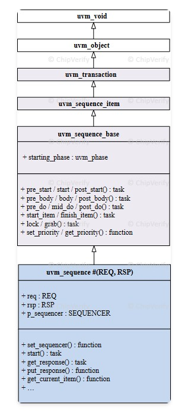

## 2. 類別階層圖在說什麼？
第一張圖是 UVM sequence 的 class hierarchy：  
- 最上面是 `uvm_void` → `uvm_object`：所有「UVM 物件」的共同祖先。  
- `uvm_transaction`：代表一次 bus 操作或封包資料，支援 record、比較、印出等功能。  
- `uvm_sequence_item`：一般我們寫的 packet class（例如 `uart_tx`、`axi_item`）會繼承自這個。  
- `uvm_sequence_base`：提供 sequence 共用的控制方法，例如 `start_item/finish_item`、`pre_start/start/post_start`、`lock/grab`、priority 相關函式等。  
- 最下面 `uvm_sequence #(REQ,RSP)`：是真正拿來繼承的 template 類別，可以指定 request/response type，並內建 `req`、`rsp` 變數與 `p_sequencer` 指標。

這張圖要強調兩點：  
1. sequence 不是 component，而是 object，所以要用 `uvm_object_utils`，不是 `uvm_component_utils`。  
2. sequence 身上已經有 `req`、`rsp` 這些欄位，可以用來收發 request/response transaction。


## 3. 建立一個自訂 UVM sequence 的三個步驟
### (1) 宣告 class，繼承 `uvm_sequence`
```systemverilog
class my_sequence extends uvm_sequence;

  `uvm_object_utils(my_sequence)

  function new(string name = "my_sequence");
    super.new(name);
  endfunction

endclass
```

重點：  
- `extends uvm_sequence`：宣告這是一個 sequence 類別。實務上多半會寫成 `uvm_sequence #(my_item)` 帶上 REQ type。  
- `uvm_object_utils`：把這個類別註冊進 factory，之後可以用 `type_id::create()` 建立、也支援 factory override。  
- `new` 建構子基本上照抄這樣的寫法即可。

### (2) 宣告 default sequencer（可選）
```systemverilog
`uvm_declare_p_sequencer(my_sequencer)
```

- 這個 macro 會在 sequence 裡幫你產生一個 `p_sequencer` 指標，型別為你指定的 `my_sequencer`。  
- 好處是：在 sequence 的 `body()` 裡就可以直接用 `p_sequencer` 呼叫 sequencer 上自訂的方法（例如 config、virtual sequence 同步等）。

### (3) 定義 `body()` task（主 stimulus）
```systemverilog
virtual task body();
  // 把此 sequence 內要送的 transaction 流程寫在這裡
endtask
```

- `body()` 就是 sequence 的主程式，通常寫 `virtual` 讓子類別可以 override。  
- 一般的做法是在裡面建立一個或多個 packet（`uvm_sequence_item`），randomize/設定欄位，然後透過 `start_item/finish_item` 或 `uvm_do` 宏送給 sequencer→driver。


## 4. 官方範例逐行解釋
頁面上的例子：  

```systemverilog
class my_sequence extends uvm_sequence;
  `uvm_object_utils (my_sequence)

  function new (string name = "my_sequence");
    super.new (name);
  endfunction

  // Called before the body() task
  task pre_body ();
    ...
  endtask

  task body ();
    my_data pkt;
    `uvm_do (pkt);
  endtask

  // Called after the body() task
  task post_body();
    ...
  endtask
endclass
```

對照說明：  
- `pre_body()`：在 `start()` 這個 sequence 時，會先呼叫；可以在這裡做 raise objection、等待某些 env ready 等前置動作。  
- `body()`：  
  - 宣告 `my_data pkt;`，這是你事先定義好的 transaction 類別（繼承 `uvm_sequence_item`）。  
  - `` `uvm_do(pkt)`` 這個 macro 會做三件事：  
    1. `pkt = my_data::type_id::create(...)` 建立物件  
    2. `assert(pkt.randomize());` 隨機化  
    3. 把 `pkt` 送給預設 sequencer：大致等價於 `start_item(pkt); finish_item(pkt);`。  
- `post_body()`：在 `body()` 跑完後呼叫，可以在這裡 drop objection 或一些收尾動作。

注意：頁面特別提醒 `pre_body()` 和 `post_body()` **不會** 在 `` `uvm_do`` 宏裡自動被呼叫，它們是與 sequence 的 start/stop 連動，而不是與單一 item 連動。


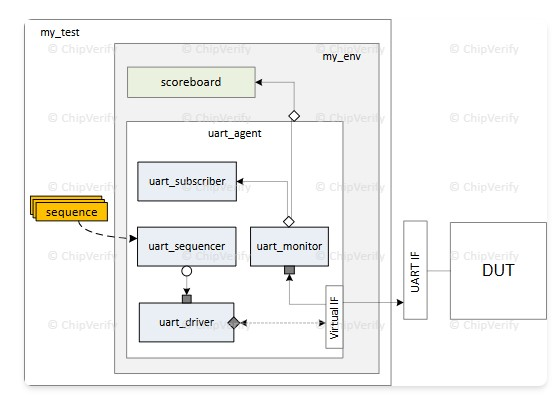

## 5. 圖片：sequence 在 UART UVM testbench 裡的位置
第二張 UART 圖，你可以這樣解讀：  

- `my_test`：整個測試最上層，裡面 new 並啟動 `my_sequence`。  
- `my_env`：UVM environment，包住 `uart_agent` 和 `scoreboard`。scoreboard 用來比對 monitor 收到的資料與預期值。  
- `uart_agent` 裡有：  
  - `uart_sequencer`：負責接收 `my_sequence` 所送出的 item。  
  - `uart_driver`：從 sequencer 拿到 item（例如一個 UART frame），轉成實際的 UART 波形透過 Virtual IF drive 到 DUT。  
  - `uart_monitor`：被動監聽 UART IF，上報實際 DUT 的輸出給 `uart_subscriber`/scoreboard 做檢查。  
  - `uart_subscriber`：通常用 `uvm_subscriber` 實作 coverage 或收集統計。  

整體流程示意：  

1. `my_test` 裡呼叫 `my_sequence.start(uart_sequencer);`。  
2. `my_sequence.body()` 用 `` `uvm_do`` 產生一個 `my_data` transaction，送給 `uart_sequencer`。  
3. `uart_driver` 從 `uart_sequencer` 取得 transaction，依照 item 的欄位（例如 baudrate、data、parity）在 Virtual IF 上 drive。  
4. DUT 收到 UART 信號後產生輸出，`uart_monitor` 觀察這些信號並轉成另一個 transaction，送去 `uart_subscriber` 和 `scoreboard` 檢查。  

這樣 sequence 就從「純物件世界」一路把抽象 transaction 轉成真實的 RTL 接口訊號，完成一次完整 stimulus。整頁內容就是在教你：  
- sequence 是 transaction-oriented 的 stimulus 控制器；  
- 怎麼繼承 `uvm_sequence` 寫出自己的 sequence；  
- 它在整個 UVM agent/testbench 裡扮演什麼角色。


----
----


這一塊是在「總結說明剛剛那個 `my_sequence` 範例裡幾個重點」，尤其是 `pre_body/post_body` 與 `` `uvm_do`` 的行為差異。

逐點翻成白話是：

- `my_sequence` 是從 `uvm_sequence` 繼承來的，所以它是一個 sequence 類別。  
- 因為 sequence 是 transaction 物件（不是 component），所以用 `\`uvm_object_utils(my_sequence)` 把它註冊到 factory，而不是 `uvm_component_utils`。[web:0]  
- 真正的主 stimulus 寫在 `body()` 裡，`pre_body()`、`post_body()` 只是一種 callback，必要時才會用來做前置／收尾動作，例如 raise/drop objection 或一些準備工作。  
- 資料封包是透過 `` `uvm_do(pkt)`` 來建立和送出的：這個 macro 會建立一個 `my_data` 類型的物件給 `pkt`，對它 randomize，然後送到此 sequence 綁定的 default sequencer 去執行。用 macro 只是為了把原本要寫好幾行的程式碼縮成一行。

黃色框那句話特別提醒：  
- 當你在 `body()` 裡寫 `` `uvm_do(pkt)`` 送一個 item 時，**這個動作不會自動觸發 `pre_body()` 或 `post_body()`**；這兩個 task 只在 sequence 被 `start()` 的前後各呼叫一次，而不是每送一個 item 就叫一次。


----
----


這份教學頁面與圖片主要是在講解 **UVM Sequence (序列)** 的概念、架構以及如何撰寫程式碼來產生驗證激勵 (Stimulus)。

根據你提供的圖片 (abc31-34) 和網頁內容，我將其整理為以下嚴謹的說明：


### 1. 什麼是 Sequence？ (核心概念)

在 UVM 中，`uvm_sequence` 是一組有序的資料封包 (Sequence Items) 或子序列 (Sub-sequences) 的集合，用來定義**特定的驗證場景**。

* **Sequence Item (`uvm_sequence_item`)**：最小的傳輸單位（例如一個封包、一個讀寫指令）。
* **Sequence (`uvm_sequence`)**：一個容器，負責組織這些 Item 如何發送（例如：先發送 Reset，再發送 10 次隨機讀寫）。

### 2. 架構與運作流程 (配合圖片說明)


#### **圖片 abc34.jpg：整體資料流向**

這張圖展示了 Sequence 在 UVM 測試平台中的位置：

* **左側 (Sequences)**：使用者定義的各種測試場景（如 Seq 1..n）。這些序列產生資料。
* **中間 (Sequencer)**：
* `Sequencer` 是一個仲裁者 (Arbiter)。
* 當多個 Sequence 同時想要傳送資料時，Sequencer 決定誰先誰後。
* 它負責將 Sequence 產生的資料傳遞給 Driver。


* **右側 (Driver & DUT)**：
* `Driver` 從 Sequencer 接收高階的 Transaction 資料。
* 將資料轉換成針腳訊號 (Pin-level toggling) 驅動 DUT (Device Under Test)。
* 圖片中的虛線箭頭代表資料透過 Sequencer 進行路由。


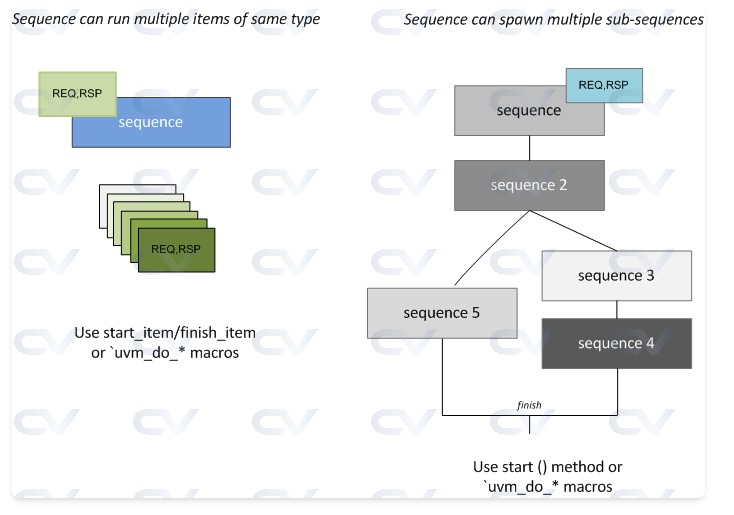
#### **圖片 abc33.jpg：Sequence 的層次結構**

這張圖解釋了 Sequence 的兩種執行模式：

1. **左圖 (單一層次)**：一個 Sequence 產生並執行多個相同類型的 Items (REQ, RSP)。
* 使用方法：`start_item()` / `finish_item()` 或 `uvm_do` 巨集。


2. **右圖 (巢狀/階層式)**：一個 Sequence 可以呼叫並啟動其他的 "Sub-sequences" (子序列)。
* 例如：`sequence` 呼叫了 `sequence 2`，而 `sequence 2` 又分支出 `sequence 3, 4, 5`。這允許將複雜的測試場景模組化。

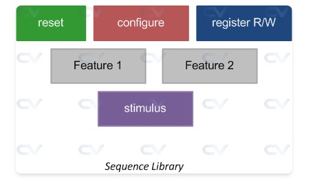
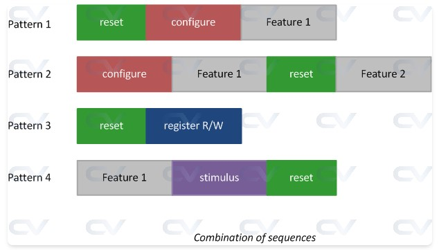

#### **圖片 abc32.jpg & abc31.jpg：場景組合 (Scenario)**

* **abc32.jpg** 展示了 Sequence 如何隨時間組合。例如 Pattern 1 是「重置 -> 設定 -> 功能1」。這說明了 Sequence 的用途是**編排流程**。
* **abc31.jpg** 展示了 Sequence Library 的概念，即擁有一個「序列庫」，可以從中挑選不同的 Feature 或 Stimulus 來執行。


### 3. 程式碼實作說明 (配合網頁程式碼)

網頁提供了一個標準的 Sequence 撰寫範本，以下是關鍵部分的詳細解讀：

#### **定義 Sequence 類別**

```systemverilog
class base_sequence extends uvm_sequence #(my_data);
   `uvm_object_utils (base_sequence)         // 註冊到 Factory
   `uvm_declare_p_sequencer (my_sequencer)   // 宣告此 Sequence 將在哪種 Sequencer 上執行

   my_data data_obj; // 定義要傳送的資料物件 (Transaction)
   int unsigned n_times = 1; // 重複次數
   ...

```

* **繼承**：必須繼承自 `uvm_sequence`，並指定資料型態 `#(my_data)`。
* **`p_sequencer`**：這是一個好用的巨集，它讓你在 Sequence 內部可以直接存取 Sequencer 的變數或 handle。

#### **核心執行邏輯：`body()` Task**

這是 Sequence 的大腦，所有的行為都在這裡定義。

```systemverilog
   virtual task body ();
      // 1. 建立物件
      data_obj = my_data::type_id::create ("data_obj");

      repeat (n_times) begin
         // 2. 請求權限 (Handshake Step 1)
         start_item (data_obj); 
         
         // 3. 隨機化資料 (晚期隨機化，Late Randomization)
         assert (data_obj.randomize ()); 
         
         // 4. 傳送給 Driver 並等待完成 (Handshake Step 2)
         finish_item (data_obj); 
      end
   endtask

```

* **`start_item(item)`**：向 Sequencer 請求仲裁，等待獲得 Driver 的使用權。
* **`randomize()`**：通常在 `start_item` 之後做，這樣可以根據當下的系統狀態來決定隨機內容（雖然範例中是簡單隨機）。
* **`finish_item(item)`**：將資料送給 Driver，並**阻塞 (Block)** 直到 Driver 處理完畢（Driver 呼叫 `item_done()`）。

#### **控制模擬結束：Objection 機制**

在 `pre_body` 和 `post_body` 中，範例使用了 Objection：

```systemverilog
   virtual task pre_body ();
      if (starting_phase != null)
         starting_phase.raise_objection (this); // 告訴 UVM：我還在忙，不要結束模擬
   endtask

   virtual task post_body ();
      if (starting_phase != null)
         starting_phase.drop_objection (this);  // 告訴 UVM：我做完了，可以結束模擬了
   endtask

```

* **重要性**：如果沒有 Raise Objection，UVM 的 `run_phase` 可能會認為沒事可做而立刻結束模擬。這段程式碼確保 Sequence 執行期間模擬會持續進行。

### 4. 如何啟動 Sequence？

網頁展示了在 `uvm_test` 中設定 `default_sequence` 的方法：

```systemverilog
class base_test extends uvm_test;
    ...
    function void start_of_simulation_phase (uvm_phase phase);
        // 使用 Config DB 設定 "default_sequence"
        uvm_config_db#(uvm_object_wrapper)::set(this,"m_top_env.m_seqr0.main_phase",
                                          "default_sequence", base_sequence::type_id::get());
    endfunction
    ...
endclass

```

* 這行程式碼的意思是：在 `m_seqr0` (Sequencer) 的 `main_phase` 階段，預設自動啟動 `base_sequence`。這是最常見的啟動方式之一。

### 總結

這頁教學結合圖片和程式碼，展示了 UVM 產生激勵的標準流程：

1. **定義**：繼承 `uvm_sequence` 撰寫測試邏輯 (`body` task)。
2. **握手**：使用 `start_item` / `finish_item` 與 Sequencer/Driver 溝通。
3. **控制**：使用 Objection 確保模擬時間足夠長。
4. **配置**：在 Test 層級透過 `config_db` 指定要跑哪個 Sequence。

這符合嚴謹的 UVM 開發規範，圖片 abc34 更是理解 UVM Driver-Sequencer 機制的經典架構圖。


----
----

```systemverilog
----------------------------------------------------------------
CDNS-UVM-1.1d (14.10-s013)
(C) 2007-2013 Mentor Graphics Corporation
(C) 2007-2013 Cadence Design Systems, Inc.
(C) 2006-2013 Synopsys, Inc.
(C) 2011-2013 Cypress Semiconductor Corp.
----------------------------------------------------------------
UVM_INFO @ 0: reporter [RNTST] Running test base_test...
UVM_INFO @ 0: reporter [UVMTOP] UVM testbench topology:
------------------------------------------------------------
Name                     Type                    Size  Value
------------------------------------------------------------
uvm_test_top             base_test               -     @2631
  m_top_env              my_env                  -     @208
    m_drv0               my_driver               -     @202
      rsp_port           uvm_analysis_port       -     @2830
      seq_item_port      uvm_seq_item_pull_port  -     @2779
    m_seqr0              my_sequencer            -     @2730
      rsp_export         uvm_analysis_export     -     @2920
      seq_item_export    uvm_seq_item_pull_imp   -     @3468
      arbitration_queue  array                   0     -
      lock_queue         array                   0     -
      num_last_reqs      integral                32    'd1
      num_last_rsps      integral                32    'd1
------------------------------------------------------------

UVM_INFO ./tb/my_pkg.sv(98) @ 0: uvm_test_top.m_top_env.m_drv0 [my_driver] Applying initial reset
UVM_INFO ./tb/my_pkg.sv(102) @ 390000: uvm_test_top.m_top_env.m_drv0 [my_driver] DUT is now out of reset
UVM_INFO ./tb/my_pkg.sv(109) @ 390000: uvm_test_top.m_top_env.m_drv0 [my_driver] Waiting for data from sequencer
UVM_INFO ./tb/my_pkg.sv(149) @ 390000: uvm_test_top.m_top_env.m_seqr0@@base_sequence [BASE_SEQ] Optional code can be placed here in pre_body()
UVM_INFO ./tb/my_pkg.sv(155) @ 390000: uvm_test_top.m_top_env.m_seqr0@@base_sequence [BASE_SEQ] Starting body of base_sequence
UVM_INFO ./tb/my_pkg.sv(122) @ 410000: uvm_test_top.m_top_env.m_drv0 [DRV] Driving data item across DUT interface
data_obj: (my_data@3581) {
  data: 'hed
  addr: 'h5
  begin_time: 390000
  depth: 'd2
  parent sequence (name): base_sequence
  parent sequence (full name): uvm_test_top.m_top_env.m_seqr0.base_sequence
  sequencer: uvm_test_top.m_top_env.m_seqr0
}
UVM_INFO ./tb/my_pkg.sv(109) @ 410000: uvm_test_top.m_top_env.m_drv0 [my_driver] Waiting for data from sequencer
UVM_INFO ./tb/my_pkg.sv(163) @ 410000: uvm_test_top.m_top_env.m_seqr0@@base_sequence [base_sequence] Sequence base_sequence is over
UVM_INFO ./tb/my_pkg.sv(168) @ 410000: uvm_test_top.m_top_env.m_seqr0@@base_sequence [BASE_SEQ] Optional code can be placed here in post_body()
UVM_INFO ./tb/my_pkg.sv(128) @ 410000: uvm_test_top.m_top_env.m_drv0 [my_driver] Finished DUT simulation

--- UVM Report catcher Summary ---


```

這份 Log（日誌）是 UVM 模擬的**執行結果證明**。它詳細記錄了從模擬開始、建立元件、執行 Sequence 到結束的完整過程。

這份 Log 主要想表達以下三個關鍵資訊：

### 1. 驗證環境已正確建立 (Topology)

Log 的第一部分顯示了 **UVM Testbench Topology**（拓樸結構表）。這證明了你在程式碼中定義的元件已經成功被 `new()` 並連接起來。

```text
Name                     Type                    Size  Value
------------------------------------------------------------
uvm_test_top             base_test               -     @2631
  m_top_env              my_env                  -     @208
    m_drv0               my_driver               -     @202
    m_seqr0              my_sequencer            -     @2730
...

```

* **表達重點**：
* `uvm_test_top` 是頂層測試。
* 環境中包含了一個 Driver (`m_drv0`) 和一個 Sequencer (`m_seqr0`)。
* 這兩者都已經正確實例化 (Instantiated)。


### 2. Sequence 與 Driver 的「握手」流程成功

Log 的時間軸部分（從 `@ 390000` 到 `@ 410000`）展示了 Sequence 如何產生資料並傳給 Driver，這是 UVM 最核心的運作機制。

* **準備階段 (`pre_body`)**：
* `UVM_INFO ... [BASE_SEQ] Optional code can be placed here in pre_body()`
* 這證明 Sequence 啟動了，且執行了 `pre_body` 任務。


* **進入主體 (`body`)**：
* `UVM_INFO ... [BASE_SEQ] Starting body of base_sequence`
* Sequence 進入 `body()` 任務，準備產生資料。


* **傳送資料 (Handshake)**：
* Driver 顯示 `Waiting for data from sequencer`。
* 接著 Driver 顯示 `Driving data item across DUT interface`。
* 這證明 `start_item` / `finish_item` 機制運作正常，資料成功從 Sequence 傳到了 Driver。


### 3. 資料物件內容 (Transaction Data)

Log 中印出了 `data_obj` 的詳細內容，這通常是 `print()` 或 `sprint()` 函式的輸出。

```text
data_obj: (my_data@3581) {
  data: 'hed
  addr: 'h5
  begin_time: 390000
  ...
}

```

* **表達重點**：
* **資料內容**：資料 (`data`) 是 `'hed` (十六進位的 ED)，位址 (`addr`) 是 `'h5`。
* **隨機化證明**：這些數值顯示隨機化 (`randomize()`) 已經生效，因為它們不是預設的 0。
* **來源追蹤**：Log 明確指出這個資料來自 `base_sequence`，且由 `m_seqr0` 經手。


### 總結

這份 Log 是一個**「驗證成功」的報告**。它告訴你：

1. 測試平台架構沒錯。
2. Reset 邏輯執行了（0 到 390000 時間單位）。
3. Sequence 成功產生了隨機資料。
4. Driver 成功收到了資料並驅動了 DUT。
5. Sequence 執行完畢後，模擬正常結束 (`Finished DUT simulation`)。


----
----


這頁教學主要是在深入講解如何使用 **`start()` 方法** 來手動執行一個 UVM Sequence，以及在這個過程中 UVM 內部的方法呼叫順序（Flow）。

我將結合你提供的圖片 (abc35, abc36) 與網頁中的程式碼範例，分三個層次為你說明：

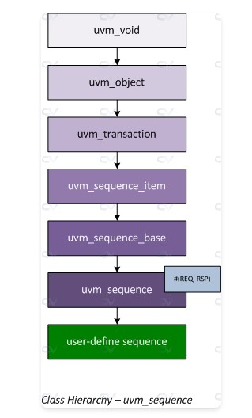
### 1. 基礎認知：Sequence 是什麼？ (配合圖片 abc35.jpg)

在執行 Sequence 之前，先看它的「身世」。
**圖片 `abc35.jpg**` 展示了 `uvm_sequence` 的繼承階層 (Class Hierarchy)：

* 所有的 Sequence 最終都繼承自 **`uvm_transaction`** 和 **`uvm_sequence_item`**。
* 這代表 Sequence 本身也是一種「物件 (Object)」，它有生命週期，可以被建立、隨機化，但它不是靜態的元件 (Component)。
* 綠色框框 **`user-define sequence`** 就是我們寫的程式碼，它繼承自 `uvm_sequence`。

### 2. 核心機制：`start()` 方法 (配合網頁文字)

網頁核心在介紹 `start()` 這個函數，這是手動啟動 Sequence 的標準方式。

函式原型如下:

```systemverilog
virtual task start ( uvm_sequencer_base sequencer,      // 必要：指定在哪個 Sequencer 上跑
                     uvm_sequence_base  parent_sequence = null, // 選用：指定誰是我的「父序列」
                     int                this_priority = -1,     // 選用：優先級
                     bit                call_pre_post = 1 );    // 選用：是否呼叫 pre/post body

```

* **`sequencer`**：這是最重要的參數，告訴 Sequence 要把資料丟給哪個 Sequencer。
* **`parent_sequence`**：如果這個 Sequence 是被另一個 Sequence 呼叫的，這裡可以填入 `this` (父序列)。這會影響執行流程 (詳見第 3 點)。
* **`call_pre_post`**：
* 設為 `1` (預設)：執行 `pre_body()` 和 `post_body()`。
* 設為 `0`：跳過這兩個方法，直接執行 `body()`。


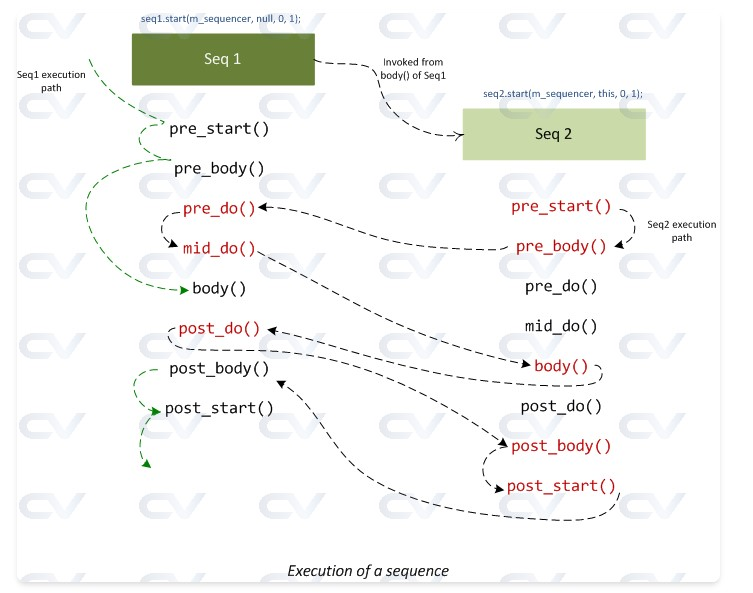
### 3. 執行流程與 Hook Methods (配合圖片 abc36.jpg 與程式碼)

這張 **`abc36.jpg`** 是整頁最重要的圖，它畫出了當你呼叫 `start()` 時，程式跑的詳細路徑。

#### **情況 A：單獨執行 (Simple Sequence Flow)**

當你在 Testbench 中單獨啟動一個 Sequence，且 `call_pre_post = 1` 時：

* **圖片路徑**：綠色虛線路徑 (Seq 1)。
* **執行順序**：`pre_start()` -> **`pre_body()`** -> **`body()`** -> **`post_body()`** -> `post_start()`。
* **程式碼證明**：
網頁中的第一個 Log 輸出證明了這點:
```text
... [base_seq] pre_body()
... [base_seq] body()
... [base_seq] post_body()

```


如果你把 `call_pre_post` 設為 `0` (如網頁第二個範例)，Log 就只會印出 `body()`。

#### **情況 B：巢狀執行 (Spawned Sequence Flow)**

這是在 Sequence 裡面呼叫另一個 Sequence (例如 `Seq 1` 呼叫 `Seq 2`)。這對應到圖片 **abc36.jpg** 中間的轉換。

網頁最後一個程式碼範例展示了最複雜的情況：**指定 Parent**。

```systemverilog
// 在 child1_seq 的 body 中
child2_seq cs = child2_seq::type_id::create ("cs");
cs.start (null, this);  // 重點：這裡的 'this' 指的是 child1_seq

```

當你這樣做時，**abc36.jpg** 中的紅色文字部分就會生效：

1. **Child (Seq 2)** 準備開始。
2. **Parent (Seq 1)** 的 `pre_do()` 會被呼叫。
3. **Parent (Seq 1)** 的 `mid_do()` 會被呼叫。
4. **Child (Seq 2)** 執行自己的 `body()`。
5. **Parent (Seq 1)** 的 `post_do()` 會被呼叫。

**網頁最後的 Log 完美印證了這個交錯的順序：**

```text
... [child1_seq] body()      <- 父序列正在跑
... [child2_seq] pre_body()  <- 子序列準備開始
... [child1_seq] pre_do()    <- 父序列被通知：子序列要開始了 (pre_do)
... [child1_seq] mid_do()    <- 父序列被通知：子序列執行中 (mid_do)
... [child2_seq] body()      <- 子序列真正做事
... [child1_seq] post_do()   <- 父序列被通知：子序列做完了
... [child2_seq] post_body() <- 子序列收尾

```

### 總結

這頁教學想要傳達三個重點：

1. **如何啟動**：使用 `seq.start(sequencer)`。
2. **控制流程**：透過 `call_pre_post` 參數決定要不要跑 `pre/post_body` 這些預備動作。
3. **父子關係**：透過 `start()` 的第二個參數 `parent`，可以建立序列間的連結，這會觸發父序列的 `pre_do/mid_do/post_do` 回呼 (Callbacks)，這在複雜的驗證場景（如需要父序列控制子序列權限時）非常有用。


----
----

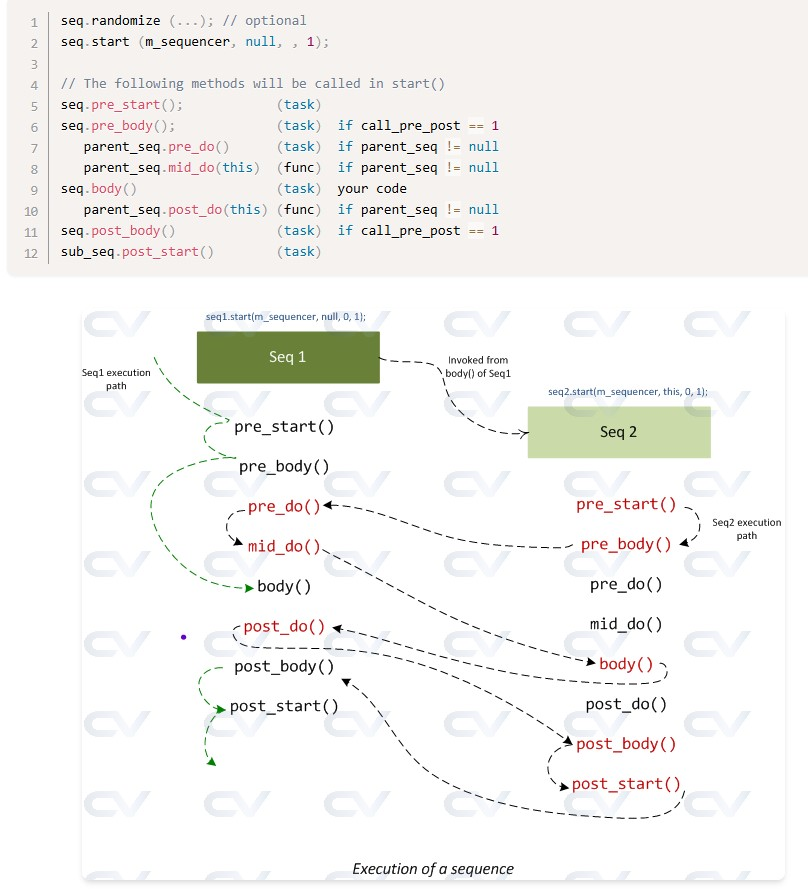

這張圖最讓人混淆的地方，在於**紅色箭頭**為什麼會「跳回去」找 `Seq 1` (Parent)，然後又「跳回來」找 `Seq 2` (Child)。

簡單來說，這是一個**「主管 (Parent) 監控 員工 (Child)」**的機制。

如果不把這個機制看成單純的程式執行，而是看成**職場上的請示流程**，你會立刻看懂。

---

### 1. 關鍵開關：這行程式碼

這一切混亂的源頭，來自於你在啟動 `Seq 2` 時，多傳了一個參數：

```systemverilog
// 在 Seq 1 (主管) 的程式碼中：
seq2.start(m_sequencer, this, ...); 

```

* 這個 `this` 就是告訴 `Seq 2`：「我是你主管 (Parent)」。
* **因為有了主管，`Seq 2` 在做核心工作 (`body`) 之前，必須先「請示」主管。**

---

### 2. 職場比喻：實習生發信流程

讓我們把 `Seq 1` 當作 **主管**，`Seq 2` 當作 **實習生**。
實習生的任務是 **寄出一封重要的信 (`body`)**。

請看著圖片中間那堆複雜的箭頭，對照以下劇情：

1. **實習生準備 (`Seq2: pre_body`)**：
* 實習生打開電腦，寫好草稿。這是他自己的準備工作。
* *(圖中綠色 Seq 2 區塊開始執行)*


2. **主管審查 (`Seq1: pre_do / mid_do`)** —— **這就是紅色箭頭跳回去的原因！**
* 在實習生按下「傳送」之前，UVM 強制規定他必須問主管：「我準備好了，可以寄嗎？」
* **`pre_do`**：主管說：「等等，我先檢查權限。」
* **`mid_do`**：主管說：「這封信的內容我最後確認一下，沒問題。」
* *(這時候控制權暫時回到 Seq 1 手上)*


3. **實習生執行 (`Seq2: body`)**：
* 得到主管確認後，實習生按下傳送鍵。
* *(這是 Seq 2 真正做事的時候)*


4. **主管收尾 (`Seq1: post_do`)** —— **紅色箭頭又跳回去！**
* 信寄出後，系統通知主管。
* 主管紀錄：「好，案件已結案。」
* *(控制權又回到 Seq 1 手上做紀錄)*


5. **實習生收工 (`Seq2: post_body`)**：
* 實習生關機下班。


---

### 3. 為什麼要設計這麼麻煩？ (Technical Why)

你可能會問：「為什麼不讓 Seq 2 自己跑就好？」

因為在驗證中，**父序列 (Parent Sequence) 往往擁有更高的權限或資訊**。

* **資源搶佔**：也許 `Seq 1` 需要先鎖住 (Grab) Sequencer，不讓別的 Sequence 插隊，才能讓 `Seq 2` 跑。這可以在 `pre_do` 裡面做。
* **修改資料**：也許 `Seq 2` 產生了一個封包，但 `Seq 1` 想要在最後一刻偷偷修改裡面的數值 (Error Injection)，這可以在 `mid_do` 裡面做。

### 總結

那張圖的紅色部分，其實就是 **UVM 的「回報機制 (Hooks)」**。

* 只要你在 `start` 時指定了 Parent (`this`)。
* **Child** 在執行核心任務 (`body`) 的**前後**，會自動觸發 **Parent** 的 `pre_do/mid_do` (前) 和 `post_do` (後)。
* 這就是為什麼箭頭會跳來跳去的原因。


----
----


### 正確的執行順序 (時間軸)

如果把那張複雜的圖拆解成時間順序，它其實是「三明治」結構：

1. **Seq 1 上半場** (麵包上層)
* `Seq 1: pre_body()`
* `Seq 1: body()` 開始執行... **遇到 `seq2.start()`！**


2. **Seq 2 插隊表演** (中間的料) —— **這就是圖中右半部那一堆箭頭**
* `Seq 1: pre_do()` (主管審核)
* `Seq 2: body()` (實習生做事)
* `Seq 1: post_do()` (主管收尾)


3. **Seq 1 下半場** (麵包下層) —— **這時候才是你畫的紫色箭頭**
* `seq2.start()` 結束，回到 `Seq 1` 的程式碼。
* `Seq 1: body()` 真正的結束。
* **`Seq 1: post_body()`** (終於輪到我了！)

----
----

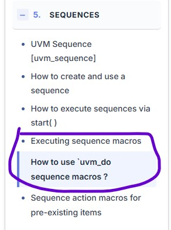
# 大會報告 以下兩頁順序相反
# 大會報告 以下兩頁順序相反
# 大會報告 以下兩頁順序相反


----
----


這頁是 UVM Sequence 的**基礎實戰篇**，主要教你如何「偷懶」。

在標準寫法中，傳送一筆資料要寫 `create` -> `start_item` -> `randomize` -> `finish_item` 四大步驟。UVM 提供了 **`uvm_do` 系列巨集 (Macros)**，讓你一行程式碼就能做完這些事。

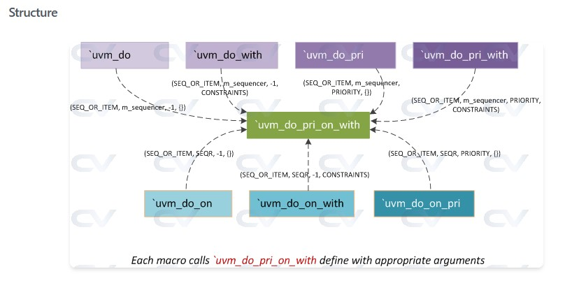
以下配合圖片 `abc40.jpg` 與網頁程式碼為你說明：

### 1. 核心概念：四大天王巨集

這頁介紹了四個最常用的巨集，它們的功能是層層疊加的：

* **`uvm_do(item)`**：
* **最基本款**。自動幫你建立物件、隨機化、並發送給 Driver。


* **`uvm_do_with(item, constraints)`**：
* **加強版（最常用）**。除了發送，還可以**加上限制 (Constraints)**。
* 例如：我想要發送資料，但規定 `addr` 必須是 0。


* **`uvm_do_pri(item, priority)`**：
* **插隊版**。指定優先級 (Priority)。如果不指定，預設是 -1。優先級高的可以插隊先送。


* **`uvm_do_pri_with(item, priority, constraints)`**：
* **全配版**。同時指定優先級和限制條件。


### 2. 巨集的內部結構 (配合圖片 abc40.jpg)

這張圖 **`abc40.jpg`** 揭示了 UVM 巨集的實作秘密：**「萬法歸宗」**。

* **中央的綠色方塊 (`uvm_do_pri_on_with`)**：
這是最底層、參數最全的「終極巨集」。它需要你提供所有資訊：`Item`, `Sequencer`, `Priority`, `Constraints`。
* **周圍的紫色方塊**：
這些是我們平常在用的巨集（如 `uvm_do`, `uvm_do_with`）。
* 你看圖中的箭頭，`uvm_do` 其實只是呼叫了綠色方塊，並自動填入預設值：
* Sequencer 填 `m_sequencer` (預設)。
* Priority 填 `-1` (預設)。
* Constraints 填 `{}` (空)。


**這張圖想表達的是**：不管你用哪一個巨集，底層跑的程式碼其實都是同一套，只是 UVM 幫你填了預設參數而已。


### 3. 程式碼實作與 Log 驗證

網頁提供了一個範例，展示如何在一支 Sequence (`base_sequence`) 中混合使用這四種巨集。

#### **程式碼對照**

```systemverilog
virtual task body ();
   // 1. 基本款：隨機發送
   `uvm_do (req)

   // 2. 限制款：指定數值 (data=4e, addr=a1)
   `uvm_do_with (req, { data == 8'h4e; addr == 8'ha1; })

   // 3. 優先權款：優先級設為 9 (雖然這單一 seq 看不出插隊效果)
   `uvm_do_pri (req, 9)

   // 4. 全配款：優先級 3 且 data 固定為 c5
   `uvm_do_pri_with (req, 3, { data == 8'hc5; })
endtask

```

#### **Log 結果驗證 (Simulation Results)**

請看 Log 的後半段，Driver 收到的 4 筆資料完美對應了上面的程式碼：

1. **第一筆 (對應 `uvm_do`)**：
```text
data: 'hfb, addr: 'h38  <-- 完全隨機的數值

```


2. **第二筆 (對應 `uvm_do_with`)**：
```text
data: 'h4e, addr: 'ha1  <-- 跟你設定的 constraint 一模一樣！

```


3. **第三筆 (對應 `uvm_do_pri`)**：
```text
data: 'hd8, addr: 'h2d  <-- 隨機數值 (因為沒設 constraint)

```


4. **第四筆 (對應 `uvm_do_pri_with`)**：
```text
data: 'hc5, addr: 'h8   <-- data 被固定為 c5

```


### 總結

這頁就是教你如何使用 **UVM 的語法糖 (Syntactic Sugar)**。
如果不使用這些巨集，上面那段程式碼會膨脹成幾十行。`uvm_do` 系列巨集是寫 Sequence 時最不可或缺的工具。


----
----

這段文字主要在講解兩個進階且重要的概念：**「指定 Sequencer (`_on_` 系列)」** 以及 **「巨集的底層架構」**。

我幫你拆解成兩個部分來說明：

### 1. 指定 Sequencer：`uvm_do_on_*` 系列

這段文字的第一部分介紹了一組新的巨集，它們都有一個共同特徵：中間多了 **`_on_`**。

* **為什麼需要這個？**
一般的 `uvm_do(item)` 預設會把工作丟給 **「當下的 Sequencer (`m_sequencer`)」** 執行。
但在某些情況下（特別是寫 **Virtual Sequence** 時），你可能身處在一個「總指揮官」的位置，你手上沒有 Driver，你必須把工作指派給「下屬 A」或「下屬 B」去執行。
* **語法結構：**
這時候你就不能只用 `uvm_do`，而要用 `uvm_do_on`，明確指定「要在誰身上執行」。
```systemverilog
// 意思：請 seqr (某個特定的 sequencer) 幫我執行這個 item
`uvm_do_on(SEQ_OR_ITEM, SEQR) 

```


* **變形金剛：**
就像 `uvm_do` 有很多變形一樣，`_on_` 系列也有對應的變形，只是多了一個參數 `SEQR`：
* `uvm_do_on`：指定 Sequencer。
* `uvm_do_on_pri`：指定 Sequencer + 插隊 (Priority)。
* `uvm_do_on_with`：指定 Sequencer + 限制條件 (Constraint)。
* `uvm_do_on_pri_with`：全部都指定。


---

### 2. 巨集的內部架構 (Structure)

這段文字的後半部（Structure 部分），其實就是在解釋我們剛看過的 **圖片 `abc40.jpg**` 的程式碼原理。

它揭露了 UVM 原始碼是怎麼寫的：**「萬法歸宗，其實只有一個巨集」**。

* **核心邏輯：**
UVM 為了讓程式碼好寫，定義了很多短巨集（如 `uvm_do`），但它們骨子裡其實都是呼叫同一個「長巨集」—— **`uvm_do_on_pri_with`**。
* **程式碼證明 (文中範例)：**
* **當你寫 `uvm_do(item)` 時**：
UVM 其實幫你把它翻譯成：
```systemverilog
`uvm_do_on_pri_with(item, m_sequencer, -1, {})
// 幫你自動填入：
// 1. m_sequencer (預設 sequencer)
// 2. -1 (預設 priority)
// 3. {} (空的 constraint)

```


* **當你寫 `uvm_do_on_with(item, seqr, c)` 時**：
UVM 幫你翻譯成：
```systemverilog
`uvm_do_on_pri_with(item, seqr, -1, c)
// 幫你填入 priority 為 -1，其他照你給的填

```

----
----


這份教材深入探討了 **Sequence Macros (`uvm_do_*`)** 的內部運作機制，特別是它們如何簡化程式碼，以及使用它們時會如何影響標準的 Sequence 執行流程（特別是 `pre_body` 和 `post_body` 的呼叫）。

以下我配合你提供的圖片和網頁程式碼，分層次進行嚴謹的說明：


### 1. 核心概念：為什麼要用 Macros？ (`uvm_do`)

在標準的 Sequence 寫法中，要傳送一個資料，你需要寫很多行：建立物件、等待權限、隨機化、傳送。
**UVM Macros**（如 `uvm_do`, `uvm_do_with`）將這些步驟封裝成一行程式碼，讓開發者更輕鬆。

#### **Macro 到底做了什麼？ (配合程式碼)**

網頁揭示了 `uvm_do` 底層其實是呼叫 `uvm_do_on_pri_with`，其邏輯如下：

1. **建立物件**：`uvm_create_on(...)`
2. **判斷型態**：
* **如果是 Item**：呼叫 `start_item` -> `randomize` -> `finish_item`。
* **如果是 Sequence**：呼叫 `sub_seq.start(..., call_pre_post=0)`。


**關鍵點 (Key Takeaway)**：
當 Macro 執行一個 **Sequence** 時，它會強制將 `start()` 方法的 `call_pre_post` 參數設為 **0**。

> 這意味著：使用 `uvm_do` 啟動的子序列，其 `pre_body()` 和 `post_body()` **永遠不會被執行**。


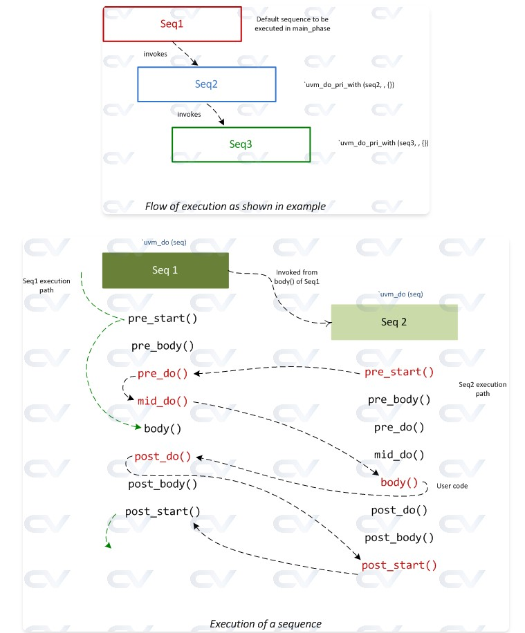

### 2. 執行流程圖解 (配合圖片 abc39.jpg)

**圖片 `abc39.jpg` (上圖)** 是一個巢狀呼叫的結構圖：

* **紅色框 (Seq1)**：頂層序列，由 `main_phase` 啟動（預設會跑 `pre/post_body`）。
* **藍色框 (Seq2)**：由 Seq1 透過 `uvm_do` 啟動。
* **綠色框 (Seq3)**：由 Seq2 透過 `uvm_do` 啟動。

**圖片 `abc39.jpg` (下圖)** 則顯示了對應的執行路徑，請注意那些**消失的步驟**：

* **Seq 1 (手動啟動)**：完整的綠色虛線路徑，包含 `pre_start`, `pre_body`, `body`...
* **Seq 2 (Macro 啟動)**：
* 注意看 `Seq 2` 的區塊，**沒有** `pre_body` 和 `post_body` 的執行路徑。
* 它直接進入 `pre_start` -> (跳過 body hooks) -> `pre_do` (回報 Parent) -> `body`。


* **Seq 3 (Macro 啟動)**：同理，也跳過了 `pre/post_body`。


### 3. 程式碼實作與驗證 (配合網頁範例)

網頁提供了一個三層的範例來驗證上述理論。

#### **A. 基礎類別 (`base_sequence`)**

定義了所有 Sequence 共用的行為，特別是加入了 `pre_do`, `mid_do`, `post_do` 的列印，方便我們追蹤「主管審核」的過程。

#### **B. 第一層 (`seq1`) - 頂層主管**

```systemverilog
task body();
   ...
   `uvm_do_pri_with (m_seq2, ,{}) // 使用 Macro 啟動 Seq2
   ...
endtask

```

* 因為 `seq1` 是在 Test 中被設為 `default_sequence` 啟動的（通常視為 `start(null)`），所以它會保有完整的 `pre_start` 行為。

#### **C. 第二層 (`seq2`) - 中階主管**

```systemverilog
task pre_body(); // 陷阱題！
   `uvm_info (..., "Executing pre_body", ...)
endtask

task body();
   `uvm_do_pri_with (m_seq3, ,{}) // 使用 Macro 啟動 Seq3
endtask

```

* **重要觀察**：雖然這裡定義了 `pre_body`，但因為它是被 `uvm_do` 啟動的，這個 Task **不會被執行**。Log 證明了這一點（找不到 `[seq2] Executing pre_body` 的紀錄）。

#### **D. 第三層 (`seq3`) - 基層員工**

最底層的序列，單純執行一些延遲和列印。


### 4. Log 分析 (證據說話)

讓我們看 Log 來印證「消失的 pre_body」和「存在的 Hooks」：

1. **Seq 1 啟動 (完整流程)**
* `[seq1] Executing pre_start()` (有出現)
* `[SEQ1] Starting seq1` (body 開始)


2. **Seq 2 啟動 (Macro 效果)**
* `[seq1] Executing pre_do` (Seq1 審核 Seq2)
* `[seq1] Executing mid_do` (Seq1 再次確認)
* **注意！** 這裡直接跳到了 `[SEQ2] Starting seq2`。**`[seq2] Executing pre_body` 完全沒出現！** 這證實了 Macro 會屏蔽 pre/post body。


3. **Seq 3 啟動**
* `[seq2] Executing pre_do` (Seq2 審核 Seq3)
* `[SEQ3] Starting seq3`
* `[SEQ3] Ending seq3`


### 總結

這頁教學的核心結論非常重要，是 UVM 面試常見的考題：

1. **Macro 的代價**：使用 `uvm_do` 系列巨集雖然方便（一行搞定），但代價是喪失了對 `pre_body` 和 `post_body` 的控制權。
2. **Hook 依然存在**：即使是用 Macro，Parent Sequence 的 `pre_do` / `mid_do` / `post_do` 依然會被正常呼叫，因為這是寫在 `start()` 內部的邏輯，不受 `call_pre_post` 參數影響。
3. **使用建議**：如果你需要在 Sequence 執行前做一些初始化設定（例如 Raise Objection），請寫在 `pre_start()` 或是 `body()` 的開頭，而**不要**依賴 `pre_body()`，因為你不知道使用者會用 `start()` 還是 `uvm_do` 來呼叫你的 Sequence。


----
----

這頁教學介紹了 UVM Sequence 中另一組非常重要的巨集：**`uvm_send`** 與 **`uvm_rand_send`**。

如果說 `uvm_do` 是「一條龍服務」（建立 + 隨機化 + 發送），那麼 `uvm_send` 就是「單純快遞服務」（只負責發送）。這在處理已經存在的物件，或是需要更精細控制隨機化時非常有用。

以下配合圖片 `abc41.jpg`、`abc42.jpg` 以及網頁程式碼為你說明：

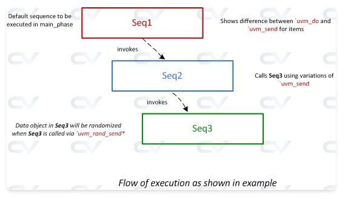
### 1. 核心區別：`uvm_do` vs. `uvm_send` (配合圖片 abc42.jpg)

**圖片 `abc42.jpg**` 展示了三層 Sequence 的呼叫關係，並標示了不同巨集的用途：

* **紅色框 (Seq1)**：這是頂層序列。
* **藍色框 (Seq2)**：圖中標示 "Shows difference between `uvm_do` and `uvm_send` for items"。
* `uvm_do`：會幫你 `create` 新物件並 `randomize`。
* `uvm_send`：假設你手上已經有一個物件了，它只負責幫你送到 Sequencer/Driver。


* **綠色框 (Seq3)**：圖中標示 "Data object in Seq3 will be randomized when Seq3 is called via `uvm_rand_send`"。這點出了 `uvm_send` 的一個變體：它可以選擇要不要隨機化。


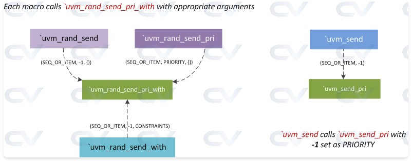
### 2. 巨集家族：Send 與 Rand Send (配合圖片 abc41.jpg)

這張圖展示了 `uvm_send` 家族的內部結構，概念跟之前的 `uvm_do` 很像：

* **右邊 (`uvm_send`)**：
* 這是最純粹的發送。
* 它直接呼叫 `start_item` 和 `finish_item`，**完全不做隨機化**。
* 適用場景：你已經手動隨機化好了，或者這個資料是從別的地方複製過來的，你想原封不動地送出去。


* **左邊 (`uvm_rand_send`)**：
* 這是「發送前先隨機化」。
* 它會先呼叫物件的 `randomize()`，然後再發送。
* **注意**：它**不會**幫你 `create` 物件！物件必須已經存在。
* 適用場景：物件已經建立好了（例如在 `new` 函數裡建好的），你只想重新隨機化數值並發送。


---

### 3. 程式碼實戰 (Code Walkthrough)

網頁提供了兩個範例 (`seq1`, `seq2`) 來演示這些差異。

#### **範例 A: `seq1` (展示 `uvm_do` vs `uvm_send`)**

```systemverilog
// 1. 使用 uvm_do (標準做法)
`uvm_do (req) 
// -> 自動建立 req, 自動隨機化, 自動發送。

// 2. 使用 uvm_send (物件已存在)
`uvm_send (req) 
// -> req 在上面已經被建立了，這裡直接送出「上一次」的數值。
// -> Log 顯示：這筆資料的數值跟上一筆一模一樣！ (addr='hc0)

// 3. 手動建立 + 手動隨機化 + uvm_send (最繁瑣做法)
`uvm_create (m_data2)
void'(m_data2.randomize ());
`uvm_send (m_data2)
// -> 這等於拆解了 uvm_do 的動作，雖然麻煩，但提供了最大控制權。

```

#### **範例 B: `seq2` (展示 `uvm_rand_send` 對 Sequence 的作用)**

這部分展示了如何發送一個 **子序列 (`m_seq3`)**。

```systemverilog
// 1. 純發送 (不隨機化)
`uvm_send (m_seq3)
// -> Log 顯示：m_data3 的值是 0 (因為沒隨機化，且 new 之後預設是 0)。

// 2. 隨機發送
`uvm_rand_send (m_seq3)
// -> Log 顯示：m_data3 的值變成了 'h61 (隨機值)。
// -> 注意：這會觸發 seq3 內部的 rand 變數進行隨機化。

// 3. 帶限制的隨機發送
`uvm_rand_send_with (m_seq3, { m_data3.data == 8'h4; ...})
// -> Log 顯示：m_data3 的值被強制設為 4。

```

### 總結

這頁教學讓你學會更精細的操作：

1. **`uvm_do`**：無腦好用，幫你 `new` + `rand` + `send`。
2. **`uvm_send`**：只負責 `send`。適用於資料已經準備好的情況（例如重送上一筆資料）。
3. **`uvm_rand_send`**：負責 `rand` + `send`。適用於物件已經 `new` 好了（例如在 class member 就建好的），只想刷新數值發送。
4. **`uvm_create`**：如果不用 `uvm_do`，你就得手動呼叫這個來建立物件。

