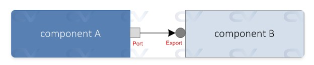
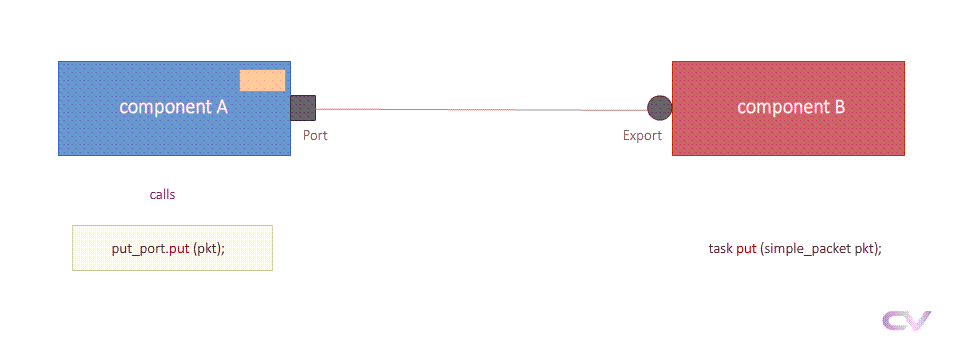
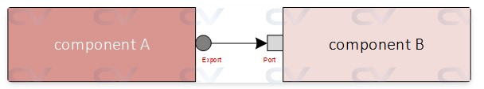
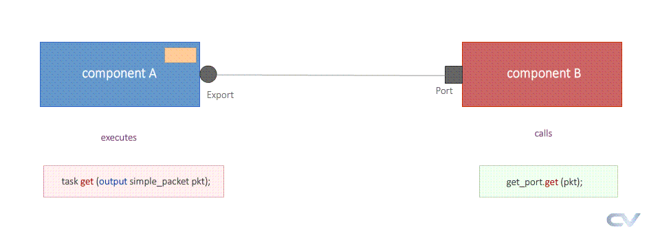

### 2026/2/11 learning Diary


## 來到第六章 UVM TLM

----
----




這份頁面介紹了 UVM 中 **TLM (Transaction Level Modeling)** 的基本概念，這是一種透過高抽象化方式讓不同組件（Component）交換資料的方法。

以下配合您提供的圖片與程式碼進行詳細說明：

### 1. 圖片架構說明：Component 間的橋樑

圖片展示了兩個 UVM 組件之間最基本的連線方式：

* **Component A (發起者)**：左側藍色方塊，代表資料的來源。它擁有一個 **Port**（正方形圖示），這是發送請求的出口。
* **Component B (接收者)**：右側淺藍色方塊。它擁有一個 **Export**（圓形圖示），負責接收來自 Port 的資料。
* **連線 (Connection)**：中間的箭頭代表 TLM 通訊。這種機制讓 `componentA` 不需要知道 `componentB` 內部的具體實作，只需要兩者的介面（Interface）匹配即可通訊。

### 2. 程式碼說明：定義傳輸的「貨物」 (Transaction)

程式碼定義了一個名為 `simple_packet` 的類別，這就是要在 Port 和 Export 之間傳遞的資料包。

```systemverilog
class simple_packet extends uvm_object;
    `uvm_object_utils (simple_packet) // 註冊到 UVM Factory，方便後續覆寫或建立

    // 定義資料欄位
    rand bit [7:0] addr; // 隨機化的地址
    rand bit [7:0] data; // 隨機化的資料
         bit       rwb;  // 讀寫控制位元 (Read/Write Bar)

    // 設定限制條件 (Constraints)，確保生成的資料符合協定規範
    constraint c_addr { addr > 8'h2a; };
    constraint c_data { data inside {[8'h14:8'he9]}; };
endclass

```

* 這個類別繼承自 `uvm_object`，使其具備 UVM 標準的資料處理能力（如列印、複製、比較）。
* 在 TLM 通訊中，`componentA` 會將這個類別實例化，填入資料後透過其 **Port** 發送出去。

### 3. TLM 的核心優點

根據頁面文字敘述，這種建模方式帶來以下好處：

* **高抽象化**：驗證人員不需要去處理每一根 Pin 腳（如 `clk`, `reset`, `valid`）的時序，而是以「一次寫入」或「一次讀取」作為一個交易單位（Transaction）。
* **隔離性 (Isolation)**：組件之間是獨立的。如果您想更換 `componentB` 的邏輯，只要新的組件依然維持相同的 Export 介面，`componentA` 的程式碼完全不需要更動。
* **靈活性與重用性**：可以輕鬆地在不同的驗證環境中交換或重複使用這些具有標準 TLM 介面的組件。

### 4. 總結

簡單來說，這頁告訴我們：**TLM 就是定義一個資料包 (Transaction Class)，並透過 Port 和 Export 將這個資料包從一個 Component 傳送到另一個 Component 的標準規範。**

----
----




這份頁面詳細教學了 UVM TLM (Transaction Level Modeling) 中最基礎的通訊方式：**Blocking Put Port (阻塞式放置埠)**。

它的核心邏輯是：「發送者 (Sender) 把資料『放 (Put)』給接收者 (Receiver)，並且發送者會**停下來等待**，直到接收者處理完畢才繼續。」

以下我將配合頁面中的程式碼，分四個步驟詳細拆解這個機制：


### 第一步：定義傳輸的資料 (The Data Object)

在 TLM 中，我們傳輸的不是單個信號 (如 0 或 1)，而是一個物件 (Object)。

```systemverilog
class Packet extends uvm_object;
  // 1. 定義要傳送的資料內容
  rand bit[7:0] addr;
  rand bit[7:0] data;

  // 2. 註冊 UVM Factory，並宣告欄位以利用 UVM 自動化功能 (如 print, copy)
  `uvm_object_utils_begin(Packet)
  	`uvm_field_int(addr, UVM_ALL_ON)
  	`uvm_field_int(data, UVM_ALL_ON)
  `uvm_object_utils_end

  function new(string name = "Packet");
    super.new(name);
  endfunction
endclass

```

* **解說**：這是一個標準的 `uvm_object`，你可以把它想像成一個包裹。裡面裝了 `addr` 和 `data`。


### 第二步：建立發送端 (The Sender - Component A)

發送端負責產生資料，並透過 **Port** 將資料送出去。

```systemverilog
class componentA extends uvm_component;
   `uvm_component_utils (componentA)

  // 1. 定義 Port：這是一個 "出口"，型別是 uvm_blocking_put_port
  //    <Packet> 代表這個出口只接受 Packet 型別的物件
  uvm_blocking_put_port #(Packet) m_put_port;
  int m_num_tx; // 決定要送幾次

   // 2. 在 build_phase 中 "實例化 (new)" 這個 Port
   virtual function void build_phase (uvm_phase phase);
      super.build_phase (phase);
      m_put_port = new ("m_put_port", this);
   endfunction

   virtual task run_phase (uvm_phase phase);
     phase.raise_objection(this);
     repeat (m_num_tx) begin
         // 3. 產生並隨機化封包
         Packet pkt = Packet::type_id::create ("pkt");
         assert(pkt.randomize ());
         
         
         // Print the packet to be displayed in log
         `uvm_info ("COMPA", "Packet sent to CompB", UVM_LOW)
         pkt.print (uvm_default_line_printer);
		 
		 
         // 4. 【關鍵動作】呼叫 put() 方法
         //    因為是 Blocking Port，程式執行到這行會 "暫停 (Block)"
         //    直到接收端 (CompB) 的 put 任務執行完畢並返回
         m_put_port.put (pkt);
      end
      phase.drop_objection(this);
   endtask
endclass

```


### 第三步：建立接收端 (The Receiver - Component B)

接收端負責接收資料，並定義收到資料後具體要「做什麼」。

```systemverilog
class componentB extends uvm_component;
   `uvm_component_utils (componentB)

   // 1. 定義 Imp (Implementation Port)：這是一個 "實作入口"
   //    注意參數有兩個：#(傳輸型別, 接收組件本身的型別)
   //    這是因為 Imp 需要知道是 "誰" 負責實作 put 任務
   uvm_blocking_put_imp #(Packet, componentB) m_put_imp;

   virtual function void build_phase (uvm_phase phase);
      super.build_phase (phase);
      m_put_imp = new ("m_put_imp", this);
   endfunction

    // 2. 【實作邏輯】定義 put() 任務
    //    當 CompA 呼叫 m_put_port.put() 時，實際執行的就是這裡的程式碼！
  	virtual task put (Packet pkt);
      `uvm_info ("COMPB", "Packet received from CompA", UVM_LOW)
      pkt.print(uvm_default_line_printer);
      // 如果這裡有延遲 (例如 #20)，CompA 就會在那邊等 20ns
   endtask
endclass

```

* **重點**：接收端使用的是 `_imp` 結尾的類別，並且**必須**在類別中定義一個名稱為 `put` 的 task。


### 第四步：連接兩者 (The Connection - Top Test)

在 Testbench 的頂層 (Test 層)，我們將 A 的出口連到 B 的入口。

```systemverilog
class my_test extends uvm_test;
   componentA compA;
   componentB compB;
   // ...
   
   virtual function void build_phase (uvm_phase phase);
      // 建立兩個組件
      compA = componentA::type_id::create ("compA", this);
      compB = componentB::type_id::create ("compB", this);
   endfunction

   virtual function void connect_phase (uvm_phase phase);
     // 【關鍵連接】 Port.connect(Imp)
     // 這就像把插頭 (Port) 插到插座 (Imp) 上
     compA.m_put_port.connect (compB.m_put_imp);
   endfunction
endclass

```


### 第五步：驗證「阻塞 (Blocking)」行為

頁面下半部展示了如果接收端處理很慢，會發生什麼事。這是理解 "Blocking" 最重要的部分。

**修改後的接收端程式碼 (加入延遲)：**

```systemverilog
virtual task put (Packet pkt);
  `uvm_info("COMPB", "Processing packet", UVM_LOW)
  #20; // 模擬處理資料需要 20ns (時間消耗)
  `uvm_info("COMPB", "Processing packet finished", UVM_LOW)
  // ...
endtask

```


### 總結

這份教學展示了 UVM TLM 的標準模式：

1. **Port (發起方)**：像是一個遙控器按鈕，按下 `put()` 就發送指令。
2. **Imp (實作方)**：像是電視機內部的電路，定義了收到訊號後要實際執行什麼動作 (task put)。
3. **Blocking (阻塞)**：發起方必須確認實作方完全做完動作後，才能做下一件事。這確保了資料處理的同步性。


----
----

# 大會報告 他的中間log有問題 請跳過
# 大會報告 他的中間log有問題 請跳過
# 大會報告 他的中間log有問題 請跳過


UVM_INFO @ 0: reporter [RNTST] Running test my_test...
UVM_INFO testbench.sv(81) @ 0: uvm_test_top.compB [COMPB] Packet received from CompA
pkt: (Packet@1903) { addr: 'h2d  data: 'hd1  } 
UVM_INFO testbench.sv(57) @ 0: uvm_test_top.compA [COMPA] Packet sent to CompB
pkt: (Packet@1903) { addr: 'h2d  data: 'hd1  } 
UVM_INFO testbench.sv(81) @ 0: uvm_test_top.compB [COMPB] Packet received from CompA
pkt: (Packet@2061) { addr: 'h42  data: 'h62  } 
UVM_INFO testbench.sv(57) @ 0: uvm_test_top.compA [COMPA] Packet sent to CompB
pkt: (Packet@2061) { addr: 'h42  data: 'h62  } 
UVM_INFO /playground_lib/uvm-1.2/src/base/uvm_report_server.svh(847) @ 0: reporter [UVM/REPORT/SERVER] 
--- UVM Report Summary ---

以上log是錯的 

我實際用他給的EDA playground 的範例去跑  結果完全不是長這樣 


# 最後的log才是對的

----
----




這份資料詳細介紹了 UVM (Universal Verification Methodology) 中 **TLM (Transaction Level Modeling)** 的 **Blocking Get Port** 機制。

為了讓你更嚴謹地理解，我們需要先釐清 **Direction (方向)** 與 **Initiator (發起者)** 的概念：

* **Put 模式**：發起者（Initiator）主動將數據「推」給目標。
* **Get 模式（本頁重點）**：發起者（Initiator）主動向目標「索取/拉（Pull）」數據。

在這份教材中，**Component B 是發起者（索取資料），而 Component A 是提供者（實作資料產生的邏輯）。**

以下配合頁面中的程式碼片段進行詳細說明：

---

### 1. 定義傳輸的資料 (Transaction Object)

首先，定義在兩個組件之間傳遞的封包 `Packet`。

```systemverilog
class Packet extends uvm_object;
  rand bit[7:0] addr;
  rand bit[7:0] data;
  // ... (省略 uvm_object_utils 註冊與 new 函數)
endclass

```

* **說明**：這是一個標準的 `uvm_object`，包含隨機變數 `addr` 和 `data`。這是接下來要從 Component A 搬運到 Component B 的「貨物」。

---

### 2. 建立提供者 (Sender / Component A)

這是 **被動** 等待請求的一方，它負責「生產」數據。因為它是被呼叫的一方，所以它必須實作（Implement）`get` 的具體行為。

```systemverilog
class componentA extends uvm_component;
   `uvm_component_utils (componentA)

   // 1. 定義 Implementation Port (IMP)
   // 注意參數：<傳輸型別, 實作這個接口的類別本身>
   uvm_blocking_get_imp #(Packet, componentA) m_get_imp;
   
   // ... (build_phase 中需執行 m_get_imp = new(...) )

   // 2. 實作 get 任務 (這是被 Component B 呼叫的)
   virtual task get (output Packet pkt);
      pkt = new();
      assert (pkt.randomize()); // 產生隨機數據
      `uvm_info ("COMPA", "ComponentB has requested for a packet", UVM_LOW)
      pkt.print (uvm_default_line_printer);
   endtask
endclass

```

* **關鍵點 `uvm_blocking_get_imp**`：這裡使用的是 `_imp` (Implementation)。凡是使用 `_imp` 的組件，都必須在類別內定義對應的任務（Task）。
* **關鍵點 `task get**`：
* 這是 UVM 標準介面方法。
* 參數是 `output Packet pkt`，表示數據是從這個任務「流出」回到呼叫者手中的。
* 當有人呼叫這個 `get` 時，Component A 才會建立並隨機化一個封包。


---

### 3. 建立索取者 (Receiver / Component B)

這是 **主動** 發起請求的一方。

```systemverilog
class componentB extends uvm_component;
   `uvm_component_utils (componentB)

   // 1. 定義 Port (發起端口)
   uvm_blocking_get_port #(Packet) m_get_port;
   
   // ... (build_phase 中需執行 m_get_port = new(...) )

   virtual task run_phase (uvm_phase phase);
     Packet pkt;
     phase.raise_objection(this);
     repeat (m_num_tx) begin
         // 2. 主動呼叫 get，向連接的組件索取數據
         m_get_port.get (pkt);
         `uvm_info ("COMPB", "ComponentA just gave me the packet", UVM_LOW)
         pkt.print (uvm_default_line_printer);
      end
     phase.drop_objection(this);
   endtask
endclass

```

* **關鍵點 `uvm_blocking_get_port**`：這裡使用的是 `_port`。Port 本身不包含實作邏輯，它只是一個「插頭」，用來呼叫外部連接對象的方法。
* **行為流程**：Component B 在 `run_phase` 執行時，主動呼叫 `m_get_port.get(pkt)`。此時，程式流程會跳轉到 Component A 的 `get` 任務中執行。

---

### 4. 連接 (Top Level / Test)

在 Testbench 的頂層將兩者連接起來。

```systemverilog
virtual function void connect_phase (uvm_phase phase);
   // 語法：發起端(Port).connect( 目標端(Imp) );
   compB.m_get_port.connect (compA.m_get_imp);
endfunction

```

* **說明**：將 B 的需求（Port）連接到 A 的實作（Imp）。如果沒有這一步，B 呼叫 `get` 時會發生錯誤（Null Pointer 或連接錯誤）。

---

### 5. 阻塞行為 (Blocking Behavior) 的驗證

網頁的後半部分特別強調了 **"Blocking" (阻塞)** 的意義。

如果在 Component A 的 `get` 任務中加入延遲：

```systemverilog
virtual task get (output Packet pkt);
   // ...
   `uvm_info("COMPA", "Preparing packet ...", UVM_LOW)
   #20; // 模擬生產數據需要耗費 20ns
   `uvm_info("COMPA", "Preparing packet over ...", UVM_LOW)
   // ...
endtask

```

**模擬結果解析 (參考頁面 Output 部分)：**

1. **時間 0**：`compB` 呼叫 `get()`。
2. **時間 0**：`compA` 收到請求，印出 "Preparing packet ..."，然後遇到 `#20` 延遲。
3. **關鍵點**：此時 `compB` 的程式碼會**停在** `m_get_port.get(pkt)` 這一行，無法往下執行（這就是 Blocking）。
4. **時間 20**：`compA` 結束延遲，準備好數據，印出 "Preparing packet over ..." 並返回。
5. **時間 20**：`compB` 終於收到數據（`get` 函數返回），印出 "ComponentA just gave me the packet"。

### 總結

這頁面透過程式碼展示了 UVM TLM 的「拉取（Pull）」模型：

1. **Component B (Port)** 是老闆，它說「我要資料」。
2. **Component A (Imp)** 是員工，它實作「如何產生資料」。
3. **Blocking** 確保了老闆（B）會等到員工（A）做完工作拿到資料後，才會繼續做下一件事。


----
----

這兩個差別只是傳輸這個動作是誰發起的而已 感覺都一樣

不過我剛剛去看他的程式範例的時候 發現一個比較需要注意的地方

`ifdef DELAY  // <--- 這裡在問： "有沒有定義 DELAY 這個名字？"
     `uvm_info("COMPA", "Preparing packet ...", UVM_LOW)
     #20;
     `uvm_info("COMPA", "Preparing packet over ...", UVM_LOW)
     `uvm_info ("COMPA", "ComponentB has requested for a packet", UVM_LOW)
`endif        // <--- 如果沒有定義，從 ifdef 到 endif 中間的內容全部刪除

他的程式有個ifdef DELAY 

在put的範例也有這段 然後注意 如果你直接他的get 範例去執行編譯 可能不會跑出來 
因為他左邊的編譯設定沒有加+define+DELAY 所以跑不出來


