### 2026/2/12 learning Diary

----
----


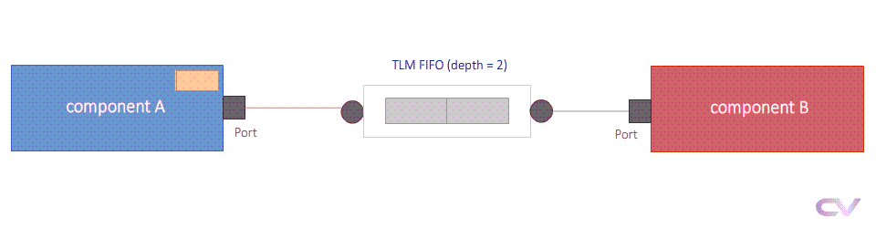

這頁教學主要是在介紹 **UVM TLM FIFO** 的使用場景與方法。這是用來解決兩個組件（Component）之間「速度不匹配」的問題。

我會結合圖片、程式碼以及你最後提出的關鍵問題（為什麼不用自己寫 `put`/`get` 實作）來詳細說明。


### 1. 核心概念與圖片說明

請看你上傳的架構圖：

* **左邊的 Component A (Producer)**：它是生產者，負責產生資料。
* 它使用 **Port** (方形圖示)，動作是 `put`（把資料推出去）。


* **右邊的 Component B (Consumer)**：它是消費者，負責處理資料。
* 它使用 **Port** (方形圖示)，動作是 `get`（主動去拿資料）。


* **中間的 TLM Fifo**：它是緩衝區（Buffer）。
* 它兩端都是 **Export** (圓形圖示)。
* 它像一個倉庫，A 把貨物堆進去，B 從裡面把貨物拿走。


**為什麼需要 FIFO？**
範例中提到：**Sender (A) 的速度比 Receiver (B) 快**。
如果沒有 FIFO，A 必須等 B 處理完才能送下一筆（Blocking），這樣 A 的效率會被 B 拖累。有了 FIFO，A 可以一直塞資料進去，直到倉庫爆滿為止；B 則可以依照自己的步調慢慢拿。


### 2. 程式碼行為分析

讓我們看看程式碼如何模擬這個「速度不匹配」的情況：

#### **Component A (快遞員)**

```systemverilog
virtual task run_phase (uvm_phase phase);
     // ...
     repeat (m_num_tx) begin
         // ... 產生封包 ...
         #50; // <--- 關鍵點：A 每 50ns 就送一次資料
         `uvm_info ("COMPA", "Packet sent to CompB", UVM_LOW)
         m_put_port.put (pkt); // 把資料推進 Port
      end
     // ...
endtask

```

* **行為**：A 非常勤勞，每 **50ns** 就產出一個封包並塞給 FIFO。

#### **Component B (慢郎中)**

```systemverilog
virtual task run_phase (uvm_phase phase);
     // ...
     repeat (m_num_tx) begin
       #100; // <--- 關鍵點：B 每 100ns 才拿一次資料
         m_get_port.get (pkt); // 向 Port 要資料
         `uvm_info ("COMPB", "ComponentA just gave me the packet", UVM_LOW)
      end
     // ...
endtask

```

* **行為**：B 動作比較慢，每 **100ns** 才去 FIFO 拿一次封包。

#### **My_Test (連接與 FIFO 設定)**

```systemverilog
   // 宣告 FIFO，括號中的 Packet 是指定倉庫裡存什麼類型的貨物
   uvm_tlm_fifo #(Packet) m_tlm_fifo;

   virtual function void build_phase (uvm_phase phase);
      // ...
      // 創建 FIFO，深度 (depth) 設為 2。意思就是倉庫只能放 2 個封包。
      m_tlm_fifo = new ("uvm_tlm_fifo", this, 2);
   endfunction

   virtual function void connect_phase (uvm_phase phase);
     // A 的 put_port 接到 FIFO 的 put_export (入貨口)
     compA.m_put_port.connect(m_tlm_fifo.put_export);
     
     // B 的 get_port 接到 FIFO 的 get_export (出貨口)
     compB.m_get_port.connect(m_tlm_fifo.get_export);
   endfunction

```


### 3. Log 結果分析 (印證 FIFO 行為)

看下方的 Output Log：

1. **@ 50ns**: A 送出第 1 包 (FIFO 剩 1 個空位)。
2. **@ 100ns**:
* B 拿走第 1 包 (FIFO 空了)。
* A 送出第 2 包 (FIFO 剩 1 個空位)。


3. **@ 150ns**: A 送出第 3 包 (FIFO 滿了，有 2 包)。
4. **@ 150ns ~ 200ns**:
* A 想要再送第 4 包，但 FIFO 滿了 (Depth=2)。
* 因為使用的是 **Blocking Port**，A 被迫**卡住 (Blocked)**，必須等待 FIFO 有空位。
* Log 中出現 `Fifo is now FULL !` 的警告。


5. **@ 200ns**: B 終於睡醒了，拿走第 2 包。FIFO 出現空位，A 解除阻塞，成功把第 4 包塞進去。


### 4. 關鍵問題：為什麼 FIFO 沒有實作 put 和 get 的 method？

你問到：「**為什麼 fifo 沒有實作 put 和 get 的 method？**」

這是一個非常好的問題！這牽涉到 UVM 的**封裝 (Encapsulation)** 與 **繼承 (Inheritance)** 概念。

**答案是：它有實作，只是「被藏起來」了（在 UVM 原始碼裡），你不需要自己寫。**

#### 詳細解釋：

1. **它是一個預先寫好的類別 (Pre-built Class)**：
你的程式碼裡寫的是 `uvm_tlm_fifo`。這不是你自己定義的 class，而是 **UVM Library** (來自 `import uvm_pkg::*;`) 裡面已經寫好的標準 class。
2. **內部結構 (Under the hood)**：
如果你去翻閱 UVM 的原始碼 (Source Code)，你會發現 `uvm_tlm_fifo` 內部其實實作了非常複雜的邏輯。它裡面大概長這樣（簡化版示意圖）：
```systemverilog
// 這是 UVM Library 內部的程式碼，你看不見但它存在
class uvm_tlm_fifo #(type T=int) extends uvm_component;

   // 內部的儲存陣列 (真正的倉庫)
   local T m_queue[$]; 
   int m_size;

   // 對外公開的 Export
   uvm_put_imp #(T, uvm_tlm_fifo #(T)) put_export;
   uvm_get_peek_imp #(T, uvm_tlm_fifo #(T)) get_export;

   // *** 這裡就是實作！ ***
   // 當外部的 A 呼叫 put 時，其實是呼叫了這個函數
   virtual task put(T t);
      while(m_queue.size() >= m_size) wait(); // 滿了就等
      m_queue.push_back(t); // 存入佇列
   endtask

   // 當外部的 B 呼叫 get 時，其實是呼叫了這個函數
   virtual task get(output T t);
      while(m_queue.size() == 0) wait(); // 空了就等
      t = m_queue.pop_front(); // 取出資料
   endtask

   // ... 建構函數與其他邏輯 ...
endclass

```


3. **為什麼之前的範例要自己寫？**
* 在之前的 `componentA` 連接 `componentB` 的範例中，因為 B 是你自己寫的組件，UVM 不知道你想怎麼處理收到的資料（是要印出來？還是拿去計算？），所以**你必須在 B 裡面自己實作 `get**`。
* 但是 `uvm_tlm_fifo` 的功能非常單純且標準，就是「先進先出」。既然邏輯固定，UVM 就幫你寫好了。你只需要 `new` 它，然後把線接上去 (connect) 即可。


**總結：**
並不是沒有實作，而是 UVM 幫你實作在 `uvm_tlm_fifo` 這個類別裡面了。這就是使用 UVM 的好處之一：**重用性 (Reusability)**。你不需要每次都重新發明輪子（重寫 FIFO）。


----
----

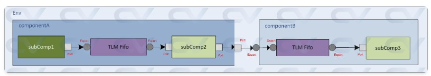

這是一個非常好的 **UVM TLM 階層式連接 (Hierarchical Connection)** 綜合範例。它將我們之前學過的 `put`、`get` 和 `FIFO` 全部結合在一起，並且展示了如何在不同層級（Sub-component 到 Component，再到 Top）之間傳遞資料。

配合你上傳的架構圖，我們將這個系統分為 **左側 (Component A)** 和 **右側 (Component B)** 兩個部分來詳細拆解。


### 1. 整體架構概念

請看圖表：

* **資料流向**：從最左邊的 `subComp1` 產生，一路往右流動，最終抵達 `subComp3`。
* **速度瓶頸**：
* `subComp1` (生產者): **50ns** 產出一次 (超快)
* `subComp2` (中繼站): **100ns** 處理一次 (中速)
* `subComp3` (消費者): **200ns** 消化一次 (超慢)


* **解決方案**：因為每一級的速度都不一樣，所以每一級中間都必須塞一個 **TLM FIFO** 來當緩衝區，否則慢的一方會拖死快的一方。


### 2. 左側：Component A (生產與中繼)

這對應圖表中左邊藍色大框框 `componentA`。

#### **(1) subComp1: 源頭**

它是最單純的生產者。

* **程式碼特徵**：只有 `uvm_blocking_put_port`。
* **行為**：每 `#50` 時間就 `put` 一個封包。
* **連接**：它的 Port 連接到內部的 FIFO 入口。

#### **(2) subComp2: 中繼轉換器 (The Middleman)**

這就是我們上一題討論過的「同時有 put 和 get」的組件。

* **程式碼特徵**：
```systemverilog
uvm_blocking_get_port #(Packet) m_get_port; // 向左拿
uvm_blocking_put_port #(Packet) m_put_port; // 向右推

```


* **行為**：每 `#100` 時間，從 FIFO `get` 資料，然後往外 `put` 出去。
* **圖表對應**：位於 Component A 的中間，左手接 FIFO，右手接外部 Port。

#### **(3) Component A 的內部連接**

在 `connect_phase` 中，這裡展示了如何把子組件串起來：

```systemverilog
// 1. subComp1 -> FIFO (存入)
m_subcomp_1.m_put_port.connect(m_tlm_fifo.put_export);

// 2. FIFO -> subComp2 (取出)
m_subcomp_2.m_get_port.connect(m_tlm_fifo.get_export);

// 3. subComp2 -> Component A 的對外窗口 (轉發)
m_subcomp_2.m_put_port.connect(this.m_put_port);

```


### 3. 右側：Component B (緩衝與接收)

這對應圖表中右邊藍色大框框 `componentB`。

因為 `subComp3` (終點) 的速度 (**200ns**) 比送過來的速度 (**100ns**) 還慢，所以 Component B 內部 **必須再加一個 FIFO**。

#### **(1) Export 的使用**

注意 Component B 的對外接口不是 Port，而是 **Export**。

* **原理**：Component B 不是主動把資料推出去，而是提供一個「入口」讓 Component A 把資料塞進來。
* **程式碼**：
```systemverilog
uvm_blocking_put_export #(Packet) m_put_export;

```


* **連接**：外部的資料塞進 `m_put_export` 後，直接導通到內部 FIFO 的 `put_export`。
```systemverilog
m_put_export.connect (m_tlm_fifo.put_export);

```


#### **(2) subComp3: 終點**

* **行為**：每 `#200` 時間才 `get` 一次資料。


### 4. 頂層連接 (Top Env) 與 Log 分析

在 `my_test` 中，將左右兩大塊接在一起：

```systemverilog
// 把 A 的輸出 Port 接到 B 的輸入 Export
compA.m_put_port.connect(compB.m_put_export);

```

#### **Log 行為解讀 (證明阻塞發生)**

這個 Log 完美展示了「塞車」現象是如何傳遞的：

1. **第一階段塞車 (Component A 內部)**：
* `subComp1` (50ns) 比 `subComp2` (100ns) 快。
* 所以 Component A 裡面的 FIFO 很快就滿了。
* **Log @ 150~190**: `componentA:TLM_Fifo is now FULL !`


2. **第二階段塞車 (Component B 內部)**：
* 雖然 `subComp2` 已經變慢成 100ns 了，但 `subComp3` (200ns) 更慢！
* 所以 Component B 裡面的 FIFO 也滿了。
* **Log @ 300+**: `componentB:TLM_Fifo is now FULL !`


### 總結這頁的教學重點

1. **Port vs Export**：
* **Port (方塊)**：Component A 用 Port，因為它是**主動**把資料推出去。
* **Export (圓形)**：Component B 用 Export，因為它**被動**提供一個接口讓別人插。


2. **階層式連接 (Hierarchical Connection)**：
* `Port` 接 `Port` (子組件推給父組件)。
* `Export` 接 `Export` (父組件導給子組件)。
* `Port` 接 `Export` (Component A 接 Component B)。


3. **流量控制**：展示了當生產者快於消費者時，多層級的 FIFO 是如何逐級緩衝並最終填滿的。

----
----

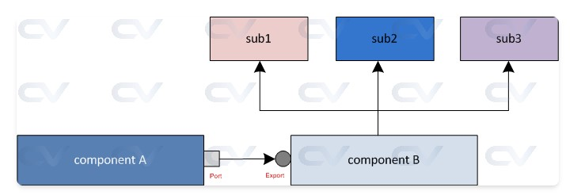
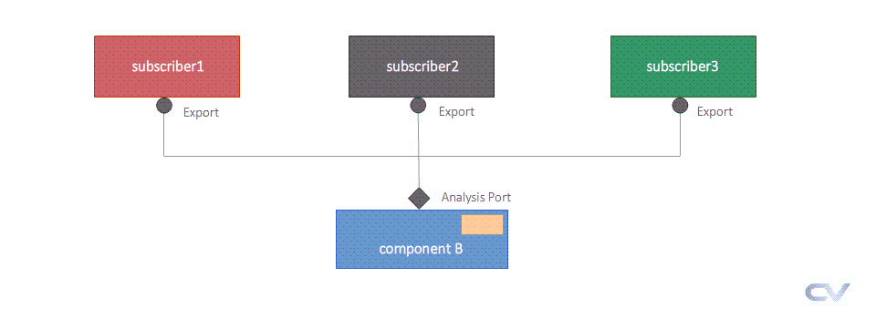

這份教學介紹了 UVM 中非常重要的一個通訊機制：**Analysis Port (分析端口)**。

如果說之前的 `put` 和 `get` 是「一對一」的打電話（你是生產者，我是消費者，我得等你），那麼 **Analysis Port** 就是「一對多」的 **廣播系統 (Broadcasting)**。

以下我配合圖片 `tlm-ap.gif` 以及程式碼來詳細拆解這個概念。


### 1. 核心概念與圖片說明

請看這張圖 ：

* **中間的 Component B (Broadcaster)**：
* 它擁有一個 **Analysis Port**（圖中下方的菱形圖示）。
* 它的角色像是「廣播電台」或「YouTuber」。
* 它負責發送訊息，而且**它不在乎有多少人收到，也不在乎有沒有人收到**。它只管發送（Write）。


* **上方的 Subscriber 1, 2, 3 (Listeners)**：
* 它們擁有 **Export**（圖中圓形圖示）。
* 它們的角色是「聽眾」或「訂閱者」。
* 它們都連接到同一個 Component B。


* **行為模式**：
* 當 Component B 呼叫 `write()` 時，Subscriber 1、2、3 會**同時**收到同一份資料。
* 這是一個 **Non-blocking (非阻塞)** 的操作，發送者送完就走，不會等待接收者處理完。


**應用場景**：這最常用於 **Monitor (監測器)**。Monitor 看到匯流排上有資料，它會透過 Analysis Port 廣播出去，給 **Scoreboard** (記分板，用來檢查對錯) 和 **Coverage Collector** (覆蓋率收集器) 同時使用。


### 2. 程式碼實作：發送端 (Broadcaster)

這對應教材中的 `componentB`。

```systemverilog
class componentB extends uvm_component;
    `uvm_component_utils (componentB)

    // 1. 宣告 Analysis Port
    // 語法：uvm_analysis_port #(資料型別) 變數名稱;
    uvm_analysis_port #(simple_packet) ap;

    virtual function void build_phase (uvm_phase phase);
        super.build_phase (phase);
        // 2. 實例化 (New)
        ap = new ("analysis_port", this);
    endfunction

    virtual task run_phase (uvm_phase phase);
        // ... (產生 packet 的程式碼) ...
        
        // 3. 廣播資料
        // 關鍵函數：write()
        ap.write (pkt); 
    endtask
endclass

```

* **重點**：`ap.write(pkt)` 是一個 **void function** (沒有回傳值，也不消耗時間)。呼叫它的瞬間，所有連接的組件都會被觸發。


### 3. 程式碼實作：接收端 (Subscriber)

這對應教材中的 `sub` 類別。UVM 提供了一個好用的基底類別叫 `uvm_subscriber`。

```systemverilog
// 繼承自 uvm_subscriber，它已經內建好 analysis_export 了
class sub #(type T = simple_packet) extends uvm_subscriber #(T);
   `uvm_component_utils (sub)

   // ... (new 和 build_phase) ...

   // 關鍵：必須實作 write 函數
   // 當 Component B 呼叫 ap.write(pkt) 時，
   // 實際上就是執行這裡面的程式碼
   virtual function void write (T t);
      `uvm_info (get_full_name(), "Sub got transaction", UVM_MEDIUM)
      // 在這裡你可以寫：
      // 1. 把資料存進 Scoreboard
      // 2. 計算 Coverage
      // 3. 印出 Log
   endfunction
endclass

```

* **重點**：你**必須**定義 `write(T t)` 函數。這是 `uvm_analysis_imp` 規定的標準接口。如果你沒寫這個函數，編譯會報錯。


### 4. 連接 (Connecting)

在 `my_env` 中，將「一個發送者」連到「三個接收者」。

```systemverilog
virtual function void connect_phase (uvm_phase phase);
    // ... 
    
    // 廣播連接：一個 ap 連接多個 export
    compB.ap.connect (sub1.analysis_export);
    compB.ap.connect (sub2.analysis_export);
    compB.ap.connect (sub3.analysis_export);
endfunction

```

* **注意**：`sub1.analysis_export` 這個名字是哪來的？我們在 `sub` 類別裡沒宣告啊？
* 答案：因為 `sub` 繼承了 `uvm_subscriber`，這個變數是父類別內建好的。


### 5. Log 結果分析

讓我們看看 Output Log，驗證「廣播」是否成功：

```text
UVM_INFO ... [COMPB] Packet received from CompA
... (Packet 資料) ...

// 下面這三行是重點！
UVM_INFO ... [sub1] Sub got transaction
UVM_INFO ... [sub2] Sub got transaction
UVM_INFO ... [sub3] Sub got transaction

```

1. **時間點**：所有動作都在 `@ 0` 發生。
2. **順序**：當 `COMPB` 收到資料並呼叫 `write` 後，`sub1`, `sub2`, `sub3` 幾乎同時（在同一個 Delta Cycle 內）印出了 "Sub got transaction"。
3. **結論**：這證明了一份資料被成功複製並發送給了三個不同的組件，這就是 Analysis Port 的威力。

### 總結

* **Put/Get Port**：像打電話 (1對1)，會佔線 (Blocking)，用於資料傳遞與流動控制。
* **Analysis Port**：像廣播 (1對多)，不佔線 (Non-blocking)，用於監測 (Monitor) 與分析 (Analysis)。
* **Write Function**：Analysis Port 的唯一接口方法，接收端必須實作它來決定收到資料後要做什麼。

----
----


這頁教學介紹了 UVM 中 **TLM 2.0** 的核心概念：**Sockets (插座/接口)**。

如果說之前的 `put` / `get` 是單純的「丟球」和「接球」，那麼 **Socket** 更像是功能強大的 **「USB 接口」** 或 **「電話線」**，它不僅能傳送資料，還能包含 **時間資訊 (Timing Annotation)**，並且支援更複雜的雙向互動。

以下配合圖片 `abc49.jpg`  與程式碼來詳細說明。

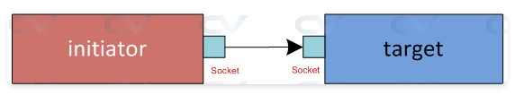

### 1. 核心概念與圖片說明

請看圖片 `abc49.jpg`：

* **Initiator (發起者/主動端)**：對應圖左的紅色方塊。它主動發起交易（Transaction）。
* 擁有 **Initiator Socket**。


* **Target (目標/被動端)**：對應圖右的藍色方塊。它接收並回應交易。
* 擁有 **Target Socket**。


* **Socket 連接**：兩個 Socket 直接對接，形成一條通路。

**關鍵差異**：在 TLM 2.0 中，我們不再說 "Put Port" 或 "Get Port"，而是統一稱作 **Socket**。傳輸的方法通常稱為 **`b_transport`** (Blocking Transport)。


### 2. 程式碼行為分析

#### **(1) Initiator (發起者)**

```systemverilog
class initiator extends uvm_component;
   // 1. 宣告 Initiator Socket (專門傳送 simple_packet)
   uvm_tlm_b_initiator_socket #(simple_packet) initSocket;
   uvm_tlm_time delay; // TLM 2.0 特有的時間物件

   virtual function void build_phase (uvm_phase phase);
      // 2. 實例化 Socket
      initSocket = new ("initSocket", this);
      delay = new ();
   endfunction

   virtual task run_phase (uvm_phase phase);
      repeat (5) begin
         // ... (產生 packet) ...
         
         // 3. 發送資料 (使用 b_transport)
         // 注意：這裡多了一個參數 'delay'
         initSocket.b_transport (pkt, delay);
      end
   endtask
endclass

```

* **重點**：它呼叫 `initSocket.b_transport(pkt, delay)`。這就像是用電話線撥號出去。

#### **(2) Target (接收者)**

```systemverilog
class target extends uvm_component;
   // 1. 宣告 Target Socket
   // 注意參數：<本類別名稱, 接收的資料型別>
   uvm_tlm_b_target_socket #(target, simple_packet) targetSocket;

   virtual function void build_phase (uvm_phase phase);
      // 2. 實例化 Socket
      targetSocket = new ("targetSocket", this);
   endfunction

   // 3. 實作 b_transport 任務
   // 當 Initiator 呼叫 b_transport 時，實際上是執行這裡的程式碼
   task b_transport (simple_packet pkt, uvm_tlm_time delay);
      `uvm_info ("TGT", "Packet received from Initiator", UVM_MEDIUM)
      pkt.print (uvm_default_line_printer);
   endtask
endclass

```

* **重點**：Target **必須定義** `b_transport` 任務。這跟之前的 `_imp` 很像，Socket 會自動把外部的呼叫轉發給這個任務。

#### **(3) 連接 (Environment)**

```systemverilog
virtual function void connect_phase (uvm_phase phase);
   // 就像把插頭插入插座一樣簡單
   init.initSocket.connect (tgt.targetSocket);
endfunction

```


### 3. Socket 與 Put/Get 的差別 (重要面試題)

這兩者最大的差別在於 **標準 (Standard)** 與 **功能 (Capability)**：

| 特性 | TLM 1.0 (Put / Get / Port) | TLM 2.0 (Sockets) |
| --- | --- | --- |
| **主要用途** | 用於 Testbench 內部簡單的資料傳遞 (如 FIFO)。 | 用於**系統級建模 (System modeling)**，模擬 CPU、Bus、Memory 行為。 |
| **方向性** | **單向 (Unidirectional)**。<br>

<br>Put 只能推，Get 只能拉。 | **雙向 (Bidirectional)**。<br>

<br>雖然此例看起來像單向，但 Socket 結構允許回傳回應 (Response) 且支援反向路徑。 |
| **傳輸方法** | `put()`, `get()` | `b_transport()` (阻塞), `nb_transport()` (非阻塞) |
| **時間模擬** | 只能用 `#10` 這種硬性延遲。 | 支援 **Timing Annotation (`uvm_tlm_time`)**。<br>

<br>這允許傳遞「這個動作耗時多久」的資訊，而不必真的在模擬中 `wait` 時間，這對高速模擬非常重要。 |
| **通用性** | 僅限 SystemVerilog UVM 使用。 | 為了與 **SystemC** 互通而設計。Socket 是跨語言通用的標準介面。 |

#### **簡單比喻**：

* **Put/Get** 就像 **「傳真機」**：
* 只能單向傳送一張紙。
* 你把紙塞進去 (`put`)，對方印出來 (`get`)。
* 結構簡單，適合單純的資料搬運。


* **Socket** 就像 **「電話」或「視訊會議」**：
* 雙方建立連線後，可以講話 (`pkt`)，也可以告訴對方「我需要想 5 秒鐘」 (`delay`)。
* 這是為了模擬更複雜的匯流排 (Bus) 行為（例如 AXI, AHB 匯流排）而設計的。


**結論**：
如果你只是要在 Testbench 裡把 Monitor 的資料丟給 Scoreboard，用 `Analysis Port` 或 `TLM FIFO (Put/Get)` 就夠了。但如果你要寫一個 **虛擬模型 (Virtual Prototype)** 來模擬一個 ARM CPU 讀寫 Memory 的行為，你就必須用 **Socket (TLM 2.0)**。


----
----

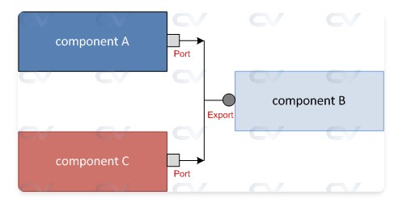
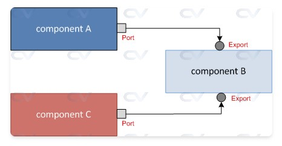

這份教學主要在解決一個很實際的問題：**當一個 Component (Component B) 同時要接收來自兩個不同來源 (Component A 和 C) 的資料，而且想要對這兩份資料做「不同」的處理時，該怎麼辦？**

配合圖片 **`abc51.jpg`**  和程式碼，我來為你詳細說明。


### 1. 核心問題：名稱衝突 (Name Collision)

在標準的 UVM TLM 中：

* 如果 Component B 有一個 `uvm_blocking_put_imp`，它就**必須**實作一個叫做 **`put()`** 的任務。
* **問題來了**：如果你有兩個輸入端口（比如一個接收影像，一個接收聲音），你不能在同一個 Class 裡面寫兩個都叫做 `put()` 的任務。SystemVerilog 不允許同名函式。

如果你不使用本頁教的方法，Component A 和 C 送來的資料都會跑進同一個 `put()` 函式，Component B 就分不清楚這份資料到底是誰送的，也無法分流處理。


### 2. 解決方案：使用 `_decl` 巨集 (Macro)

UVM 提供了一套巨集 `uvm_*_imp_decl`，讓你能夠「改名」。它允許你定義特殊的 Port，這些 Port 對應的執行函式不再叫 `put`，而是叫 `put_1`、`put_2` (或是任何你取的名字)。

#### **步驟一：定義後綴 (Outside the Class)**

在 Class 定義的外面，呼叫巨集：

```systemverilog
// 這會告訴 UVM：請幫我創造兩個新的類別，
// 一個以後要呼叫 put_1，另一個要呼叫 put_2
`uvm_blocking_put_imp_decl (_1)
`uvm_blocking_put_imp_decl (_2)

class componentB extends uvm_component;
   // ...

```

#### **步驟二：宣告特殊的 Implementation Port**

在 Component B 裡面，我們不再用標準的 `uvm_blocking_put_imp`，而是用剛剛巨集生出來的新類別：

```systemverilog
   // 注意：原本是 uvm_blocking_put_imp
   // 現在變成了 uvm_blocking_put_imp_1 和 _2
   uvm_blocking_put_imp_1 #(simple_packet, componentB) put_imp1;
   uvm_blocking_put_imp_2 #(simple_packet, componentB) put_imp2;

```

#### **步驟三：實作不同的任務**

這是最關鍵的一步。現在你可以在同一個 Component B 裡寫兩個不同的處理邏輯：

```systemverilog
   // 專門處理從 put_imp1 (Component A) 進來的資料
   task put_1 (simple_packet pkt);
      `uvm_info ("COMPB", "Packet received from put_1", UVM_LOW)
      // 比如：把這份資料存到硬碟
   endtask

   // 專門處理從 put_imp2 (Component C) 進來的資料
   task put_2 (simple_packet pkt);
      `uvm_info ("COMPB", "Packet received from put_2", UVM_LOW)
      // 比如：把這份資料丟棄
   endtask

```


### 3. 一般 Put 與 Macro Put (_decl) 的差別

你問到：「這個 put 和一般的 put 差別在哪？」

| 特性 | 一般 Put (Standard) | 特殊 Put (`_decl` Macro) |
| --- | --- | --- |
| **宣告方式** | `uvm_blocking_put_imp` | `uvm_blocking_put_imp_SUFFIX` |
| **對應函式** | 必須命名為 **`put()`** | 必須命名為 **`put_SUFFIX()`** (例如 `put_1`) |
| **主要用途** | 用於單一輸入，或「多個輸入但處理邏輯完全相同」的情況。 | 用於「多個輸入且處理邏輯**必須分開**」的情況。 |
| **Class 限制** | 一個 Component 內只能有一個 `put()` 函式。 | 透過不同後綴，一個 Component 內可以有多個 `put_x()`, `put_y()`。 |

### 總結

請看 `abc51.jpg` ：

* **左上 Component A**：它只知道自己要把東西送出去，它用的是普通的 `put_port`。
* **左下 Component C**：它也只知道自己要送東西，用的也是普通的 `put_port`。
* **右邊 Component B**：它是接收者。因為它要同時應付 A 和 C，而且要區分這兩者，所以它使用了 **Macro (`_decl`)** 來創造出兩個不同的入口 (`put_imp1` 和 `put_imp2`)，分別對應到內部的 `put_1()` 和 `put_2()` 任務。

簡單來說，這個技巧就是為了解決 **「一個 Component 沒辦法寫兩個同名 `put` 函式」** 的語法限制而生的。


----
----


這篇文章主要在介紹 UVM (Universal Verification Methodology) 中 **TLM (Transaction Level Modeling)** 的 **Nonblocking Put Port** 機制。

簡單來說，之前的教學可能提到過 "Blocking Put" (阻塞式傳送)，發送端 (Sender) 必須等到接收端 (Receiver) 完成接收後才能繼續執行。而 **Nonblocking (非阻塞式)** 的特點是：發送端**不會**停下來等，它會嘗試傳送，並立即獲得「成功」或「失敗」的結果，或者先詢問接收端「是否準備好了」。

這篇文章透過三個步驟/範例來解說如何實作。以下我配合程式碼為您詳細說明：


### 1. 基本概念與資料物件 (Packet)

首先，TLM 需要傳送一個資料封包（Transaction）。
程式碼定義了一個 `Packet` 類別：

```systemverilog
class Packet extends uvm_object;
  rand bit[7:0] addr;
  rand bit[7:0] data;
  // ... (省略 macro 與 new 函式)
endclass

```

這是一個標準的 UVM Sequence Item，包含兩個隨機變數 `addr` 和 `data`，這是 Component A 要丟給 Component B 的東西。


### 2. 範例一：基本的 try_put 傳輸

這是最基礎的 Nonblocking 用法：**「試著丟丟看，並告訴我結果」**。

#### 發送端 (Sender): `componentA`

**關鍵程式碼解讀：**

1. **定義 Port:**
```systemverilog
uvm_nonblocking_put_port #(Packet) m_put_port;

```


宣告這是一個非阻塞的 put port。
2. **執行傳送 (Run Phase):**
```systemverilog
success = m_put_port.try_put(pkt); // 嘗試傳送
if (success)
   `uvm_info(...) // 成功
else
   `uvm_info(...) // 失敗

```


* **重點機制**：呼叫 `try_put(pkt)`。這是一個 **Function** (不消耗時間)。
* 它會立即回傳 `1` (成功) 或 `0` (失敗)。發送端根據回傳值決定下一步（在這個範例中只是印出 Log）。


#### 接收端 (Receiver): `componentB`

**關鍵程式碼解讀：**

1. **定義 Imp:**
```systemverilog
uvm_nonblocking_put_imp #(Packet, componentB) m_put_imp;

```


宣告這是一個實作端 (Imp)，並指定它屬於 `componentB`。
2. **實作方法:**
```systemverilog
virtual function bit try_put (Packet pkt);
  // 印出收到的封包
  return 1; // 回傳 1 表示「我收到了，沒問題」
endfunction

```


* 因為 Port 端呼叫的是 `try_put`，接收端必須實作這個 Function。在這個簡單範例中，它總是回傳 `1`，代表永遠準備好接收。


#### 連接 (Testbench): `my_test`

在 `connect_phase` 中將兩者接起來：

```systemverilog
compA.m_put_port.connect (compB.m_put_imp);

```


### 3. 範例二：模擬 Blocking 行為 (Polling)

在現實電路中，接收端可能正在忙 (Buffer 滿了)，無法立刻接收。這個範例展示了：**如果接收端沒空，發送端該怎麼做？**

#### 修改後的發送端 (`componentA`)

它使用了一個 `do-while` 迴圈來模擬「等待」：

```systemverilog
do begin
  success = m_put_port.try_put(pkt); // 試著丟
  if (success)
    // 成功
  else
    // 失敗，印出 Log
  #1; // 等待 1ns 後重試 (非常重要！)
end while (!success);

```

* **重點**：這就是所謂的 **Polling (輪詢)**。
* 如果 `try_put` 回傳失敗，它不會放棄，而是等待一段時間 (`#1`) 再試一次，直到成功為止。這在行為上就像是 Blocking put，但底層是用 Nonblocking 實現的。

#### 修改後的接收端 (`componentB`)

為了測試發送端的重試機制，接收端隨機決定是否拒收：

```systemverilog
virtual function bit try_put (Packet pkt);
  bit ready;
  std::randomize(ready); // 隨機決定是否準備好

  if (ready) begin
    // 接收處理
    return 1;
  end else begin
    return 0; // 拒絕接收
  end
endfunction

```

* 當回傳 `0` 時，`componentA` 的迴圈就會繼續跑，直到隨機出 `1` 為止。


### 4. 範例三：使用 `can_put` (先問再送)

除了直接丟封包看結果，另一種 Nonblocking 的作法是：**「先問你能不能收，確定能收我再丟」**。

#### 發送端 (`componentA`)

邏輯改變如下：

```systemverilog
// 1. 先確認接收端是否準備好
do begin
  success = m_put_port.can_put(); // 詢問：你可以收嗎？
  // 如果 success 是 0，迴圈會繼續等待
end while (!success);

// 2. 確定準備好後，才執行傳送
m_put_port.try_put(pkt);

```

* **差異**：這裡分成了兩步。先用 `can_put()` 輪詢狀態，確認對方 Ready 後，再呼叫 `try_put()`。

#### 接收端 (`componentB`)

除了 `try_put`，現在必須實作 `can_put`：

```systemverilog
virtual function bit can_put();
  return $urandom_range(0,1); // 隨機回傳 0 或 1 (模擬忙碌狀態)
endfunction

```

* `try_put` 負責實際接收資料。
* `can_put` 僅負責回傳狀態 (不涉及資料傳輸)。


### 總結

這頁教學主要傳達了 UVM TLM Nonblocking 的三種操作模式：

1. **Fire-and-Forget (或 Fire-and-Check):** 直接呼叫 `try_put()`。若成功就成功，失敗就算了（或做錯誤處理）。
2. **Polling (模擬阻塞):** 使用 `try_put()` 配合迴圈與延遲，直到傳送成功。
3. **Query-then-Send:** 先呼叫 `can_put()` 確認狀態，等到 Ready 後再呼叫 `try_put()` 傳送。

這些機制讓驗證環境能模擬真實硬體中 FIFO 滿載、匯流排忙碌等「非即時完成」的通訊協議。

----
----

這頁教學的核心在於解說 UVM 中**跨越不同階層 (Hierarchy)** 的 TLM 連接方式。

在大型驗證環境中，發送 Transaction 的元件（Initiator）和接收處理的元件（Target）通常不會在同一層，而是被層層包裝在 Agent 或 Env 裡面。為了讓它們能溝通，我們需要透過 **Port**（出口）、**Export**（入口/轉發）和 **Imp**（實作/終點）來打通這些階層。

以下我將配合您提供的四張圖片與程式碼片段，一一說明這四種連接情境。


### 基本概念 (三種端口)

在開始看圖前，請先記住這三個角色的定義：

1. **Port (方框 □)**: 發起端。我要把資料送出去 (Initiator)。
2. **Export (圓圈 ○)**: 轉發端。我是一個外殼，收到資料後轉給內部的元件 (Passthrough)。
3. **Imp (實心圓 ●)**: 實作端。我是終點，實際的 `put()` 函式寫在我這裡 (Target)。


### 1. Port to Port to Export to Imp
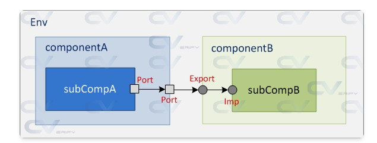
**對應圖片：abc52.jpg**

這是最標準、最完整的跨階層傳輸範例。

* **階層結構**：
* **發送側 (藍色)**: `subCompA` 在 `componentA` 裡面。
* **接收側 (綠色)**: `subCompB` 在 `componentB` 裡面。


* **資料流向**：`subCompA` (產出) -> `componentA` (轉發) -> `componentB` (轉發) -> `subCompB` (接收/消化)。

**程式碼配合說明：**

1. **Subcomponent A**: 定義 `uvm_blocking_put_port`。
2. **Component A**: 定義 `uvm_blocking_put_port`。
* **連接 (由下往上)**: 在 `connect_phase` 中，將子元件的 port 連到自己的 port。
* `m_subcomp_A.m_put_port.connect(this.m_put_port);`


3. **Component B**: 定義 `uvm_blocking_put_export`。它不是終點，只是個入口。
* **連接 (由上往下)**: 將自己的 export 連到子元件的 imp。
* `m_put_export.connect(m_subcomp_B.m_put_imp);`


4. **Top (my_test)**:
* **連接 (平層)**: 將 A 的 Port 連到 B 的 Export。
* `compA.m_put_port.connect(compB.m_put_export);`


### 2. Port to Port to Imp
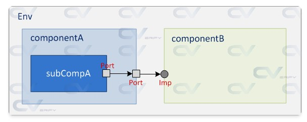
**對應圖片：abc53.jpg**

這個情境是：**接收端沒有子元件，它自己就是終點。**

* **階層結構**：
* **發送側**: 同上，`subCompA` 包在 `componentA` 裡。
* **接收側**: `componentB` 直接接收並處理，沒有內層了。


* **差異點**：
* 注意看圖片右邊，`componentB` 的端口變成了 **Imp** (實心圓)，而不是 Export。


**程式碼配合說明：**

* **Component B**:
* 定義：`uvm_blocking_put_imp #(Packet, componentB) m_put_imp;`
* 實作：因為它是 Imp，所以它必須在其 Class 內寫出 `task put(Packet pkt)` 的內容（例如 print 出來）。


* **Top (my_test)**:
* 連接：`compA.m_put_port.connect(compB.m_put_imp);`
* (註：雖然通常建議連到 Export，但直接連到 Imp 在語法上也是允許的，前提是層級正確)。


### 3. Port to Export to Imp
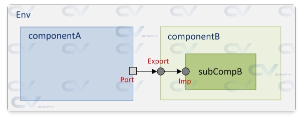
**對應圖片：abc54.jpg**

這個情境是：**發送端沒有子元件，它自己就是源頭。**

* **階層結構**：
* **發送側**: `componentA` 自己產生封包。
* **接收側**: 同情境 1，`componentB` 轉發給 `subCompB`。


* **差異點**：
* 注意看圖片左邊，`componentA` 沒有內層，Port 直接長在它身上。


**程式碼配合說明：**

* **Component A**:
* 在 `run_phase` 直接呼叫 `m_put_port.put(pkt)` 發送資料，不需要處理子元件連接。


* **Top (my_test)**:
* 連接邏輯不變：`compA.m_put_port.connect(compB.m_put_export);`


### 4. Port to Port to Export to Export to Imp (多層轉發)

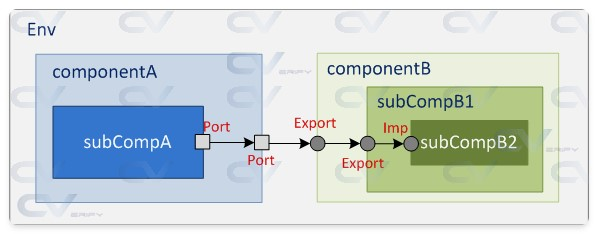
**對應圖片：abc55.jpg**

這個情境展示了 UVM 的**高擴充性**：可以穿越無數層 Export。

* **階層結構**：
* 接收側非常深：`componentB` -> `subCompB1` -> `subCompB2`。
* `subCompB2` 才是真正的終點 (Imp)。


* **資料流向**：A -> Port -> Port -> Export (CompB) -> Export (SubB1) -> Imp (SubB2)。

**程式碼配合說明：**

* **Component B**: 有 Export，連到 `subCompB1` 的 Export。
* `m_put_export.connect(m_subcomp_B1.m_put_export);`


* **SubComp B1**: 也有 Export，連到 `subCompB2` 的 Imp。
* `m_put_export.connect(m_subcomp_B2.m_put_imp);`


* 這證明了 Export 可以接 Export，就像接水管一樣，直到最後接到水龍頭 (Imp)。


### 總結規則 (Cheatsheet)

在閱讀這類 UVM 程式碼時，掌握 `connect` 的方向性是最重要的：

1. **Child Port → Parent Port** (向上):
`child.port.connect(parent.port)`
2. **Parent Port → Parent Export** (平層/跨模組):
`compA.port.connect(compB.export)`
3. **Parent Export → Child Export/Imp** (向下):
`parent.export.connect(child.export)` 或 `parent.export.connect(child.imp)`

這篇文章與圖片就是在展示這三種規則的排列組合。


----
----


這篇文章主要在介紹 UVM TLM 中的 **Non-blocking Get Port** (`uvm_nonblocking_get_port`) 機制。

這與上一篇 "Put" 的概念剛好相反，但操作邏輯（Blocking vs Non-blocking）是一樣的。

* **Put (推)**: 發送者主動把資料推給接收者。
* **Get (拉)**: 接收者主動向發送者請求（拉取）資料。

以下我將配合程式碼與邏輯流程圖（由於您未上傳此頁面的圖片，我將透過文字描述您通常會看到的架構圖）來詳細說明。


### 1. 核心概念：Non-blocking Get

在 **Blocking Get** 中，如果接收者請求資料，但發送者沒準備好，接收者會**卡住 (Stall)** 直到拿到資料為止。
而在 **Non-blocking Get** 中，接收者向發送者請求資料時，發送者會立刻回覆：「拿去（成功）」或「現在沒有（失敗）」，接收者**不會卡住**，可以立刻決定下一步要做什麼。

它主要有兩個 Function：

1. **`try_get(pkt)`**: 「試著拿拿看」。如果有資料就回傳 1 (成功)，沒有就回傳 0 (失敗)。
2. **`can_get()`**: 「請問現在有資料可以拿嗎？」。只詢問狀態，不進行傳輸。


### 2. 角色與架構

在這個範例中，資料流向是從 A 到 B，但**控制權（誰發起動作）**是在 B 手上。

* **Component B (Receiver / Initiator)**: 它是**主動方**。它擁有 `get_port`，負責說「給我資料」。
* **Component A (Sender / Target)**: 它是**被動方**。它擁有 `get_imp`，負責實作「當別人跟我要資料時，我該怎麼給」。

**架構示意：**
`[ Comp B (Port) ] <---請求資料--- [ Comp A (Imp) ]`
`[ Comp B (Port) ] <---資料封包--- [ Comp A (Imp) ]`


### 3. 範例一：使用 `try_get` (直接試誤法)

這是最直接的方法：接收者不斷嘗試去拿資料。

#### 接收者 (Component B)

```systemverilog
class componentB extends uvm_component;
   // 定義 Get Port
   uvm_nonblocking_get_port #(Packet) m_get_port;

   virtual task run_phase (uvm_phase phase);
     repeat (m_num_tx) begin
       // 嘗試去拿資料
       if (m_get_port.try_get(pkt))
         // 回傳 1：成功拿到，印出 Log
         `uvm_info ("COMPB", "ComponentA just gave me the packet", UVM_LOW)
       else
         // 回傳 0：沒拿到
         `uvm_info ("COMPB", "ComponentA did not give packet", UVM_LOW)
     end
   endtask
endclass

```

* **重點**：`try_get` 是一個 **Function**，它不消耗模擬時間。程式執行到這裡瞬間就會知道結果。

#### 發送者 (Component A)

```systemverilog
class componentA extends uvm_component;
   // 定義 Get Imp (實作端)
   uvm_nonblocking_get_imp #(Packet, componentA) m_get_imp;

   // 必須實作 try_get 函式
   virtual function bit try_get (output Packet pkt);
      pkt = new();           // 1. 產生封包
      assert (pkt.randomize()); // 2. 隨機化
      return 1;              // 3. 回傳 1 (代表我永遠準備好給資料)
   endfunction
endclass

```

* **重點**：因為 Port 呼叫了 `try_get`，Imp 端必須定義這個 Function 的內容。在這個簡單範例中，它總是回傳 `1`，代表隨時都有資料給人家。


### 4. 範例二：使用 `can_get` (先問再拿)

這個範例模擬了更真實的情況：發送者不一定隨時都有資料。接收者會先「輪詢 (Poll)」狀態。

#### 修改後的接收者 (Component B)

```systemverilog
virtual task run_phase (uvm_phase phase);
   repeat (m_num_tx) begin
     // 迴圈檢查：如果 can_get 回傳 0 (沒準備好)，就等待 10ns
     while (!m_get_port.can_get()) begin
       #10 `uvm_info("COMPB", $sformatf("See if can_get() is ready"), UVM_LOW)
     end

     // 跳出迴圈代表 can_get 回傳 1 (準備好了)
     // 這時候再去執行 try_get 就一定會成功
     `uvm_info("COMPB", $sformatf("COMPA ready, get packet now"), UVM_LOW)
     m_get_port.try_get(pkt);
   end
endtask

```

* **機制**：這就是所謂的 Polling。B 會一直問 A：「好了沒？...好了沒？...」，直到 A 說「好了」，B 才會真正伸手去拿 (`try_get`)。

#### 修改後的發送者 (Component A)

為了配合測試，A 必須實作 `can_get` 並模擬「有時候忙碌」的狀態。

```systemverilog
// 實作 can_get
virtual function bit can_get();
   bit ready;
   // 隨機決定是否準備好 (70%機率不準備好，30%機率準備好)
   std::randomize(ready) with { ready dist {0:/70, 1:/30}; };
   return ready;
endfunction

```

* **結果**：你看 Output Log 會發現，Component B 問了好幾次 "See if can_get() is ready"，直到 Component A 隨機擲骰子擲到了 `1`，B 才會印出 "COMPA ready, get packet now"。


### 5. 連接 (Testbench)

無論使用哪種方法，最上層的連接方式都是一樣的：

```systemverilog
virtual function void connect_phase (uvm_phase phase);
  // 將 B 的 Port (需求方) 連接到 A 的 Imp (供給方)
  compB.m_get_port.connect (compA.m_get_imp);
endfunction

```

### 總結比較

| 方法 | 行為描述 | 應用場景 |
| --- | --- | --- |
| **Blocking Get** (`get`) | 「給我資料，沒給我就不走。」(會卡住時間) | 確保資料同步，簡單的生產者-消費者模型。 |
| **Non-blocking** (`try_get`) | 「有資料嗎？有就拿，沒有就算了。」(立即回傳) | 檢查緩衝區，不想浪費時間等待，或者有其他事要忙。 |
| **Non-blocking** (`can_get`) | 「現在能拿嗎？」(查詢狀態) | 在執行拿取動作前，先確認對方狀態，避免錯誤。 |

----
----

