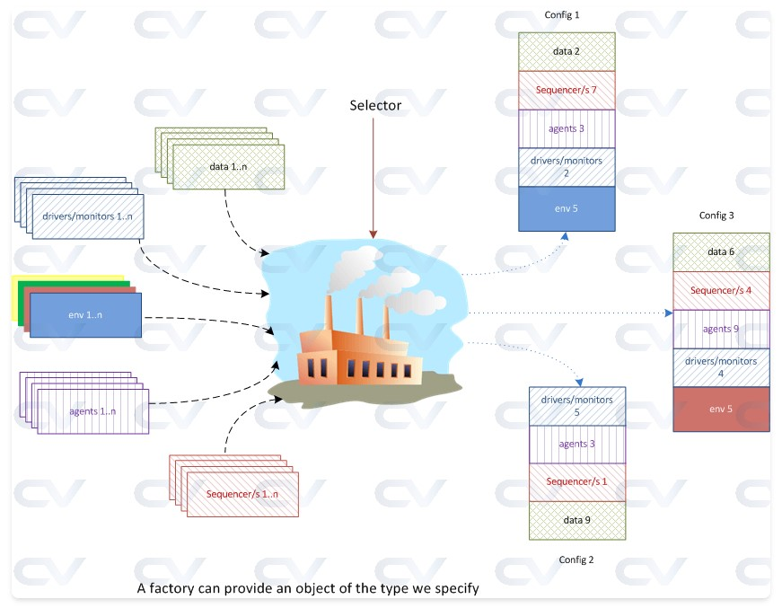
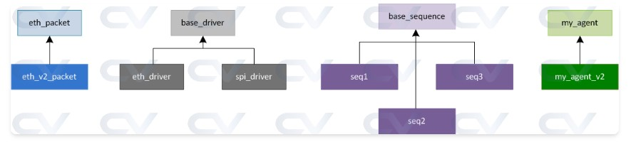
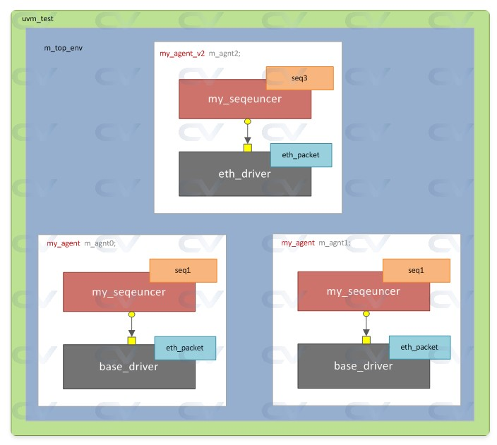
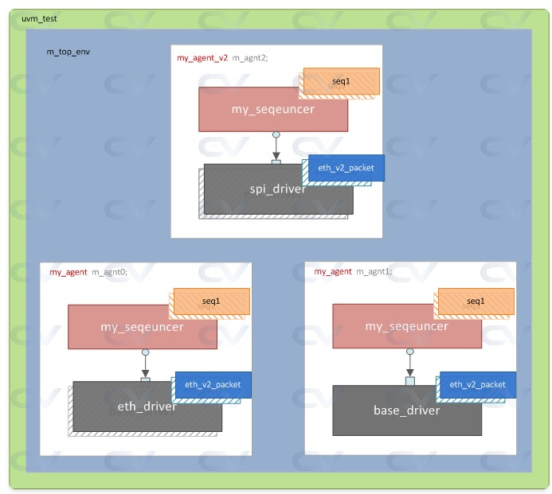
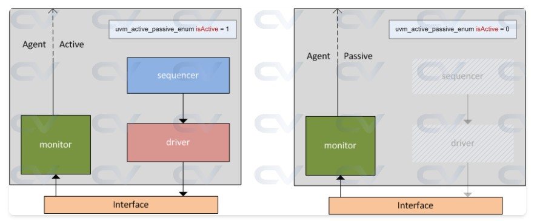
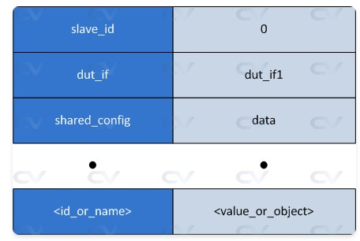
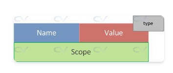
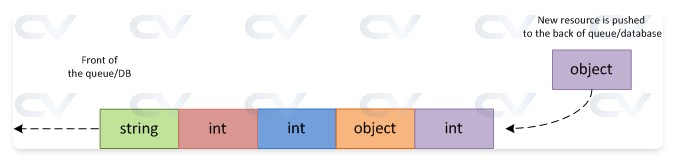
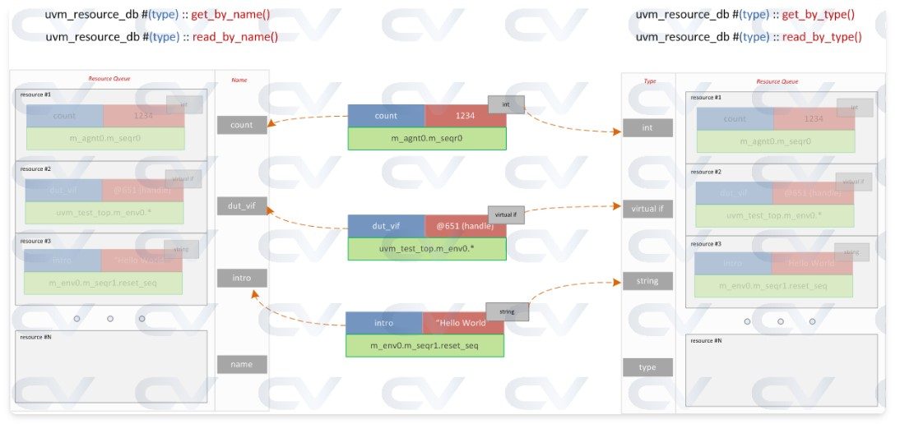

### 2026/2/13 learning Diary




----
----


這份資料詳細介紹了 UVM (Universal Verification Methodology) 中最核心的機制之一：**Factory (工廠機制)**。

簡單來說，Factory 的存在是為了實現**「不修改原始程式碼，就能替換元件物件」**。這在大型驗證專案中極其重要，因為你可以在不更動環境 (Environment) 或代理器 (Agent) 底層程式的情況下，透過測試案例 (Test) 直接更動某個元件的行為。

以下我將這頁內容拆解為三個核心部分進行詳細說明：


## 1. 為什麼需要 Factory？ (物件創建的演進)

在傳統 SystemVerilog 中，我們使用 `new()` 來建立物件。但這會導致「寫死 (Hardcoding)」的問題。

* **使用 `new()` 的缺點：** 就像資料中提到的 Wishbone 協議升級。如果你的 Driver 裡寫死了 `pkt = new()`，當你要換成 `new_pkt` 時，你必須去修改每一個 Driver 的原始碼。
* **使用 `create()` 的優點：** 改用 `type_id::create()`。這不是直接叫系統分配記憶體，而是**「詢問 Factory：我現在想要一個 base_agent，請給我正確的實例」**。


## 2. Factory 註冊與覆蓋 (Registration & Override)

要讓 Factory 起作用，必須經過兩個步驟：

### A. 註冊 (Registration)

程式碼中的這行巨集就是註冊動作：

```systemverilog
`uvm_component_utils(base_agent)

```

這就像是在 Factory 的名冊上登記：「我叫 `base_agent`，以後有人找我請來這裡。」

### B. 覆蓋 (Override) 方法

當你需要把 `base_agent` 換成 `child_agent` 時，有兩種主要的覆蓋方式：

| 方法 | 說明 | 適用情境 |
| --- | --- | --- |
| **Type Override** | **全面替換**。只要是申請 `base_agent` 的地方，全部給 `child_agent`。 | 當整個驗證環境都要升級某個元件時。 |
| **Instance Override** | **局部替換**。只有特定路徑（如 `env.agent_A`）下的物件才會被替換。 | 當你只想修改某一個特定的介面，而不影響其他相同的 Agent 時。 |


## 3. 程式碼實作邏輯分析

這份資料提供了兩個實驗範例，邏輯如下：

### 範例 1：Type Override (型態覆蓋)

在 `base_test` 的 `build_phase` 中執行：

```systemverilog
set_type_override_by_type(base_agent::get_type(), child_agent::get_type());

```

* **執行流程：**
1. Test 告訴 Factory：「從現在起，只要有人要 `base_agent`，就給他 `child_agent`。」
2. Test 接著建立 `m_env`。
3. `m_env` 在自己的 `build_phase` 呼叫 `base_agent::type_id::create`。
4. **結果：** 雖然 Handle 是 `base_agent` 型態，但指向的實際物件是 `child_agent`。


### 範例 2：Instance Override (實例覆蓋)

```systemverilog
set_inst_override_by_type("m_env.*", base_agent::get_type(), child_agent::get_type());

```

* **關鍵點：** 多了一個路徑參數 `"m_env.*"`。
* 這表示只有在 `m_env` 底下的元件申請 `base_agent` 時才會被換掉。這展現了 UVM 對於階層化路徑（Hierarchy）精確控制的能力。


## 總結：

1. **定義：** `child_agent` 繼承自 `base_agent`。
2. **註冊：** 兩者都用 `uvm_component_utils` 註冊。
3. **配置：** 在 `uvm_test` 中設定 Override 規則。
4. **生產：** 底層元件用 `create()` 請求物件，Factory 根據規則發放 `child_agent`。

這機制讓你可以在不碰觸已經驗證過的底層代碼的情況下，靈活地擴展測試功能。


----
----


這正是 UVM Factory 最神奇的地方。雖然程式碼看起來是先設定 **Override**，然後才 **Create Environment**，但這個順序正是關鍵。

我們可以把這個過程拆解成以下幾個步驟來看：

### 1. 執行順序與邏輯

當 `base_test` 的 `build_phase` 執行時：

1. **設定規則**：`set_type_override_by_type(...)` 這行程式碼執行後，UVM Factory 的內部表格會記下一筆紀錄：「**以後只要有人要 `base_agent`，請自動換成 `child_agent`。**」
2. **開始創建**：接著執行 `m_env = base_env::type_id::create(...)`。
3. **連鎖反應**：
* `m_env` 被創建後，會進入 `m_env` 的 `build_phase`。
* 在 `m_env` 的程式碼中，有一行：`m_agent = base_agent::type_id::create("m_agent", this);`
* 這時候，`base_agent::type_id::create` 會去詢問 Factory：「我要做一個 `base_agent`。」
* **Factory 檢查表格**，發現你剛才在 Test 設下的規則，於是它「偷樑換柱」，最後回傳了一個 **`child_agent`** 的實例（Instance）給 `m_env`。


### 2. 為什麼一定要用 `create`？

如果你在 `base_env` 裡面是寫 `m_agent = new()`，那麼 Factory 就完全沒機會介入，你換掉 `base_agent` 的計畫就會失敗。

只有透過 `type_id::create`，物件的生成權才會交給 Factory，從而實現：

* **不必修改 `base_env` 的原始碼**（它裡面依然寫著要建立 `base_agent`）。
* **靈活替換元件**（透過 `base_test` 決定實際要用哪一個版本）。


### 3. 檢查結果

你可以從你貼出的 **Output** log 中證實這點：

> `UVM_INFO ... [AGENT] Factory returned agent of type=child_agent, path=uvm_test_top.m_env.m_agent`

這行 Log 顯示：雖然路徑是在 `m_env` 下面，且原本預期是 `base_agent`，但實際拿到的 **type** 已經變成了 **`child_agent`**。


### 關鍵細節：為什麼在 `build_phase` 設定？

在 UVM 中，我們通常在 `build_phase` **由上而下（Top-down）** 建立元件。

* **Test** 是最頂層，它最先執行 `build_phase`。
* 所以 Test 可以在底層元件（如 Env, Agent）還沒被創建之前，先把「換貨規則」寫好。
* 等到底層元件開始 `create` 時，規則就已經生效了。


----
----


這份資料提供了一個更複雜、更貼近實戰的 UVM Factory 範例。它展示了如何在一個包含多個 Agent 的環境中，透過 **Type Override (型態覆蓋)** 與 **Instance Override (實例覆蓋)** 來精確操控不同的元件。

以下我結合程式碼、繼承關係圖與環境結構圖為你詳細說明：



## 1. 繼承關係與環境結構 (對應圖片 abc58.jpg)

首先，我們必須理解類別之間的血緣關係，因為 **Factory 只能讓子類別 (Child) 替換掉父類別 (Base)**。

* **資料封包 (Data):** `eth_v2_packet` 繼承自 `eth_packet`。
* **驅動程式 (Driver):** `eth_driver` 與 `spi_driver` 都繼承自 `base_driver`。
* **代理器 (Agent):** `my_agent_v2` 繼承自 `my_agent`。
* **序列 (Sequence):** `seq1`, `seq2`, `seq3` 都源自 `base_sequence`。



## 2. 初始狀態 (對應圖片 abc57.jpg)

在沒有任何 Override 的情況下，`my_env` 裡面裝了三個 Agent：

1. **m_agnt0 & m_agnt1**: 型態為 `my_agent`，內部預設使用 `base_driver`。
2. **m_agnt2**: 型態為 `my_agent_v2`，內部預設使用 `eth_driver`。

* **預設行為**：所有 Driver 內部創建的封包都是 `eth_packet`。


## 3. 實戰 Override 分析 (對應 `feature_test` 程式碼)

這份範例最精采的地方在於 `feature_test` 中的三個 Override 操作，這會直接改變環境結構，變成 **abc59.jpg** 的樣子：

### A. 全局型態覆蓋 (Type Override)

```systemverilog
set_type_override_by_type (eth_packet::get_type(), eth_v2_packet::get_type());

```

* **結果**：整個環境中，只要有人呼叫 `eth_packet::type_id::create`，通通都會變成 `eth_v2_packet`。
* **圖解**：你可以看到 abc59.jpg 中，三個 Agent 旁邊標示的封包都變成了深藍色的 **eth_v2_packet**。

### B. 特定路徑覆蓋 (Instance Override) - 針對 Driver

```systemverilog
factory.set_inst_override_by_type (base_driver::get_type(), eth_driver::get_type(), 
                                  {get_full_name(), ".m_top_env.m_agnt0.*"});

```

* **對象**：針對 `m_agnt0` 裡面的 `base_driver`。
* **結果**：只有 `m_agnt0` 的 Driver 從灰色的 `base_driver` 變成了深灰色的 **`eth_driver`**。
* **對比**：`m_agnt1` 因為不在路徑規則內，所以它維持原樣使用 `base_driver`。

### C. 特定路徑覆蓋 (Instance Override) - 針對 Sequence

```systemverilog
set_inst_override_by_type ("m_top_env.m_agnt1.m_seqr0.*", seq1::get_type(), seq2::get_type());

```

* **結果**：當 `m_agnt1` 的 Sequencer 想要執行 `seq1` 時，Factory 會把它換成 **`seq2`**。
* **圖解**：在 abc59.jpg 中，`m_agnt1` 上方的橘色區塊標註了 `seq1` 被換成了 `seq2`（透過 Log 輸出的 `[SEQ2]` 可以證實）。


## 4. 最終運行結果 (對應 Output Log)

從 Log 的 **UVM testbench topology** 可以清楚看到 Factory 介入後的成果：

1. **m_agnt0.m_drv0**: 變成了 `eth_driver`（被 Instance Override 替換）。
2. **m_agnt1.m_drv0**: 維持 `base_driver`（沒有被覆蓋）。
3. **m_agnt2.m_drv0**: 依然是 `eth_driver`（原本就是這樣定義的）。
4. **Packet Type**: 所有 Driver 運行的 Info 都顯示 `with packet of type : eth_v2_packet`（被 Type Override 全域替換）。


這頁展示了 **"Separation of Concerns" (關注點分離)**：

* **開發者**：寫好通用的 `my_env` 和 `my_agent`。
* **驗證工程師 (測試端)**：不需要去動 `my_env` 的程式碼，只需要在 `feature_test` 寫幾行 `set_inst_override`，就能把某個特定介面的 Driver 換成 SPI，或是把所有封包升級到 V2 版本。

**這就是 UVM 能夠處理複雜 SoC 驗證的關鍵：極高的重用性與靈活性。**

----
----


這份資料探討的是 UVM 中另一個至關重要的概念：**Configuration Mechanism (配置機制)**。

如果說 Factory 是用來「替換零件」，那麼 Configuration 就是用來「調整零件的開關或參數」。它的核心目的在於**封裝複雜度**，讓撰寫測試 (Test) 的人不需要知道底層元件如何連接，只需透過幾個「旋鈕 (Knobs)」就能改變驗證環境的行為。

以下配合圖片與程式碼為您詳細說明：



### 1. 靈活的配置旋鈕：Active 與 Passive 模式 (配合 abc60.jpg)

UVM 元件（尤其是 Agent）通常會設計一些參數來控制其行為。

* **Active Mode (isActive = 1)**：如圖左側，Agent 同時擁有 **Monitor**、**Sequencer** 與 **Driver**。它會主動對 DUT 發送資料。
* **Passive Mode (isActive = 0)**：如圖右側，Driver 與 Sequencer 會消失（或不執行），Agent 只剩下 **Monitor**。這通常用於只需要「觀察」匯流排訊號而不需要驅動訊號的場景。
* **程式應用**：這是透過 `uvm_active_passive_enum` 這個變數來控制的。測試人員只需在 Test 層級修改這個值，就能切換 Agent 的狀態。


### 2. UVM Configuration Database (配合 abc61.jpg)

資料中將 `uvm_config_db` 比喻為一張 **「兩欄式的內部表格」**：

* **第一欄 (ID/Name)**：變數的名字。
* **第二欄 (Value/Object)**：存入的值或物件。

當所有元件都能存取這張表時，傳遞資訊就變得非常簡單。例如，最常見的用法是傳遞 **Virtual Interface**（連接硬體與軟體的橋樑）或 **ID 編號**。

* **程式碼解析**：
```systemverilog
// 只有 wbSlaves[0] 路徑下的元件能拿到這個 ID
uvm_config_db #(int) :: set (this, "*.wbSlaves[0]", "slave_id", 0);

```


* **層級限制 (Visibility)**：透過指定路徑（如 `"*.wbSlaves[0]"`），你可以限制誰能看見這些資料。這能避免資料污染，確保 AHB Driver 不會誤拿 Analog Interface 的配置。


### 3. 配置類別 (Configuration Class) 的應用 (配合 abc62.jpg)

當參數很多時，一個一個 `set` 非常麻煩。更專業的做法是將所有旋鈕包裝成一個 **Configuration Class (cfg)**。

* **運作流程 (如圖 abc62.jpg)**：
1. 在 **uvm_test** 中建立一個 `cfg` 物件，並設定好裡面的所有變數。
2. 將整個 `cfg` 物件透過 `uvm_config_db` 傳遞給 **uvm_env**。
3. **uvm_env** 收到後，再將它往下傳遞給 **uvm_agent** 或 **uvm_monitor**。


* **優點**：
* **階層化傳遞**：配置物件可以像水流一樣從頂層流向底層。
* **支援隨機化**：因為它是一個類別，你可以對 `cfg` 裡的參數進行隨機化（Randomization），並加上約束（Constraints），這在隨機驗證中非常強大。


### 總結：Factory vs. Configuration

這兩頁資料共同構成了 UVM 的靈活性基礎：

* **Factory (前兩頁)**：我想把「整顆引擎」換掉 (例如：把 `base_driver` 換成 `spi_driver`)。
* **Configuration (這一頁)**：引擎不換，但我想要「調整馬力」或「關掉某個排氣閥」(例如：切換 Active/Passive 或 設定 Slave ID)。


----
----

這份資料主要介紹了 UVM 中的 **Resource Database (資源資料庫)**，它是 `uvm_config_db` 底層的核心機制。我們可以把它想像成一個全域的佈告欄，讓驗證環境中分散的各個組件（Component）能夠互相分享資訊。

以下是針對頁面內容、三個範例以及 SystemVerilog 限制的詳細說明：



### 1. 資源資料庫的核心結構 (配合圖片 abc63, abc64, abc65)

資源資料庫（`uvm_resource_pool`）是一個全域單例（Singleton），其儲存的每個「資源」包含四個關鍵欄位：

* **Name (名稱)**：儲存與檢索用的標籤。
* **Value (數值)**：實際存入的資料，可以是任何型態（int, class handle, virtual interface 等）。
* **Scope (範圍)**：使用**正規表達式**定義哪些組件可以看到這項資源。
* **Type (型態)**：資料的數據類型。

**運作邏輯 (圖 abc64 & abc65)：**
資料庫會將資源組織成佇列（Queue）。如圖 abc64 所示，當有多個同名或同型態的資源時，**較早存入（Push to front）的資源擁有較高的優先權**。當組件呼叫 `get` 時，資料庫會從佇列前端開始搜尋第一個符合 Scope 的資源。

---

### 2. 範例詳細說明

這頁提供了三個實務上最常見的應用場景：

#### **範例 #1：傳遞虛擬介面 (Virtual Interface)**

這是 UVM 最重要的應用。硬體訊號（Interface）存在於頂層 Module，但軟體組件（Driver/Monitor）需要存取它。

* **設定端 (tb_top.sv)**：
```systemverilog
// 將物理介面 vif 以 "vif" 為名存入資料庫，"*" 表示全域可見
uvm_config_db#(virtual ubus_if)::set(null, "*", "vif", vif);

```


* **獲取端 (Driver)**：
```systemverilog
// 在 build_phase 嘗試取得名為 "vif" 的虛擬介面
if (!uvm_config_db#(virtual dut_if)::get(this, "", "vif", vif)) begin
  `uvm_fatal("NOVIF", "找不到介面！");
end

```


#### **範例 #2：設定配置數值 (Configuration Value)**

用於動態控制測試參數，而不需重新編譯。

* **Test 端**：設定 `transaction_count` 為 1000。
* **Component 端**：讀取該數值。如果資料庫裡找不到（例如其他 Test 沒設），則使用程式碼中預設的 500。這讓同一個環境可以適應不同的測試需求。

#### **範例 #3：禁用暫存器測試 (Disabling Register Tests)**

這展示了如何利用 **Scope** 進行精確控制。

* 在 RAL (Register Abstraction Layer) 測試中，某些暫存器（如時鐘控制）不適合亂寫資料。
* 程式碼：`uvm_config_db#(bit)::set(this, {regmodel.blk.get_full_name(), ".*"}, "NO_REG_TESTS", 1);`
* 這行程式會針對特定的暫存器區塊（及旗下所有子項）打上標記，讓自動化測試序列知道要跳過這些部分，避免意外副作用。

---

### 3. SystemVerilog 的限制是什麼意思？

這部分解釋了為什麼我們**不能只靠原始的 SystemVerilog (SV)** 來寫大型驗證環境，必須引入 UVM 資源資料庫的原因：

1. **全域變數缺乏控制**：純 SV 的全域變數沒有 Scope 概念，容易發生命名衝突且難以追蹤誰修改了它，容易產生隱藏 Bug。
2. **編譯時期限制 (Compile-time only)**：SV 的 `parameter` 在編譯時就固定了。如果想在執行時（Run-time）根據不同的 Test 內容改變環境配置（如改變 Slave 數量），純 SV 難以達成，而 UVM 可以在執行時動態決定。
3. **硬連線 (Hardcoded) 的脆弱性**：若不使用資料庫，你必須寫死層級路徑（例如 `top.env.agent.drv.vif`）。一旦環境結構稍微變動，所有路徑都會失效，這大幅降低了組件的**重用性**。
4. **缺乏除錯支援**：SV 變數無法記錄存取歷史。UVM 資源資料庫則支援 `+UVM_CONFIG_DB_TRACE` 指令，能傾印（Dump）出完整的資源使用歷史，對於追蹤「為什麼我的介面沒拿到」非常有幫助。

**總結來說：** 資源資料庫解決了資料在複雜層級間傳遞的「解耦」問題，讓驗證環境更靈活、更易於維護。

----
----


這部分內容主要是在解釋 UVM **資源資料庫（Resource Database）的底層定義與運作邏輯**。簡單來說，它是在告訴你「資源是什麼」、「它長什麼樣子」以及「資料庫如何處理重名的衝突」。

以下為您詳細拆解這部分的重點：


### 1. 什麼是資源（Resource）？

資源就像是一個**有標籤的參數容器**，它可以裝載任何類型的資料。

* **內容物**：可以裝整數（int）、位元（bit）、物件控制把手（handle）、佇列（queue），甚至是連接硬體的虛擬介面（virtual interface）。
* **主要欄位**：
* **Name (名稱)**：存取時用的標籤，存跟取必須用同一個名字。
* **Value (數值)**：你實際要存入的資料內容。
* **Scope (範圍)**：這是最關鍵的欄位。它使用「正規表達式」來決定測試平台中哪些部分可以看到這筆資料。
* **Type (型態)**：資料的數據類型（如 string, int 等）。


### 2. 資源資料庫（uvm_resource_pool）的結構

資料庫是一個全域（Global）的儲存區域，整個 UVM 環境中只有一份副本，所以任何地方都能存取它。

* **分類方式**：它會根據**名稱（Name）**和**型態（Type）**兩種方式來組織資料。
* **排序規則（優先權）**：
* 當你存入多個名稱或型態相同的資源時，它們會被放在一個**佇列（Queue）**裡。
* **先進先出（FIFO）優先**：越早被 `set` 進去的資源，在搜尋時會排在越前面，擁有更高的優先權。


### 3. 如何尋找資源？（優先權範例）

這段文字特別強調了搜尋的邏輯：

* **搜尋過程**：當你呼叫 `get_by_name()` 或 `get_by_type()` 時，資料庫會從佇列的**前端（Front）往後端（Back）**遍歷。
* **衝突處理**：假設佇列裡有兩個型態都是 `string` 的資源，且它們的 Scope 都符合你的要求，資料庫會**回傳排在最前面（最早存入）的那一個**。


### 4. 調試（Debug）利器：紀錄功能

這部分提到了一個很實用的功能：

* **歷史紀錄**：資料庫會自動記錄所有的 `get` 請求，不論成功或失敗。
* **模擬結束後的傾印**：你可以在模擬結束時將這些紀錄倒出來（Dump），這能幫你快速檢查為什麼某個組件沒拿到預期的參數，或者到底是誰先佔用了該名稱。


### 總結這部分的重點：

這段話是在建立你對 UVM 資料儲存的**底層架構感**。它解釋了為什麼 UVM 可以精確地把資料傳給「特定路徑」的組件（靠 Scope），以及當資料設定衝突時誰會贏（靠存入的時間順序）。

----
----


簡單來說，`uvm_config_db` 是建立在 `uvm_resource_db` 之上的「高級封裝」。雖然它們共享同一個底層資料庫，但在使用習慣和「誰比較大（優先權）」的規則上完全不同。

以下為您詳細比較兩者的差別：

## 1. 核心定位與用途

* **uvm_resource_db (通用型工具)**：
* 提供了一個通用的介面，讓資源可以根據「名稱」或「型態」進行存取。
* 它不強調階層關係，適合用於跨組件、不限特定路徑的資訊共享。


* **uvm_config_db (階層配置型工具)**：
* 專門為了簡化 `uvm_component` 的配置而設計的便利介面。
* 它是 UVM 最推薦的配置方式，特別是當參數與組件在 testbench 中的「路徑位置」密切相關時。


## 2. 關鍵欄位與過濾機制

兩者在儲存資源時都包含以下欄位，但 `config_db` 強烈依賴於「階層路徑」：

* **Name**：儲存資源的標籤名稱。
* **Value**：實際存入的資料內容。
* **Type**：資料的數據類型（如 `int`, `string` 或虛擬介面）。
* **Scope (範圍/路徑)**：
* `resource_db`：通常使用正規表達式來定義可見範圍。
* `config_db`：使用 UVM 的組件路徑（例如 `"uvm_test_top.m_env.*"`）來嚴格控制誰能存取該資源。


## 3. 最核心的差別：優先權 (Precedence)

這是兩者在實務運作上最大的不同點：

| 特性 | uvm_resource_db | uvm_config_db |
| --- | --- | --- |
| **優先順序** | **時間優先 (FIFO)** | **層級優先 (Top-down)** |
| **邏輯說明** | 同名資源中，**最早被 `set` 進去**的資源在佇列最前端，擁有最高優先權。 | 離頂層越近的 `set` 優先權越高。例如 `uvm_test` 設定的值會覆蓋 `uvm_env` 設定的同名值。 |
| **搜尋方式** | 從佇列前端往後遍歷，返回第一個符合的資源。 | 根據組件的階層深度進行權重比較。 |


## 4. 為什麼需要兩個？

* **uvm_resource_db** 適合用於「全域性質」或是「非組件階層」的資料。例如，你可能想在某個 sequence 裡存一個變數，讓另一個完全不相關的模組讀取，且不介意路徑。
* **uvm_config_db** 則是為了處理複雜的 SoC 驗證環境。它能確保頂層的 Test 能夠精確地修改底層 Agent 的參數，且這種「由上而下」的覆蓋邏輯符合驗證的直覺需求。

## 總結

你可以把 **resource_db** 想成是「自由市場」，誰先搶（先 `set`）誰先贏；而 **config_db** 則是「軍事體制」，職位越高（階層越靠近 Top）的命令優先權越高。

----
----


這份資料詳細介紹了 UVM 中最重要的配置工具：**`uvm_config_db`**。

你可以把它想像成一個「全域的公佈欄」。在驗證環境這個大樓裡，主管（Test/Env）把指令貼在公佈欄上，底下的員工（Driver/Monitor）再去公佈欄看指令做事。這樣主管就不需要親自跑去每個員工的位子上傳話（Hardcoding），大大增加了管理的靈活性。

以下我將針對每一個 Part、每一段程式碼與圖片進行詳細解釋。


### 1. 什麼是 `uvm_config_db`？

它是一個參數化的類別（Parameterized Class），專門用來在不同的 UVM 元件之間傳遞資料。

* **Type-Safe（型別安全）**：因為有參數化 `#(type T)`，所以你不會不小心把整數當成字串來讀，這避免了很多低級錯誤。
* **主要用途**：
1. **傳遞參數**：例如告訴 Agent 要產生多少筆 Transaction。
2. **傳遞介面**：將虛擬介面（Virtual Interface）從 Top module 傳給 Driver。
3. **開關功能**：例如開啟或關閉 Coverage 收集。


### 2. 核心方法 (Core Methods)

#### **A. `set()` 方法：貼公告**

這是用來「存入」資料的。

```systemverilog
// 語法結構
uvm_config_db#(type T)::set(uvm_component cntxt, string inst_name, string field_name, T value);

```

* **cntxt (Context)**：誰發出的公告？通常填 `this`（如果是組件內）或 `null`（如果是 Top module）。
* **inst_name (Instance Name)**：公告給誰看？可以使用萬用字元 `*`。
* **field_name**：公告標題（變數名稱）。
* **value**：公告內容（實際數值）。

**程式碼範例解析：**

```systemverilog
// 1. 在 Top module 設定虛擬介面
// cntxt=null 代表從最頂層開始。
// "uvm_test_top.*" 代表 uvm_test_top 底下的所有人都能看到。
// "apb_vif" 是標籤名，apb_if 是實際的介面 Handle。
uvm_config_db #(virtual apb_if) :: set (null, "uvm_test_top.*", "apb_vif", apb_if);

// 2. 開啟 Coverage 功能
// 設定 m_apb_agent 及其子元件(*) 的 "cov_enable" 為 1。
uvm_config_db #(int) :: set (null, "uvm_test_top.m_env.m_apb_agent.*", "cov_enable", 1);

// 3. 在 Agent 內部設定
// cntxt=this，代表路徑是從目前這個 Agent 開始算起。
// "*" 代表這個 Agent 底下的所有子元件都能收到。
uvm_config_db #(int) :: set (this, "*", "cov_enable", 1);

```

#### **B. `get()` 方法：看公告**

這是用來「讀取」資料的。

```systemverilog
// 語法結構
uvm_config_db#(type T)::get(uvm_component cntxt, string inst_name, string field_name, inout T value);

```

* **關鍵點**：`get()` 是一個函數，會回傳 **1 (成功)** 或 **0 (失敗)**。**一定要檢查回傳值！**

**程式碼範例解析：**

```systemverilog
// 嘗試取得虛擬介面
// 這裡的 cntxt=this, inst_name=""，代表「我要找寄給我的信」。
if (!uvm_config_db #(virtual apb_if) :: get (this, "", "apb_vif", apb_if))
   // 如果回傳 0 (失敗)，印出錯誤訊息
   `uvm_error(get_type_name(), "NOVIF: Did not find apb_if !"))

// 嘗試取得 int 變數
// 如果失敗，變數 cov_var 就不會被改變（維持預設值）。
uvm_config_db #(int) :: get (null, "uvm_test_top", "cov_enable", cov_var);

```

#### **C. `exists()` 與 `wait_modified()**`

* **`exists()`**：只是檢查資料在不在，不負責取值。
* **`wait_modified()`**：這是一個 Task，會**卡住（Block）**程式執行，直到指定的配置值被改變為止。這可用於動態調整測試行為。

**wait_modified 程式碼解析：**

```systemverilog
// Agent 的 run_phase
virtual task run_phase (uvm_phase phase);
    // 程式停在這裡，直到有人去改 "loopCount" 的值
    uvm_config_db #(int) :: wait_modified (this, "", "loopCount");
endtask

// Env 的 main_phase
virtual task main_phase (uvm_phase phase);
    // 迴圈動態修改 loopCount，這會觸發上面的 wait_modified 解鎖
    uvm_config_db #(int) :: set (this, "m_apb_agent", "loopCount", i);
endtask

```


### 3. 便利型別 (Convenience Types)

為了少打幾個字，UVM 定義了一些別名：

* `uvm_config_int` = `uvm_config_db #(uvm_bitstream_t)`
* `uvm_config_string` = `uvm_config_db #(string)`
* `uvm_config_object` = `uvm_config_db #(uvm_object)`


### 4. 最佳實踐 (Essential Best Practices) - **這部分最重要**

#### **A. 使用配置物件 (Configuration Objects)**

不要一個一個變數傳（int a, int b, string c...），把所有設定包成一個 Class (`my_agent_config`) 一次傳遞。

**定義 Config Class:**

```systemverilog
class my_agent_config extends uvm_object;
  `uvm_object_utils(my_agent_config) // 註冊 Factory
  int num_transactions = 10;
  bit enable_coverage = 1;
  virtual my_bus_if vif; // 連介面也包進來
  ...
endclass

```

**在 Env 中設定 (Set):**

```systemverilog
// 建立 Config 物件
m_cfg = my_agent_config::type_id::create("m_cfg");
m_cfg.num_transactions = 500; // 修改設定

// 一次把整包物件傳給 Agent
uvm_config_db#(my_agent_config)::set(this, "m_agent*", "my_agent_cfg", m_cfg);

```

**在 Agent 中讀取 (Get):**

```systemverilog
// 讀取整包 Config 物件
if (!uvm_config_db#(my_agent_config)::get(this, "", "my_agent_cfg", m_cfg)) begin
  `uvm_fatal("NOCFG", "設定檔遺失！"); // 這是嚴重錯誤，直接 Fatal
end
// 之後就能用 m_cfg.num_transactions 來做事了

```

#### **B. 虛擬介面是關鍵 (Virtual Interfaces are Key)**

這是連接硬體 (DUT) 與軟體 (UVM) 的唯一橋樑。

* **Top Module**: 用 `set` 把實體介面 `bus_if_inst` 丟進 DB。
* **Driver**: 用 `get` 把介面拿出來，存到 `vif` 變數裡，這樣 Driver 才能驅動訊號。
*(程式碼邏輯與上面 Config Object 類似，只是包在 Object 裡傳遞)*

#### **C. 在 `build_phase` 進行設定**

* `set()` 最好都在 `build_phase` 做完。這樣在下一階段 `connect_phase` 或 `run_phase` 時，所有組件都能確保拿到正確的設定。

#### **D. 永遠檢查 `get()` 的回傳值**

不要假設設定一定存在。如果 `get()` 失敗（回傳 0），代表配置路徑寫錯或沒人設定。對於像 Virtual Interface 這種關鍵資料，如果沒拿到，應該直接報 **`uvm_fatal`** 終止模擬，而不是讓它跑下去然後報 Null Pointer Error。

#### **E. 避免使用過時方法**

不要用 `set_config_int` 這種舊語法（這是 OVM 時代的遺毒），請堅持使用 `uvm_config_db`。


### 總結

這頁的核心觀念就是：**「由上而下控制，由下而上讀取」**。
Top/Env 負責決定參數 (`set`)，底層的 Driver/Agent 負責讀取參數 (`get`)。而最專業的做法是把所有參數打包成一個 **Config Object** 來傳遞，既整潔又安全。

----
----

這份資料提供了 `uvm_config_db` 的實戰範例，重點在於展示「不同的路徑寫法（Scope）」如何影響資料的存取結果。這是 UVM 初學者最容易搞混的地方：到底 `set` 的路徑要怎麼寫，`get` 才拿得到？

以下我將資料拆解為五個核心部分，配合程式碼與邏輯詳細說明。


### 1. 核心方法 (Methods) 與 規則 (Rules)

這裡再次複習了兩個主角：`set` (寄信) 與 `get` (收信)。

* **`set` (寄信)**：
```systemverilog
uvm_config_db#(T)::set(cntxt, inst_name, field_name, value);

```


* **邏輯**：它會在資料庫中建立一筆資料，其有效範圍（Scope）是 `{cntxt 的路徑} + "." + {inst_name}`。
* **關鍵規則**：如果 `cntxt` 填 `null`，那麼範圍就完全由 `inst_name` 決定（通常用於頂層 Top module）。


* **`get` (收信)**：
```systemverilog
uvm_config_db#(T)::get(cntxt, inst_name, field_name, value);

```


* **邏輯**：它會去搜尋資料庫。搜尋的路徑是 `{cntxt 的路徑} + "." + {inst_name}`。通常 `inst_name` 留空 `""`，代表「就在我自己這個層級找」。


* **優先權規則**：
1. **階層越高越贏**：`uvm_test` 設定的值會覆蓋 `uvm_env` 設定的值。
2. **同階層後者贏**：如果在同一個 Phase 裡對同一個變數 `set` 兩次，後面那次生效（Last setting wins）。


### 2. 如何除錯？ (How to debug uvm_config_db ?)

這是這頁最實用的技巧。當你發現 `get` 失敗（回傳 0）時，不要瞎猜。

* **指令**：在執行模擬時加上 `+UVM_CONFIG_DB_TRACE` 選項。
* **效果**：模擬器會在 Log 中印出每一次 `set` 和 `get` 的詳細資訊，包括它用了什麼路徑、找到了什麼值，或者是 "failed lookup" (找不到)。


### 3. 實戰範例：Test 與 Env (Case #1 & #2)

這裡展示了兩種設定路徑的方法，結果是一樣的。

**環境結構**：`uvm_test_top` (Test) -> `uvm_test_top.base_env` (Env)

#### **Case #1：使用 `null` (絕對路徑)**

```systemverilog
// In Test (寄件人)
// cntxt = null, inst_name = "uvm_test_top"
// 最終路徑 = "uvm_test_top"
uvm_config_db #(string) :: set (null, "uvm_test_top", "Friend", "Joey");

// In Env (收件人)
// 這裡很特別！Env 試圖用絕對路徑去拿
// cntxt = null, inst_name = "uvm_test_top"
// 搜尋路徑 = "uvm_test_top" -> 符合！
uvm_config_db #(string) :: get (null, "uvm_test_top", "Friend", name)

```

* **解釋**：雖然可行，但這不是好習慣。因為 Env 通常不應該知道自己被放在哪個 Top 底下（reusability 低）。

#### **Case #2：使用 `this` (相對路徑)**

```systemverilog
// In Test (寄件人)
// cntxt = this (即 uvm_test_top), inst_name = ""
// 最終路徑 = "uvm_test_top" + "." + "" = "uvm_test_top"
uvm_config_db #(string) :: set (this, "", "Friend", "Joey");

// In Env (收件人)
// 同上 Case 1

```

* **結論**：Case 2 的 `set` 寫法比較常見，代表「我要設定我自己這個層級的參數」。


### 4. 推薦的實踐 (Recommended Practice) - 精準控制

這一區展示了**為什麼我們不應該總是把範圍設太大**，以及**萬用字元 (Wildcard)** 的使用。

**情境**：Test 想要把 "Friend" 這個參數傳給 Agent，但不想傳給 Env。

#### **失敗的嘗試 (Scope 不對)**

```systemverilog
// Test 設定路徑： "uvm_test_top.m_env.m_agent*" (只給 Agent)
uvm_config_db #(string) :: set (this, "m_env.m_agent*", "Friend", "Joey");

// Env 嘗試讀取
// Env 的路徑是 "uvm_test_top.m_env"
// 搜尋失敗！因為資料庫裡的資料是給 "m_env.m_agent*" 的，"m_env" 沒資格拿。
uvm_config_db #(string) :: get (this, "", "Friend", name);

```

#### **成功的修正 (多設一次)**

如果你希望 Env 和 Agent 都能拿到，你必須滿足雙方的路徑需求：

```systemverilog
// 1. 給 Agent 們 (m_agent0, m_agent1)
uvm_config_db #(string) :: set (this, "m_env.m_agent*", "Friend", "Joey");

// 2. 特別多設一行給 Env
uvm_config_db #(string) :: set (this, "m_env", "Friend", "Joey");

```

* **Log 分析**：你會看到 Log 顯示 Env 的 `get` 成功讀到了 `uvm_test_top.m_env.Friend`，而 Agent 讀到了 `uvm_test_top.m_env.m_agent0.Friend`。


### 5. `set` vs `get` 結果對照表 (Set vs Get Results)

這是整頁最有價值的部分。它列出了一張矩陣圖，告訴你當 `set` 使用不同路徑時，底下的 Component (Env, Agent1, Agent2) 誰能拿得到。

讓我們挑幾個關鍵的例子來解讀（對應表格）：

1. **`set(null, "uvm_test_top")`**
* **Env (m_env)**: ❌ 拿不到。Env 的路徑是 `...m_env`，與設定的路徑 `uvm_test_top` 不匹配。
* **Agent**: ❌ 拿不到。


2. **`set(this, "*")`** (設定範圍為 `uvm_test_top.*`)
* **Env**: ✅ **拿得到**。因為 `*` 可以匹配 `m_env`。
* **Agent**: ✅ **拿得到**。因為 `*` 也可以匹配 `m_env.m_agent0`。
* **解釋**：這是最暴力的設定法，Test 說「我底下的所有人通通可以拿到這個參數」。


3. **`set(this, "m_env.*")`**
* **Env**: ❌ 拿不到。因為 `m_env.*` 要求至少要有一層子路徑（例如 `m_env.data`），而 `m_env` 本身不符合 `m_env.*` 的格式（視 Simulator 實作而定，但在精確比對中通常不含自身）。
* **Agent**: ✅ **拿得到**。因為 `m_env.m_agent0` 符合 `m_env.*`。


4. **`set(this, "m_env")`**
* **Env**: ✅ **拿得到**。完全匹配。
* **Agent**: ❌ 拿不到。Agent 路徑太深了，對不上。


### 總結

這頁的核心教訓是：**`get()` 預設是「找屬於我這個路徑的信」**。

* 如果你在 Driver 裡呼叫 `get(this, "", "vif", ...)`，它會向資料庫請求：「請給我寄到 `top.env.agent.driver` 的 `vif`」。
* 所以你在 Top 寫 `set` 時，路徑必須能涵蓋到 `top.env.agent.driver` (例如用 `*`)，否則 Driver 會找不到信。

----
----


這頁的主題是 **UVM Config DB 的實戰範例**，重點在於**「路徑怎麼設，別人才拿得到？」*


### 1. 核心觀念：寄信與收信

請想像 `uvm_config_db` 是一個郵局。

* **`set` 是寄信**：你需要寫清楚「收件人地址」(`cntxt` + `inst_name`) 和「信件標題」(`field_name`)。
* **`get` 是收信**：你需要告訴郵局「我是誰」(`cntxt`)，郵局會檢查有沒有寄給你的信。

**重要規則**：
收信人 (`get`) 的地址，必須被包含在寄信人 (`set`) 寫的地址範圍內，否則就會收不到。


### 2. 範例一：Test 與 Env (最簡單的狀況)

這裡展示 Test (寄信人) 寄信給 Env (收信人)。

#### **程式碼解讀 (Case #1)**

**寄信 (在 `base_test` 裡面)**：

```systemverilog
// 參數 1 (cntxt): null (代表我是從最頂層寄出的，沒有特定寄件人)
// 參數 2 (inst_name): "uvm_test_top" (指定收件人地址是 uvm_test_top)
// 參數 3 (field_name): "Friend" (信件標題)
// 參數 4 (value): "Joey" (信件內容)
uvm_config_db #(string) :: set (null, "uvm_test_top", "Friend", "Joey");

```

* **解讀**：這封信指名寄給 `uvm_test_top` 這個地址。

**收信 (在 `base_env` 裡面)**：

```systemverilog
// 參數 1 (cntxt): null (我不想用相對路徑)
// 參數 2 (inst_name): "uvm_test_top" (我要查 uvm_test_top 這個地址有沒有信)
// 參數 3 (field_name): "Friend" (我要找標題是 Friend 的信)
if (uvm_config_db #(string) :: get (null, "uvm_test_top", "Friend", name))
    // 找到了！印出內容
    `uvm_info ("ENV", $sformatf ("Found %s", name), UVM_MEDIUM)

```

* **結果**：地址完全一樣，所以收到了。
* **注意**：這種寫法 (`cntxt` 為 `null`) 雖然成功，但在 UVM 裡比較少見，因為它用了「絕對路徑」，以後如果要改名會很麻煩。

#### **程式碼解讀 (Case #2 - 推薦寫法)**

**寄信 (在 `base_test` 裡面)**：

```systemverilog
// 參數 1 (cntxt): this (代表我自己，也就是 uvm_test_top)
// 參數 2 (inst_name): "" (空字串，代表「就在我這裡」)
// 組合地址 = this 的路徑 ("uvm_test_top") + "" = "uvm_test_top"
uvm_config_db #(string) :: set (this, "", "Friend", "Joey");

```

* **解讀**：這跟 Case #1 的結果地址一模一樣，但是寫法更靈活。就算 Test 改名叫 `my_test`，這行程式碼也不用改 (`this` 會自動變)。


### 3. 範例二：Test, Env, 和兩個 Agent

現在結構變複雜了：
`Test` -> 包含 `Env` -> 包含 `Agent0` 和 `Agent1`

#### **失敗的例子 (只寄給 Agent，Env 卻想拿)**

**寄信 (在 Test)**：

```systemverilog
// 地址設為: "m_env.m_agent*"
// this 是 uvm_test_top
// 完整地址 = "uvm_test_top.m_env.m_agent*"
uvm_config_db #(string) :: set (this, "m_env.m_agent*", "Friend", "Joey");

```

* **解讀**：這封信是寄給 `m_env` 底下所有名字開頭是 `m_agent` 的人。

**收信狀況**：

1. **Env 想收**：Env 的地址是 `uvm_test_top.m_env`。
* **結果**：❌ **收不到**。因為信是寄給 `m_agent` 的，Env 的層級不符合。


2. **Agent0 想收**：Agent0 的地址是 `uvm_test_top.m_env.m_agent0`。
* **結果**：✅ **收到了**。因為 `m_agent0` 符合 `m_agent*` 這個通配符。


#### **成功的修正 (多寄一封)**

如果你希望 Env 也能收到，你必須**再寄一封**專門給它的信：

```systemverilog
// 第一封：給 Agent 們
uvm_config_db #(string) :: set (this, "m_env.m_agent*", "Friend", "Joey");

// 第二封：專門給 Env
// 地址設為 "m_env"
uvm_config_db #(string) :: set (this, "m_env", "Friend", "Joey");

```

* **結果**：現在 Env (用 `m_env` 拿) 和 Agent (用 `m_agent*` 拿) 都能各自收到屬於自己的信了。


### 4. Set vs Get 結果對照表 (最下面那個大表格)

這個表格展示了各種「地址寫法」的排列組合。我們來看幾個關鍵的：

* **第 2 列**: `set(this, "")` -> 地址是 `uvm_test_top`
* **Env**: ❌ 拿不到 (Env 地址是 `uvm_test_top.m_env`，不匹配)。
* **Agent**: ❌ 拿不到。


* **第 3 列**: `set(this, "*")` -> 地址是 `uvm_test_top.*` (萬用)
* **Env**: ✅ **拿得到**。因為 `*` 可以代表 `m_env`。
* **Agent**: ✅ **拿得到**。因為 `*` 也可以代表 `m_env.m_agent0`。
* **解釋**：這是「廣播」，所有人都有份。


* **第 6 列**: `set(this, "m_env.*")` -> 地址是 `uvm_test_top.m_env.*`
* **Env**: ❌ **拿不到**。這點很關鍵！`m_env.*` 通常是指 `m_env` **底下**的東西，而不包含 `m_env` 自己。
* **Agent**: ✅ **拿得到**。因為 Agent 確實在 Env 底下。


* **第 7 列**: `set(this, "m_env.m_agent*")` -> 指定給 Agent
* **Env**: ❌ 拿不到。
* **Agent**: ✅ **拿得到**。


### 總結重點

1. **`set` 的地址**：由 `cntxt` (起點) + `inst_name` (路徑) 組成。
2. **`get` 的地址**：通常 `cntxt` 用 `this`，`inst_name` 用空字串 `""`，代表「收寄到我家的信」。
3. **匹配規則**：寄信的地址範圍必須**涵蓋**收信人的地址。
* `*` (萬用字元) 很強大，但也容易讓不該收到的人收到。
* 指定具體路徑 (如 `m_env.m_agent*`) 最安全。


----
----

