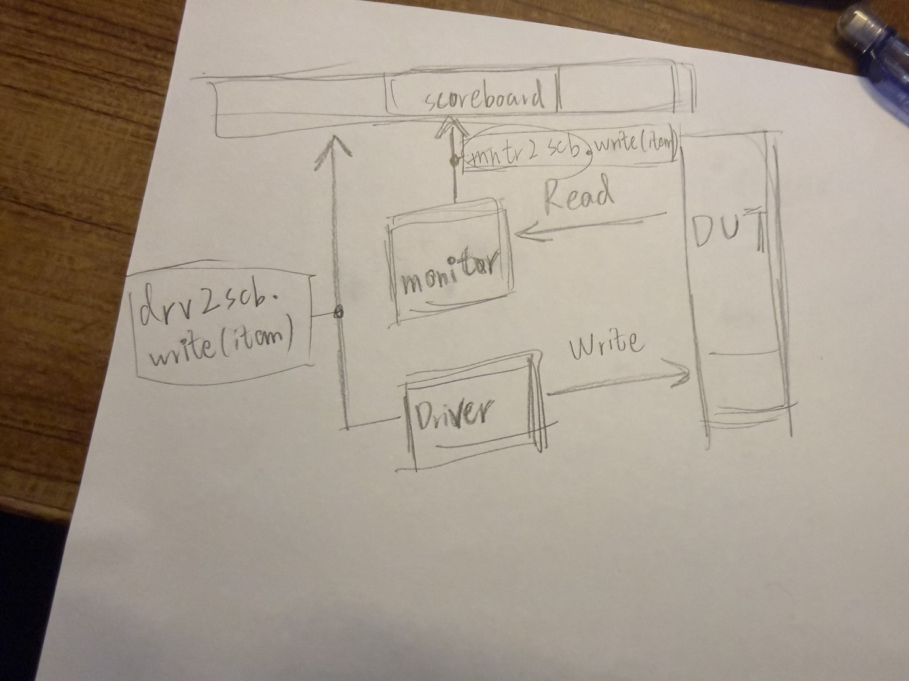

### project outline
以這篇github  https://github.com/courageheart/AMBA_APB_SRAM 為基準

-----
 
你這個 APB3 slave 寫得已經很聚焦，就是「256x8 SRAM + out‑of‑range 出 PSLVERR」，對應的 UVM 其實用不到 Chipverify 全部內容。 以這個 DUT 來說，我會幫你重新分成三類：必看、選看、先跳過。 

## 1. 這個 project 的「必看章節」

為了把下面幾個東西做出來：`apb_seq_item / sequencer / driver / monitor / agent / env / test / scoreboard`，你需要：  

- **1. INTRODUCTION**  
  建立整個 testbench 的大架構概念（test → env → agent → driver/monitor → interface → DUT）。 

- **2. UVM BASE CLASSES（快速掃過即可）**  
  知道所有東西都是從 `uvm_component`、`uvm_object` 之類繼承，之後看例子不會迷路。 

- **3. UVM COMPONENTS**  
  這章在講 test/env/agent/driver/monitor/scoreboard 的分工，完全對應你要做的 APB master VIP。 

- **4. UVM PHASES**  
  至少要會 `build_phase / connect_phase / run_phase`，因為 agent、env 的 create/connect 都靠這三個 phase。 

- **5. SEQUENCES**  
  你要產生「APB read / write 交易」：把 `paddr / pwdata / is_write` 等丟給 driver，全都在 sequence & sequence item 這一套裡面。

- **6. TLM (TRANSACTION LEVEL MODELING)**  
  monitor 觀察到 bus 上的交易後，要用 analysis port/ex imp 把 transaction 推給 scoreboard 比對 memory model。 

- **7. UVM FACTORY**  
  至少會 `type_id::create` 和最基本的 override，讓你可以很容易換不同的 sequence、或之後改 driver/monitor 行為。 

這 1–7 章配合你現成的 RTL，就足夠寫出一個「只做 APB master、把交易打到你這個 slave 上」的 UVM 環境，外加 scoreboard 檢查：  
- 正常讀寫：`paddr < 256` 時，`prdata` 是否等於 `memory[paddr]`，寫完再讀應該一致。 
- error：`paddr >= 256` 時，`pslverr` 是否只在 `PSEL & PENABLE & PREADY` 那一拍為 1。

## 2. 可以「再看一點」但不是現在的重點

- **8. REGISTER MODEL (RAL)**  
  你的 DUT 本質上就是一個 256x8 的 memory，沒有太多 field 屬性（RW/RO/W1C 等），用 scoreboard 比對就夠了，**目前可以不看 RAL**。  
  等你想把這顆改成「一堆具名寄存器 + 欄位屬性」再來看 RAL 章節和額外的 RAL 教學就好。 

- **10. FIELD & UTILITY MACROS**  
  剛開始只要會 `uvm_object_utils` / `uvm_component_utils`，其餘 `uvm_field_*` 宏先不必細讀，真的想讓 transaction 自動 print/compare 時再回來看。 

## 3. 可以暫時完全跳過的

在你這個 side project 完成「MVP」之前，下列章節都不是必要條件：  

- **9. REPORTING & UTILITIES**：`uvm_info/uvm_error` 的基本用法在很多範例都會寫，遇到需求再查就好。 
- **11. ADVANCED SEQUENCES**：像 virtual sequence、多層 sequence 目前用不到，你只有一個 APB master agent。 
- **12. ADVANCED TOPICS**：objection、callback、config_db 進階用法等，先不用管得這麼細。
- **13. GUIDELINES**：偏風格與 best practice，先照簡單骨架寫，之後再回頭重構也來得及。 
- **14. UVM EXAMPLES**：可以當參考，但建議你自己先完成一版，卡住時再拿來對照（例如 GitHub 上的 APB SRAM UVM testbench 就很接近你這顆）。
- **15. INTERVIEW QUESTIONS**：跟完成這個 RTL 的驗證沒有直接關係，要面試再刷就可以。

## 4. 接下來可以怎麼做（簡要版）

對你這顆 `apb_slave`，接下來的 UVM 任務可以照這個順序來：  
1. 定義 `apb_if` interface，把 `pclk/presetn/psel/penable/pwrite/paddr/pwdata/prdata/pready/pslverr` 包起來。 
2. 寫 `apb_seq_item`（欄位：addr、wdata、rdata、write、exp_err 等）。 
3. 寫 `apb_driver`：實作兩拍流程（SETUP: `PSEL=1, PENABLE=0`；ACCESS: `PENABLE=1`，等 `PREADY`），把 item 映射到 bus 上。 
4. 寫 `apb_monitor`：從 bus 抽出實際發生的 transaction（含是否 error），丟到 scoreboard。
5. 寫簡單 `scoreboard`：用一個 reference array 模擬你的 `memory`，照 monitor 的 transaction 更新 / 比對即可。
6. 寫 basic sequences：  
   - `apb_smoke_seq`：幾個固定地址的 write+read；  
   - `apb_rand_seq`：隨機地址/資料，含部分 out‑of‑range 地址來測 PSLVERR。  

如果你願意，我下一步可以直接幫你列：  
- `apb_seq_item` 應該有哪些欄位與 constraint；  
- `apb_driver` 針對你這個 slave 的 pseudo‑code（不會貼一整段版權 code，只給結構）；  
讓你一邊對照 Chipverify 章節、一邊實作，不會迷路。

----
----

先做「最小骨架」，再往外長，不要一開始全攤開。以你現在這個 APB3 slave，小步驟建議是這個順序：  

## 第一步：interface + seq_item

1. **寫 APB interface（module 外的那個）**  
   - 包住 `pclk, presetn, psel, penable, pwrite, paddr, pwdata, prdata, pready, pslverr`。
   - 這是之後 `virtual apb_if vif;` 要連的地方。  

2. **寫 `apb_seq_item`（交易的資料長相）**  
   - 欄位：`rand bit [7:0] addr; rand bit [7:0] wdata; bit [7:0] rdata; rand bit write; rand bit exp_err;` 類似這樣。  
   - constraint：合法地址 `addr < 8'h100`，另一個 sequence 再刻意產生 `addr >= 8'h100` 來測 PSLVERR。

這兩個做好，你就有「一筆 APB 交易要包含什麼資訊」的模型，後面 driver / monitor / scoreboard 都會用到同一個型別。  

## 第二步：driver + sequencer（先讓 DUT 被正確「驅動」）

3. **寫 `apb_sequencer`**  
   - 幾乎是樣板：`class apb_sequencer extends uvm_sequencer #(apb_seq_item);`，不用太糾結。

4. **寫 `apb_driver`**  
   - 這是最關鍵的一塊，先完成：  
     - 等待 `seq_item_port.get_next_item(req);` 拿到 transaction。  
     - 依 APB 規範做兩拍：  
       - SETUP：`PSEL=1, PENABLE=0, PADDR/PWRITE/PWDATA` driven。  
       - ACCESS：下一拍 `PENABLE=1`，等 `PREADY==1` 完成交握。
     - write 時不用讀 `PRDATA`，read 時在 `PREADY==1` 那拍 sample `PRDATA` 塞回 `req.rdata`。  
   - 做完之後，就可以寫一個超簡單的 sequence，單筆 write/read，確認你的 RTL 跟 driver handshake OK。  

做到這裡，其實你已經用 UVM 成功「打到 DUT」，是第一個重要里程碑。  

## 第三步：monitor + agent（開始抽象結構）

5. **寫 `apb_monitor`**  
   - 被動連到同一個 `virtual interface`。  
   - 在 `PSEL && PENABLE && PREADY` 那拍，用 bus 上的 `PADDR/PWRITE/PWDATA/PRDATA/PSLVERR` 組一筆新的 `apb_seq_item`（稱 actual_tx）。  
   - 用 `uvm_analysis_port #(apb_seq_item) ap;` 把 actual_tx 推出去。

6. **寫 `apb_agent`**  
   - `class apb_agent extends uvm_agent;` 裡 **has‑a**：sequencer、driver、monitor。  
   - `build_phase` new 這三個；`connect_phase` 把 `driver.seq_item_port.connect(sequencer.seq_item_export);`。

現在你有一個完整 APB master agent，可以在不同 env 裡重用。  

## 第四步：scoreboard + env + test（讓測試自動判斷 pass/fail）

7. **寫 `apb_scoreboard`**  
   - 內部做一個 reference memory：`byte ref_mem[256];`。  
   - 用 `uvm_analysis_imp #(apb_seq_item, apb_scoreboard) item_collected_export;` 接 monitor 的分析 port。
   - 每收到一筆 actual_tx：  
     - 如果是合法 write，就更新 `ref_mem[addr] = wdata`，並檢查 `PSLVERR==0`。  
     - 如果是合法 read，就檢查 `PRDATA == ref_mem[addr]`、`PSLVERR==0`。  
     - 如果地址越界，就檢查 `PSLVERR==1`。  

8. **寫 `apb_env`**  
   - has‑a：`apb_agent agt; apb_scoreboard sb;`  
   - `connect_phase`：`agt.monitor.ap.connect(sb.item_collected_export);`。 

9. **寫 `apb_base_test` + 幾個 sequence**  
   - base_test：在 `build_phase` new `apb_env`，用 config_db 設定 `virtual interface`。  
   - sequence：  
     - smoke_seq：幾筆固定地址 write/read。  
     - rand_seq：隨機合法地址。  
     - err_seq：刻意產生非法地址，測 PSLVERR。  

到這一步，你就有一個「真的能自動判斷 pass/fail 的 UVM testbench」，架構和 GitHub 那個 APB_SRAM 幾乎同級，只是 DUT 比較簡單。

***

如果你要，我可以下一個回答直接幫你寫出：  
- `apb_seq_item` 的雛型；  
- `apb_driver` 的流程 pseudo‑code（針對你現在的 8‑bit slave）；  
讓你照著填空，不會一次被全部元件淹沒。

-------

2026/02/15 
 
subscriber 的部分可以丟掉 
 
2026/02/16
 
為什麼monitor 在op type = write 的時候不用傳資料給scoreboard 
 
因為write的資料由Driver 去傳 
 
示意圖

